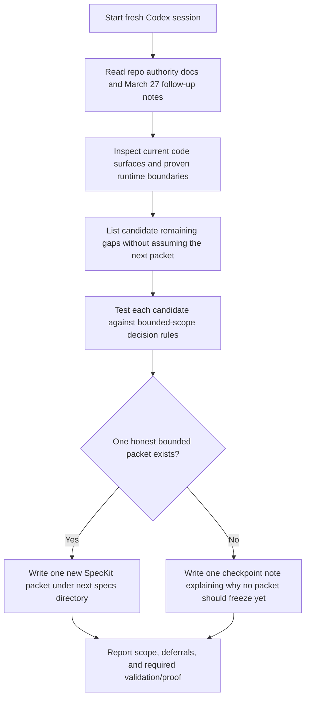

# Implementation Plan — Mister Smith Post-Packet-020 Next Phase Spec Handoff Prompt

## Step 1: Example Identification

### Source Prompt (normalized from user request)

Write a new forward-development handoff prompt for Mister Smith that tells a fresh agent what to
do next after packet `020`, the March 27 runtime-planning follow-up, and the `MS-110`
ambiguous-prompt evidence freeze.

The prompt should guide a research-and-spec-building session for the next honest development
phase, explicitly grounded in `docs/research-output/` and the frontier mandate, without
pre-deciding the answer or drifting into implementation.

### External Examples

#### Example 1

```text
{
  input: "Write a handoff to define the next bounded SpecKit packet for Mister Smith.",
  ideal_output: "A fresh-session prompt that grounds the receiving agent on current repo truth,
  current proof boundaries, code surfaces to inspect, scope-decision rules, and honest stop
  conditions before freezing a new packet."
}
```

Source: `docs/prompt-improver-spec/final-prompts/mister-smith-next-speckit-epic-handoff.md`

#### Example 2

```text
{
  input: "Write a forward-development prompt after a bounded runtime proof pass.",
  ideal_output: "A repo-grounded planning brief that distinguishes landed proof from remaining
  gaps, avoids reopening closed lanes, and tells the receiving agent when to produce a new packet
  versus when to stop with a checkpoint note."
}
```

Source:
`docs/plans/2026-03-27-ms-110-adaptive-runtime-topology-planning.md` plus
`docs/plans/2026-03-27-ms-110-ambiguous-prompt-evidence-freeze.md`

### What the examples demonstrate

- the prompt should be a direct fresh-session briefing, not a generic reusable template
- it should ground the agent in current repo truth before choosing a next phase
- it should route the agent through the existing research corpus rather than treating "research" as
  a blank-slate activity
- it should keep the session on the planning/spec side, not implementation
- it should tell the receiving agent when to freeze a new packet and when to stop because a new
  packet would be dishonest or premature

## Step 2: Planning Analysis

### Intent Summary

**What**: Produce a handoff prompt for a fresh Codex session to identify and, only if justified,
freeze the next bounded development phase after packet `020` and the March 27 follow-up notes.

**Who**: A fresh Codex session operating in `/Users/macmain/MisterSmith`.

**Why**: The repo has no frozen post-packet-020 bounded phase yet. The next session needs a clear,
repo-grounded brief for deciding whether the next move is frontier research synthesis, checkpoint
refresh, or a new SpecKit packet.

### Deployment Summary

- **Target environment**: fresh Codex session in `/Users/macmain/MisterSmith`
- **Primary task**: determine the next honest bounded development phase from current repo truth
- **Expected outcome**:
  - either one new bounded SpecKit packet under the next numbered `specs/` directory
  - or one concise durable checkpoint note that explains why freezing a new packet would still be
    premature

### Task Flowchart



### Lessons from Examples and Current Repo Truth

- `docs/current-state.md` now says there is no frozen post-packet-020 bounded phase
- the March 27 runtime-planning simplification and `MS-110` evidence freeze both reduce pressure
  to treat topology shaping as the immediate next implementation packet
- `docs/research-output/ROUTING_MANIFEST.md` and `consolidated/00-MASTER-FINDINGS.md` already rank
  frontier opportunities, so the next-phase prompt should force the receiving agent to reuse that
  corpus rather than restating generic market trends
- the next phase should be chosen from current repo/code/proof truth, not by carrying forward an
  older packet assumption
- the prompt should allow the receiving agent to conclude that research or checkpoint work comes
  first if a new packet would be premature
- the prompt must forbid reopening already landed packet-020 work unless current repo truth shows a
  real defect
- the frontier mandate requires a legitimacy/triage judgment before advancing speculative work

### Chain-of-Thought Approach

Yes. The prompt should require the receiving agent to:

1. verify current repo truth and proof boundaries
2. synthesize the existing `docs/research-output/` findings that are still relevant to the current
   repo posture
3. inspect the main code surfaces that define remaining default-runtime and operator gaps
4. run frontier-legitimacy and follow-up classification before advancing a speculative next phase
5. compare candidate next-phase directions without pre-selecting one
6. freeze one bounded packet only if the evidence supports it
7. stop with a checkpoint note if no honest bounded packet is ready

### Output Format

Markdown.

The handoff prompt should provide:

- mission and current known repo posture
- required reading order
- required research-output reading order
- code surfaces to inspect
- frontier legitimacy gate
- scope-decision rules
- explicit non-goals and anti-patterns
- packet output requirements if a packet is justified
- stop conditions if a packet is not yet honest

### Variable Plan

| Variable | XML Tag | Description |
| -------- | ------- | ----------- |
| Repo root | `<repo_root>` | Absolute path to the Mister Smith repo |
| Starting main SHA | `<starting_main_sha>` | Current clean synced `main` commit at handoff |
| Current state note | `<current_state_note>` | Primary repo-state router file |
| Latest closure note | `<latest_closure_note>` | Packet-020 closure note on current main |
| March 27 follow-up note | `<march27_followup_note>` | Runtime-planning simplification note |
| Evidence freeze note | `<evidence_freeze_note>` | `MS-110` ambiguous-prompt evidence note |
| Next specs root | `<next_specs_root>` | Next numbered `specs/` directory if a packet is justified |
| Checkpoint note path | `<checkpoint_note_path>` | Durable note path if a new packet would be premature |

### Structural Notes

- keep the prompt research-and-spec oriented rather than implementation-oriented
- front-load the fact that no frozen post-packet-020 bounded phase currently exists
- treat the research corpus as a required frontier input, not a side reference
- explicitly name the Smith legitimacy tools the receiving agent must use before freezing scope
- tell the receiving agent to choose between new packet and checkpoint note based on evidence
- preserve the repo's "clarify, do not overclaim" posture
- explicitly forbid treating dormant planning items like `MS-110` as active bugs

### Ambiguities & Questions

None that block prompt creation.

The prompt can safely instruct the receiving agent to choose the honest next-phase deliverable from
current repo truth.

### Prompt Filename

`mister-smith-post-packet-020-next-phase-spec-handoff`

### Constraint Preservation Checklist

- [x] The output remains a handoff prompt, not execution of the next phase
- [x] The prompt does not pre-select the next packet without evidence
- [x] The prompt preserves research/spec-building boundaries
- [x] The prompt keeps stop conditions for premature packet freezing
- [x] The prompt stays grounded in current March 27 repo truth

## Step 4: Critique & Revision Plan

### Issues Identified

1. **"write a prompt for the next phase of development"** → Problem: this could drift into
   pre-choosing a packet or implementation lane → Revision: make the prompt explicitly decide
   whether the next honest move is a new packet or a checkpoint note.
2. **Older next-packet handoff language from packet-016 days** → Problem: it assumes a next packet
   exists and uses stale authority notes → Revision: re-anchor the prompt to `docs/current-state.md`
   plus the March 27 runtime-planning and evidence-freeze notes.
3. **"research and spec building?"** → Problem: this can be read as two separate activities or as
   a presumed decision → Revision: instruct the receiving agent to do research first and only then
   freeze a packet if the repo truth supports it.
4. **Missing anti-pattern guard** → Problem: the receiving agent could reopen packet-020 follow-up
   work or turn the session into implementation → Revision: add explicit anti-patterns and
   non-goals that forbid implementation, queue staging, or reopening dormant lanes.
5. **Missing research-output and frontier gate** → Problem: "research" reads like generic forward
   planning and ignores the repo's existing research corpus plus legitimacy tooling → Revision: add
   a required research-output reading pass, frontier-mandate instructions, and a Smith
   legitimacy/classification gate before any packet is frozen.

### Areas Needing Expansion

- stronger decision rules for packet versus checkpoint note
- clearer reading order anchored on current March 27 repo truth
- explicit routing through `docs/research-output/` and the frontier mandate
- a sharper definition of what the receiving agent should inspect in code
- explicit final response requirements for scope, deferrals, and validation

### Structural Improvements

- add a dedicated **Forward-Development Boundary** section
- add a dedicated **Frontier Mandate** section
- add a **Decision Rule** section for packet versus checkpoint note
- add **Candidate Gap Families** as questions rather than answers
- add **Anti-Patterns** near the stop conditions

### Constraint Preservation Check

- [x] The prompt remains briefing-only and does not do the next agent's work
- [x] The prompt preserves bounded-spec and checkpoint stop conditions
- [x] The prompt avoids pre-solving the next packet choice
- [x] The prompt stays grounded in current repo truth instead of stale packet direction
- [x] The prompt treats existing research findings and frontier legitimacy as required inputs
