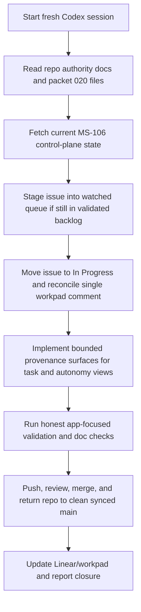

# Implementation Plan — Mister Smith MS-106 Orchestration Provenance Handoff Prompt

## Step 1: Example Identification

### Source Prompt (normalized from user request)

Create a continuation prompt for the next Mister Smith task after `MS-105`, using the
`prompt-improver` workflow so the next session receives a clear, bounded, repo-grounded briefing.

### Normalized Example

```text
{
  input: "Produce a prompt for the next task after the just-landed packet-020 slice.",
  ideal_output: "A fresh-session handoff prompt that identifies the real next Linear issue, grounds
  the agent on current repo and packet authority, preserves Smith-first workflow requirements, and
  keeps the next implementation slice bounded to its actual acceptance criteria."
}
```

### What the example demonstrates

- the output should be a briefing for a new agent session, not execution of the next task
- the prompt must identify the actual next issue from current repo and Linear state instead of
  guessing from packet headings alone
- the prompt should carry forward the repo's Smith-first control-plane discipline
- the prompt must preserve bounded scope and clean-closure expectations

## Step 2: Planning Analysis

### Intent Summary

**What**: Produce a fresh-session handoff prompt for the next packet-020 implementation slice.

**Who**: A new Codex session operating in `/Users/macmain/MisterSmith`.

**Why**: `MS-105` is now landed, so the next session needs a concise but fully grounded prompt for
`MS-106` without re-deriving the packet state from scratch.

### Deployment Summary

- **Target environment**: fresh Codex session in `/Users/macmain/MisterSmith`
- **Primary task**: execute `MS-106` end to end
- **Control-plane posture**: Smith-first, with current issue state checked before mutation
- **Expected outcome**: a prompt that is immediately usable to start `MS-106` from clean synced
  `main`

### Task Flowchart



### Lessons from Current Repo State

- the next bounded packet-020 slice is `MS-106`, not a generic packet heading
- `MS-106` is currently `Backlog` in `MisterSmith Validated Backlog`, so the prompt should tell
  the next session to verify and, if still necessary, stage it into `MisterSmith Execution Queue`
- the issue is blocked by `MS-105`, but that blocker is now landed and `MS-105` is `Done`
- the runtime/core contract work for verifier verdicts, clarification, and failure-context
  checkpoint lineage is already present from `MS-104` and `MS-105`
- the next slice is about projecting that provenance on task/autonomy inspection surfaces and
  keeping deterministic versus live-proof boundaries explicit

### Chain-of-Thought Approach

Yes. The prompt should tell the next session to:

1. ground on current repo and issue truth
2. refresh the issue/control-plane state before mutating it
3. implement only the bounded provenance projection slice
4. validate the affected behavior honestly
5. finish the git/PR/Linear closure lane

### Output Format

Markdown.

The prompt should give:

- the mission and exact issue identifier
- the file-reading order
- the bounded scope and non-goals
- validation requirements
- closure requirements
- a short final-response format

### Variable Plan

| Variable | XML Tag | Description |
| -------- | ------- | ----------- |
| Repo root | `<repo_root>` | Absolute path to the Mister Smith repo |
| Next issue | `<linear_issue>` | The next Linear issue to execute |
| Packet source | `<packet_source>` | Packet 020 spec directory |
| Suggested branch | `<branch_name>` | Linear-provided branch name for the next slice |
| Merge base | `<starting_main_sha>` | Current clean synced `main` commit at handoff |

### Structural Notes

- preserve the user's preferred direct task-handoff format rather than turning the prompt into a
  generic reusable template
- include current known repo state, but instruct the receiving agent to verify it before acting
- keep the prompt specific enough to start `MS-106` immediately without pre-solving the actual code
  changes
- include Smith-first lifecycle steps because the next issue starts in backlog rather than already
  in progress

### Ambiguities & Questions

None that block prompt creation. The next task is concretely identified as `MS-106`, and the
prompt can instruct the next session to verify any mutable state before acting.

### Prompt Filename

`mister-smith-ms-106-orchestration-provenance-handoff`

### Constraint Preservation Checklist

- [x] The output remains a prompt, not execution of the next issue
- [x] Smith-first workflow expectations are preserved
- [x] Bounded packet-020 scope is preserved
- [x] Clean-closure expectations are preserved
- [x] Deterministic versus live-proof boundaries remain explicit

## Step 4: Critique & Revision Plan

### Issues Identified

1. **"continue with the next task"** → Problem: on its own, this is ambiguous because packet task
   headings and actual Linear issues can diverge → Revision: explicitly identify `MS-106` as the
   next real issue and tell the receiving agent to verify current state before acting.
2. **A handoff prompt can drift into implementing the issue.** → Problem: too much detail would
   start doing the next session's work → Revision: keep the prompt focused on mission, scope,
   reading order, validation, and closure, not a step-by-step patch design.
3. **Backlog-to-queue lifecycle is easy to miss.** → Problem: the next issue is still in
   validated backlog, so a generic prompt could skip Smith-first staging → Revision: include
   explicit control-plane staging instructions with verification-first language.
4. **The prompt could blur deterministic and live-proof expectations.** → Problem: `MS-106`
   touches docs and operator-facing provenance, so the next session could overclaim runtime proof
   → Revision: add a hard boundary that docs must keep deterministic versus live-proof language
   explicit.

### Areas Needing Expansion

- exact next-issue identification and current known status
- the dependency on `MS-105`-landed provenance fields
- closure requirements so the new session does not stop at PR open

### Structural Improvements

- front-load current known state and verification instructions
- separate scope from non-goals clearly
- include a dedicated Smith-first workflow section
- include a final-response shape that matches the repo's recent delivery style

### Constraint Preservation Check

- [x] The handoff remains a prompt, not partial implementation
- [x] All bounded-scope constraints are preserved
- [x] The repo's lifecycle/closure discipline is preserved
- [x] The prompt stays specific to `MS-106` instead of becoming generic
