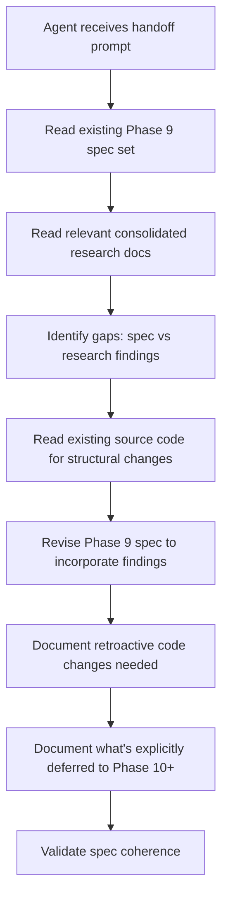

# Implementation Plan — Phase 9 Spec Revision Handoff Prompt

## Step 1: Example Identification

### Embedded Examples
No source prompt to improve — this is a **creation** task informed by:
- A prior handoff prompt drafted in-session (focused on implementation, later corrected to spec revision)
- Five crate-level audit reports comparing existing code against research findings
- The complete research corpus (7 rounds, 2000+ papers, 9 consolidated synthesis docs)
- The existing Phase 9 spec set at `specs/009-phase9-llm-provider-integration/`

### Normalized Examples
| Input | Ideal Output |
|-------|-------------|
| Prior handoff prompt (implementation-focused) | Revised prompt scoped to spec revision + retroactive code assessment |
| Five audit reports (security, supervision, agents, transport, persistence) | Categorized findings: what needs spec changes vs. what's deferred |
| Research corpus (consolidated/) | Specific findings that affect spec revision, with doc references |

### What the Prior Handoff Demonstrated
Strengths:
- Comprehensive technical artifact listing
- Clear project context for zero-context agent
- Good technology stack documentation

Weaknesses:
- Framed as implementation task, not spec revision
- Didn't include audit findings about existing code
- Didn't distinguish between "Phase 9 spec changes" vs "retroactive code changes" vs "deferred to Phase 10+"
- Included too much general project history that a spec-revising agent doesn't need

## Step 2: Planning Analysis

### Intent Summary
**What**: A handoff prompt briefing a fresh agent to revise and supplement the Phase 9 spec based on research findings and crate audit results.
**Who**: A fresh Claude agent with zero prior context about Mister Smith.
**Why**: The Phase 9 spec was written before 7 rounds of research were completed and synthesized. The spec needs to incorporate key research findings and address structural gaps identified in the existing codebase.

### Deployment Summary
- Pasted directly to a new Claude Code session
- Agent has full filesystem access to the Mister Smith repo
- Agent will read existing spec files, research docs, and source code
- Agent will EDIT spec files, NOT write implementation code
- Output: revised spec set at `specs/009-phase9-llm-provider-integration/`

### Task Flowchart

### Chain-of-Thought Approach
Yes — the agent should:
1. First read the existing spec set to understand current design
2. Then read the specific research findings that affect Phase 9
3. Then compare: what does the spec already cover vs what's missing?
4. Then revise the spec with specific, grounded changes

### Output Format
Markdown — revised spec files in existing SpecKit format.

### Variable Plan
No variables needed. All context is in the repo filesystem. The handoff prompt should tell the agent WHERE to look, not embed the content.

### Structural Notes
The handoff prompt must clearly separate three categories:
1. **Spec revision scope** — what changes to the Phase 9 spec
2. **Structural code changes** — what existing types/structs need modification (identified by audits)
3. **Explicit deferrals** — what belongs in Phase 10+ and must NOT be added to Phase 9

### Ambiguities & Questions
1. Should the handoff prompt include the full audit results inline, or direct the agent to read them from files? → **Decision: Inline summaries with file references for detail.** The audit results are in agent task output files that won't persist across sessions.
2. Should Phase 9.1 (Security Hardening) be part of the Phase 9 spec or a separate spec? → **Flag for user decision.** Include as question in the prompt.
3. How much project background does a spec-revising agent need? → **Minimal.** The agent has CLAUDE.md and MEMORY.md. Focus the handoff on the specific task, not general education.

### Prompt Filename
`phase9-spec-revision-handoff`

### Constraint Preservation Checklist
- [x] N/A — creation task, no source constraints to preserve

---

## Step 4: Critique & Revision Plan

### Issues Identified

1. **`"Use the SpecKit skills to produce spec artifacts. The workflow is: 1. /specify ..."`** → Problem: A fresh agent may not know these are Claude Code slash commands that invoke skills. The instruction is too terse. → Revision: Add a brief note that these are slash commands available in Claude Code that invoke the SpecKit skill pipeline. Also clarify execution order: Phase 9 revision first, then Phase 9.1 creation (since 9.1 references transport changes specified in 9).

2. **`"Missing fields needed: ... plane: MessagePlane ... signature: Option<String>"`** → Problem: MessageEnvelope field additions are listed together but belong to different specs. `plane` and `stream_class` are Phase 9 (routing/streaming). `signature`, `nonce`, `capability_token` are Phase 9.1 (security). This split isn't explicit. → Revision: Split the missing fields list by which spec owns them.

3. **Persistence LWW finding listed but not actionable.** → Problem: The audit section lists "HybridStateManager uses last-write-wins only" under "Structural Changes Required" but CRDTs are Phase 13 — neither Phase 9 nor 9.1 addresses this. Including it creates confusion. → Revision: Move to a "Known Limitations (Documented, Not Addressed)" subsection, or remove entirely. Keep only findings that have a clear owner in Phase 9 or 9.1.

4. **Missing: Existing partial implementation.** → Problem: Recent commits `fe951e4` (Claude subscription provider) and `075813a` (OpenAI auth flows) suggest Phase 9 foundation work may already exist in the codebase. The agent should check this before revising the spec. → Revision: Add a note to investigate these commits and any existing LLM-related code.

5. **Missing: Canonical architecture specs.** → Problem: The prompt references `CLAUDE.md` and `ROADMAP.md` but not the `spec/` directory containing canonical architecture specs (type-definitions.md, message-schemas.md, agent-orchestration.md). These define the type contracts the spec should conform to. → Revision: Add `spec/` directory reference, especially `agent-orchestration.md` which explicitly flags the MessageEnvelope security gap.

6. **Missing: Validation criteria.** → Problem: No success criteria for when the spec revision is done. The agent needs to know what "complete" looks like. → Revision: Add completion checklist.

7. **Missing: `research.md` disposition.** → Problem: Phase 9 spec set has a `research.md` that pre-dates the 7-round research. Should it be updated to reference the consolidated docs, or left as-is? → Revision: Add instruction to update `research.md` to reference the consolidated synthesis docs as the authoritative research source.

8. **Directory numbering inconsistency.** → Problem: Phase 9.1 spec uses directory `specs/011-phase9.1-security-hardening/` but this numbering is confusing — Phase 8 is `010`. → Revision: Clarify the naming convention or let the agent decide based on existing patterns.

### Areas Needing Expansion
- SpecKit workflow section needs execution order and practical context
- Completion criteria missing entirely
- Existing partial implementation not acknowledged

### Structural Improvements
- Split MessageEnvelope fields by owning spec (Phase 9 vs 9.1)
- Move LWW finding out of "Structural Changes Required" since it's not actionable in these phases
- Add completion checklist at the end
- Add investigation step for existing partial implementation

### Constraint Preservation Check
- [x] All MUST/MUST NOT preserved
- [x] All scope boundaries preserved
- [x] SpecKit workflow referenced
- [x] Phase deferral table preserved
- [x] Governing principles preserved
- [ ] Missing: completion criteria (adding)
- [ ] Missing: existing partial implementation check (adding)
- [ ] Missing: canonical spec/ directory reference (adding)
