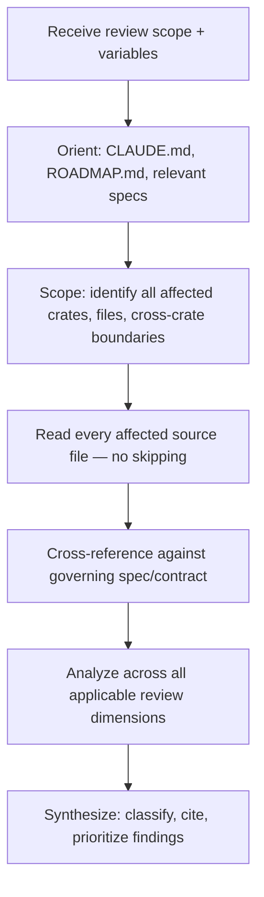

# Implementation Plan — Mister Smith Post-Implementation Review Template

## Step 1: Example Identification

### Source Prompt (embedded example)
A Phase 9-specific code review prompt with 8 hardcoded review dimensions, specific commit hashes, file references, and phase-specific technical callouts. Written for a single review instance.

### Normalized Example
```
{
  input: "Review the last 4 commits (Phase 9 LLM Provider Integration). Read CLAUDE.md + ROADMAP.md first. 8 dimensions: correctness, contract compliance, backward compat, error handling, feature gating, concurrency, test coverage, code quality. Cite file:line. Classify findings.",
  ideal_output: "Deep source-level analysis with file:line citations, classified findings, identification of bugs/discrepancies/optimization areas, verification that implementation is complete and correct against spec"
}
```

### What the example demonstrates
- Review is anchored to a defined scope (commits, files, feature area)
- Agent must orient on project context before reviewing
- Analysis spans multiple dimensions simultaneously
- Source-level evidence is mandatory (not summary-level)
- The agent's job is to find what's wrong, missing, or suboptimal — not confirm what's right

---

## Step 2: Planning Analysis

### Intent Summary
**What**: A reusable template prompt for post-implementation review of any code change in the Mister Smith framework — commits, PRs, feature completions, refactors, or pre-release audits.
**Who**: Frontier-class agents (GPT-5.4, Claude Opus 4.6, etc.) in various environments.
**Why**: Ensure thorough, non-lazy source-level review. The primary failure mode is agents skimming code and producing surface-level observations instead of deep semantic analysis.

### Deployment Summary
- **Target agents**: Frontier LLMs with full codebase access
- **Environments**: Cloud platforms, local IDE agents (Claude Code, Cursor, Codex, etc.)
- **Trigger**: Any post-implementation review need — feature completion, PR, refactor, audit
- **Reuse**: Throughout SDLC, across all phases and crates
- **Output**: NOT specified — agents/platforms have their own output formats

### Task Flowchart


### Lessons from Source Prompt
- **Keep**: Multi-dimensional analysis, file:line citation requirement, project context orientation, spec cross-referencing
- **Generalize**: Remove hardcoded commits/phases/files → variables
- **Generalize**: 8 specific dimensions → framework-aware dimension set with guidance on which apply when
- **Remove**: Test/CI/linter execution as primary actions (per user directive: automated triggers handle this)
- **Strengthen**: The "don't be lazy" directive — make it structural (require file reading before analysis) not just instructional

### Chain-of-Thought Approach
Yes — orient → scope → read → compare → analyze → synthesize. This sequence forces the agent to build understanding before forming opinions.

### Output Format
**NOT SPECIFIED** — per user directive.

### Variable Plan
| Variable | XML Tag | Description |
|----------|---------|-------------|
| Review scope | `<review_scope>` | What to review: commit range, PR number, feature area, crate(s), file set |
| Governing spec | `<governing_spec>` | Path to the spec/contract defining correct behavior (optional — agent should locate if not provided) |
| Additional context | `<additional_context>` | Optional supplementary information, prior decisions, known issues |

### Structural Notes
- Template needs clear phase separation: Orient → Scope → Analyze → Synthesize
- Mister Smith-specific knowledge embedded as framework context, not review instructions
- Review dimensions should be presented as a comprehensive set with guidance, not a checklist
- The agent must be forced to read files, not just reason about them from memory/context
- No output format, but the expectation of source-level evidence with citations is a process requirement, not an output requirement

### Ambiguities & Questions
None — user requirements are clear and specific.

### Prompt Filename
`mister-smith-post-implementation-review`

### Constraint Preservation Checklist
- [x] Deep source reading emphasis preserved
- [x] file:line citation requirement preserved
- [x] Mister Smith project orientation preserved
- [x] Multi-dimensional analysis preserved and generalized
- [x] CI/test/lint actions demoted to optional/secondary
- [x] No output format prescribed
- [x] Capable-agent audience respected (no hand-holding)

---

## Step 4: Critique & Revision Plan

### Issues Identified

1. **`"Your job is to find what's wrong"`** → Problem: Good adversarial framing but slightly misleading — the agent should also identify what's incomplete or suboptimal, not just "wrong." → Revision: Already covers this in the same sentence. No change needed.

2. **Phase 1 Orient: `"Do not proceed to Phase 2 until you have read these files"`** → Problem: Slightly hand-holdy for a frontier agent. The phased structure already implies ordering. → Revision: Remove the explicit gate instruction. The phase structure is sufficient. Trust the agent.

3. **Missing: Spec-to-code traceability direction.** → Problem: Phase 3 says "does it match the spec?" but doesn't tell the agent to also check the reverse — are there things in the code that AREN'T in the spec? Unauthorized additions, scope creep, or speculative implementations are as important as missing implementations. → Revision: Add bidirectional traceability to the Correctness dimension.

4. **`"Every finding must include: The specific file and line"`** → Problem: Good, but this is in Phase 4 (Synthesize) — by the time the agent reaches synthesis, it may not have collected line references during analysis. → Revision: Move the citation requirement into Phase 3 as a working practice, not just a synthesis format. Something like "annotate findings as you go."

5. **Framework Reference section is too long relative to the review workflow.** → Problem: The reference section (lines 121-150) is detailed but could bloat the prompt for agents with smaller context windows. → Revision: Trim to essentials. The agent has access to CLAUDE.md which contains all of this. Reference CLAUDE.md instead of duplicating it. Keep only the patterns that aren't in CLAUDE.md (orphan rule, RuntimeConfigExt, parking_lot vs std::sync choices).

6. **Missing: Dependency and Cargo.toml review.** → Problem: Phase 2 mentions "feature-gated code paths" but doesn't mention reviewing Cargo.toml changes — new dependencies, version constraints, feature flag definitions. These are common sources of issues (unnecessary deps, version conflicts, missing optional flags). → Revision: Add Cargo.toml review to Phase 2.

7. **Missing: Scope elasticity guidance.** → Problem: The template assumes the review scope is well-defined. In practice, a commit or PR may touch files that reveal issues in adjacent code. The agent needs guidance on how far to chase tangents. → Revision: Add brief guidance in Phase 2 about following the dependency path but not expanding scope infinitely.

8. **Phase 3 dimensions read like a checklist despite the preamble saying they're not.** → Problem: The "use judgment" instruction is followed by 8 subsections with bullet lists that look exactly like a checklist. → Revision: Reframe the dimensions as analytical lenses, not items to check off. Consolidate where there's overlap (e.g., "Contract & Trait Compliance" and "Cross-Crate Boundaries" have significant overlap on feature flags and re-exports).

### Areas Needing Expansion
- Bidirectional spec-code traceability
- Cargo.toml / dependency review

### Areas Needing Reduction
- Framework Reference — reference CLAUDE.md instead of duplicating
- Phase 1 Orient — remove explicit gate, trust the structure

### Structural Improvements
- Move citation requirement from Phase 4 into Phase 3 as a working practice
- Consolidate overlapping dimensions
- Add scope boundary guidance to Phase 2
- Tighten Framework Reference to delta from CLAUDE.md

### Constraint Preservation Check
- [x] All core review dimensions preserved
- [x] No output format prescribed
- [x] Source-level evidence requirement preserved
- [x] Mister Smith specificity preserved
- [x] CI/test actions remain secondary
