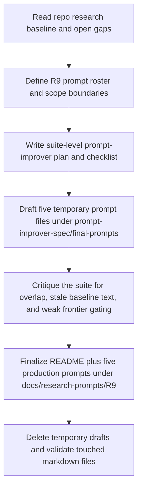

# Implementation Plan — Mister Smith R9 Deep-Research Prompt Suite

## Step 1: Example Identification

### Source Prompt (normalized from user request)

Create a new additive `R9` suite of deep-research prompt documents for Mister Smith focused on
recent advancements in workflow, orchestration, coordination, and real-time inter-agent
communication that are not already covered by the existing research corpus under
`docs/research-output/`.

The suite must use the prompt-improver workflow as one batched campaign, keep shared workflow
artifacts in `docs/prompt-improver-spec/`, create temporary drafts under
`docs/prompt-improver-spec/final-prompts/`, and publish the final production prompts under
`docs/research-prompts/R9/`.

### External Examples

#### Example 1

```text
{
  input: "Refresh the dynamic orchestration research prompt without rediscovering what the repo
  already knows.",
  ideal_output: "A bounded deep-research prompt that names the baseline corpus, states the search
  window, sharpens the open questions, and forces the receiving researcher to separate genuinely
  new findings from already-landed conclusions."
}
```

Source:
`docs/research-prompts/R8/04-dynamic-orchestration.md`

#### Example 2

```text
{
  input: "Create a new research prompt on coordination and verification for Mister Smith.",
  ideal_output: "A prompt that uses the repo's consolidated findings and open gaps as the
  baseline, names the specific coordination primitives already accepted, and asks only for new
  work that materially changes the current implementation trajectory."
}
```

Source:
`docs/research-prompts/R8/05-crdt-formal-verification.md`
and
`docs/research-output/consolidated/05-coordination-and-state.md`

#### Example 3

```text
{
  input: "Create a recurring research task template for a new domain.",
  ideal_output: "A prompt structure with clear standing orders, a compressed do-not-rediscover
  baseline, scoped research dimensions, and explicit output criteria that avoid generic AI news."
}
```

Source:
`docs/prompt-improver-spec/final-prompts/pulse-task-template.md`

### What The Examples Demonstrate

- final prompts should be self-contained production briefings, not exploratory notes
- the baseline must come from `docs/research-output/*`, not from prior prompt text alone
- each prompt needs a firm scope boundary so adjacent research domains do not collapse together
- the receiving researcher must be told what is already known, what counts as new, and how to
  classify findings against Mister Smith's frontier mandate
- reusable structure matters, but the "already known" sections must be rebuilt from repo truth

## Step 2: Planning Analysis

### Intent Summary

**What**: build a six-file `R9` deep-research prompt suite:

- `README.md`
- `01-workflow-engines-compensation-and-resume.md`
- `02-dynamic-orchestration-and-topology-control.md`
- `03-coordination-protocols-shared-state-and-dynamic-verification.md`
- `04-real-time-inter-agent-communication-and-transport.md`
- `05-collaborative-communication-handoffs-and-cognitive-alignment.md`

**Who**: a deep-research agent or analyst with live web access.

**Why**: the existing research corpus and `R8` prompts already cover large parts of the landscape,
but the repo still has documented gaps around workflow semantics, decentralized topology safety,
dynamic protocol verification, real-time transport behavior, and collaborative communication
policies. `R9` should convert those gaps into a sharper, additive prompt set.

### Deployment Summary

- **Working artifacts**:
  - `docs/prompt-improver-spec/implementation_plan.md`
  - `docs/prompt-improver-spec/task.md`
  - `docs/prompt-improver-spec/walkthrough.md`
- **Temporary drafts**:
  - `docs/prompt-improver-spec/final-prompts/r9-*-draft.md`
- **Production outputs**:
  - `docs/research-prompts/R9/*.md`
- **Baseline authority**:
  - `docs/current-state.md`
  - `docs/research-output/ROUTING_MANIFEST.md`
  - relevant files under `docs/research-output/consolidated/`

### Task Flowchart



### Lessons From Examples And Current Repo Truth

- `R8` already provides a deep-research family with a stable section backbone; `R9` should reuse
  that shape for consistency
- the authoritative boundary for "already discovered" is the research corpus under
  `docs/research-output/`, especially the consolidated docs and routing manifest
- [current-state](/Users/macmain/MisterSmith/docs/current-state.md) confirms the live runtime path
  has moved through verifier-gated orchestration and packet `021` is now frozen, so the prompts
  should assume phases `1-10` are landed and current frontier work is about sharpening next moves
- the consolidated docs expose concrete open questions rather than broad unknowns:
  decentralized DAG + OTP integration, workflow compensation semantics, dynamic MPST, production
  evidence for meta-orchestration, provider-side backpressure, and communication policy design
- the frontier mandate must stay visible in every prompt so future research does not drift into
  market-following summaries

### Chain-of-Thought Approach

Yes. The improved prompts should instruct the receiving researcher to:

1. anchor on the repo baseline before searching
2. separate already-known findings from genuinely new work
3. evaluate production evidence and contradictions, not just novelty
4. map each finding to Mister Smith implementation surfaces
5. rank outcomes by frontier leverage rather than popularity

### Output Format

Markdown.

Each production prompt should remain a standalone research brief with the shared section order:

`Context` → `Frontier-First Mandate` → `Research Objective` →
`What Has Already Been Researched` → `Research Dimensions` →
`Per-Dimension Output Structure` → `Synthesis` → `Research Methodology`

### Variable Plan

| Variable | XML Tag | Description |
| -------- | ------- | ----------- |
| Baseline boundary date | `<baseline_boundary>` | Fixed date after which the research should search for delta |
| Repo state router | `<repo_state_router>` | Current repo-wide truth document |
| Routing manifest | `<routing_manifest>` | Classification taxonomy and discovery-routing authority |
| Baseline docs | `<baseline_docs>` | Relevant consolidated research files per prompt |
| Search window | `<search_window>` | March 7, 2026 to present, with tightly scoped exceptions |
| Frontier taxonomy | `<frontier_taxonomy>` | `EXTEND`, `TRANSFORM`, `NEW`, `FRONTIER`, `INCREMENTAL` |
| Implementation vector | `<implementation_vector>` | Likely crates, runtime surfaces, or spec areas affected |

### Structural Notes

- `R9` is additive and should not replace or rewrite `R8`
- each prompt must own one surface clearly:
  - workflow semantics and compensation
  - orchestration and topology control
  - coordination and dynamic verification
  - transport and real-time communication
  - collaborative communication and alignment
- prompts should cite exact baseline docs in the context rather than generic "existing corpus"
- "already known" sections should be rebuilt from consolidated findings and open gaps, not copied
  verbatim from `R8`
- every prompt must explicitly ask for:
  - frontier classification
  - Mister Smith implementation vector
  - production-validated vs research-only separation
  - thin-results reporting
  - contradictions to current assumptions

### Overlap Boundaries

- **Workflow vs orchestration**:
  workflow prompt owns checkpointing, cancellation, compensation, reversible side effects, and
  long-running execution semantics; orchestration prompt owns topology choice, team structure, and
  adaptive control
- **Orchestration vs coordination**:
  orchestration prompt owns how teams are shaped; coordination prompt owns the shared-state and
  protocol primitives those teams use once they exist
- **Coordination vs transport**:
  coordination prompt owns correctness and verification of interaction semantics; transport prompt
  owns streaming, multiplexing, QoS, and wire-level delivery behavior
- **Transport vs collaborative alignment**:
  transport prompt owns the channel; collaborative alignment prompt owns the policy of what agents
  say to each other, when they clarify, and how they avoid groupthink or trust drift

### Ambiguities & Questions

None that block execution.

The user already resolved the two material choices:

- build a full new `R9` round rather than a narrow gap patch
- publish production prompts under `docs/research-prompts/R9/`

### Prompt Filenames

- `README.md`
- `01-workflow-engines-compensation-and-resume.md`
- `02-dynamic-orchestration-and-topology-control.md`
- `03-coordination-protocols-shared-state-and-dynamic-verification.md`
- `04-real-time-inter-agent-communication-and-transport.md`
- `05-collaborative-communication-handoffs-and-cognitive-alignment.md`

### Constraint Preservation Checklist

- [x] The work remains prompt creation only; it does not perform the research
- [x] The baseline authority is `docs/research-output/*`, not `docs/pulse-tasks/*`
- [x] `R9` is additive and does not replace `R8`
- [x] Final production prompts live under `docs/research-prompts/R9/`
- [x] Shared prompt-improver artifacts remain under `docs/prompt-improver-spec/`
- [x] Each prompt preserves the frontier-first, anti-market-copying stance
- [x] Each prompt includes frontier classification and implementation-vector requirements
- [x] Each prompt forces honest reporting of thin results and contradictions

## Step 4: Critique & Revision Plan

### Issues Identified

1. **"workflow, orchestration, coordination, and real-time communication"** → Problem: the raw
   scope language is broad enough that one prompt could collapse several domains together →
   Revision: split the suite into five prompt owners with explicit overlap boundaries.
2. **"using R8 as structure reference"** → Problem: if followed loosely, this encourages copying
   stale baseline sections from the old prompt batch → Revision: require every "already known"
   section to be rebuilt from `docs/research-output/*`.
3. **"find recent advancements"** → Problem: a generic freshness requirement can devolve into
   market-news summaries → Revision: enforce the routing-manifest taxonomy plus
   `production-validated`, `research-only`, `thin-results`, and `contradictions` outputs.
4. **"recent advancements in workflow"** → Problem: the repo baseline is strongest on topology,
   supervision, and transport but thinner on compensation semantics and reversible tool taxonomy →
   Revision: create a dedicated workflow-engine prompt anchored on compensation, resume, and
   partial-failure recovery.
5. **"real-time communication between the agents"** → Problem: that phrase spans transport,
   multiplexing, protocol negotiation, and cognitive communication policy → Revision: separate
   transport behavior from collaborative alignment and handoff policy.

### Areas Needing Expansion

- a suite-level README explaining why `R9` exists and how to run it
- exact baseline doc mapping for each production prompt
- stronger instruction that older sources may be used only if absent from the baseline and
  materially trajectory-changing
- explicit implementation-surface mapping so research findings land closer to crates/specs/runtime
- clearer distinctions between production evidence, frontier speculation, and thin-result areas

### Structural Improvements

- add a common "Fixed Inputs" subsection inside each prompt `Context` section
- add a uniform "Baseline documents for this prompt" list in every prompt
- add a shared per-dimension output contract with eight required fields
- add run-order guidance in the `R9` README so the suite can be executed as a batch or as
  individual prompts

### Constraint Preservation Check

- [x] All user-required files are represented in the suite
- [x] The prompt backbone stays consistent across the five production prompts
- [x] The baseline remains repo-authority-first
- [x] The frontier mandate stays explicit and anti-imitative
- [x] The production path and temporary-draft path remain distinct
- [x] The work stays bounded to repo-local docs and prompt artifacts
