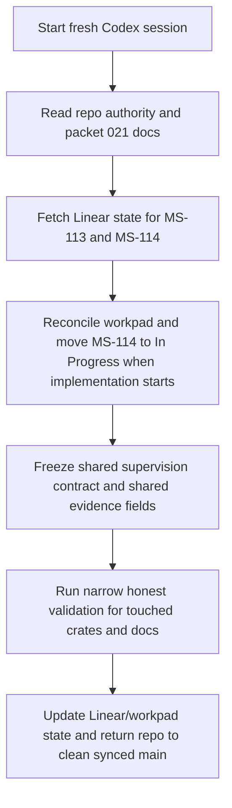

# Implementation Plan — Mister Smith MS-114 Packet-021 Contract-Freeze Handoff Prompt

## Step 1: Example Identification

### Source Prompt (normalized from user request)

Create a fresh-session handoff prompt for the first implementation slice of packet `021` after
the packet spec, tasks, and issue structure have been entered into Linear.

The prompt should initialize a new Codex session on the first runnable issue, grounded in the
repo packet and Linear state, without pre-solving the implementation work.

### External Examples

#### Example 1

```text
{
  input: "Write a fresh-session handoff for a bounded packet child issue.",
  ideal_output: "A direct implementation brief that names the issue, parent packet, reading
  order, exact scope, validation floor, lifecycle expectations, and stop conditions without doing
  the receiving agent's work."
}
```

Source:
`docs/prompt-improver-spec/final-prompts/mister-smith-ms-106-orchestration-provenance-handoff.md`

#### Example 2

```text
{
  input: "Initialize implementation for a packet whose first milestone is a shared contract
  freeze.",
  ideal_output: "A handoff that keeps the session on the contract-freeze slice, points to the
  contract artifact, blocks scope expansion into later slices, and requires shared-surface
  validation before follow-on work."
}
```

Source:
`specs/015-complex-multi-agent-proof-and-unified-result-surfaces/contracts/result-surface-contract.md`
and
`specs/021-profile-aware-predictive-runtime-supervision/contracts/supervision-evidence-contract.md`

### What The Examples Demonstrate

- the prompt should target one concrete Linear issue, not the whole packet parent
- it should ground the receiving agent on current repo and tracker truth before edits
- it should preserve the repo's Smith-first workflow and clean-closure expectations
- it should point to the shared contract artifact explicitly when the slice is a contract freeze
- it should prevent drift into later child slices or generic frontier strategy work

## Step 2: Planning Analysis

### Intent Summary

**What**: produce a fresh-session handoff prompt for implementing `MS-114`, the first runnable
packet-021 child issue.

**Who**: a fresh Codex session operating in `/Users/macmain/MisterSmith`.

**Why**: packet `021` is now frozen and represented in Linear as parent `MS-113` plus bounded
child slices. The next session should start at the first blocking slice rather than rediscovering
scope or reopening packet framing.

### Deployment Summary

- **Target environment**: fresh Codex session in `/Users/macmain/MisterSmith`
- **Primary task**: execute `MS-114` end to end
- **Expected outcome**:
  - shared supervision contract published and aligned across `core`, `events`, and `orchestrator`
  - validation run for the touched shared-surface crates and docs
  - repo and Linear state closed cleanly at the end

### Task Flowchart



### Lessons From Examples And Current Repo Truth

- `MS-114` is the first blocking child slice under parent `MS-113`
- the new packet includes a real contract artifact at
  `specs/021-profile-aware-predictive-runtime-supervision/contracts/supervision-evidence-contract.md`
- the receiving agent should implement only the contract-freeze slice, not `MS-115` through
  `MS-118`
- packet `020` repair lineage remains canonical and must stay coherent with the new contract
- the prompt should preserve repo reading order, issue/workpad discipline, validation floor, and
  clean-closure rules

### Chain-of-Thought Approach

Yes. The prompt should require the receiving agent to:

1. verify current repo and Linear truth
2. read the packet and contract artifacts before editing
3. ground on the shared code surfaces that define the contract freeze
4. execute only the first bounded slice
5. validate touched crates and docs honestly before closure
6. leave repo and Linear state aligned

### Output Format

Markdown.

The handoff prompt should provide:

- mission and current known state
- required reading order
- primary code surfaces
- workflow expectations and lifecycle rules
- exact scope and boundaries
- validation floor
- closure requirements
- final response requirements

### Variable Plan

| Variable | XML Tag | Description |
| -------- | ------- | ----------- |
| Repo root | `<repo_root>` | Absolute path to the Mister Smith repo |
| Linear parent issue | `<linear_parent_issue>` | Packet parent issue identifier |
| Linear issue | `<linear_issue>` | First runnable child issue identifier |
| Linear doc | `<linear_doc>` | Packet doc attached to the parent issue |
| Starting main SHA | `<starting_main_sha>` | Clean synced `main` commit at handoff |
| Packet source | `<packet_source>` | Packet `021` directory |
| Contract source | `<contract_source>` | Shared supervision contract artifact |
| Branch name | `<branch_name>` | Suggested branch name if one is used |

### Structural Notes

- target the prompt at `MS-114`, not the packet parent
- front-load the fact that this is the first contract-freeze slice
- use current repo truth and the new Linear issue structure rather than stale packet-020 language
- keep the prompt implementation-oriented, not spec-selection-oriented
- explicitly forbid widening into `MS-115` through `MS-118`

### Ambiguities & Questions

None that block prompt creation.

The first runnable slice and its repo/Linear anchors are now explicit.

### Prompt Filename

`mister-smith-ms-114-packet-021-contract-freeze-handoff`

### Constraint Preservation Checklist

- [x] The output remains a handoff prompt, not execution of `MS-114`
- [x] The prompt targets one bounded issue instead of the entire packet
- [x] The prompt preserves repo authority, Linear, and clean-closure rules
- [x] The prompt keeps later packet-021 slices explicitly out of scope
- [x] The prompt grounds the receiving agent on the published contract artifact

## Step 4: Critique & Revision Plan

### Issues Identified

1. **"initialize this spec implementation"** → Problem: could imply the whole packet parent
   instead of the first runnable slice → Revision: target `MS-114` explicitly.
2. **"input the issues/tasks/spec into Linear"** → Problem: a handoff prompt could ignore the new
   tracker state and fall back to repo-only grounding → Revision: include parent `MS-113`, child
   `MS-114`, and the attached Linear doc in the prompt.
3. **Generic implementation handoff structure** → Problem: it could miss that this slice is a
   shared contract freeze → Revision: make the contract artifact a first-class required read and a
   scope boundary.
4. **Missing anti-scope-drift guard** → Problem: the receiving agent could widen into runtime
   wiring, fingerprints, or operator-console work → Revision: add explicit out-of-scope language
   for `MS-115` through `MS-118`.
5. **Validation floor too vague** → Problem: shared-surface work can regress quietly across
   multiple crates → Revision: name the narrowest honest test/clippy/build/doc checks for this
   slice.

### Areas Needing Expansion

- stronger issue-state grounding from Linear
- a clearer contract-first reading order
- explicit closure requirements for repo and Linear state
- sharper separation between `MS-114` and the later packet-021 child slices

### Structural Improvements

- add a **Current Known State** section with issue IDs and repo SHA
- add a **Scope For MS-114 Only** section
- add a **Boundaries** section that names later child issues explicitly
- add a **Closure Requirements** section matching current repo workflow expectations

### Constraint Preservation Check

- [x] The prompt stays briefing-only and does not do the receiving agent's work
- [x] The prompt preserves repo authority and tracker grounding
- [x] The prompt keeps the packet slice bounded to contract freeze only
- [x] The prompt keeps validation and closure requirements explicit
- [x] The prompt avoids prescribing exact implementation details beyond necessary scope control
