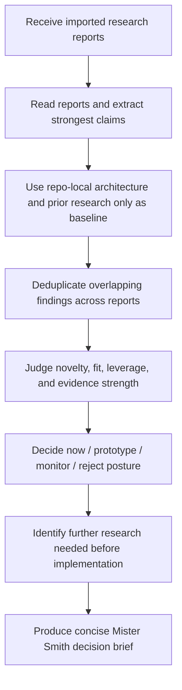

# Implementation Plan — Mister Smith Post-Research Analysis Brief Prompt

## Step 1: Example Identification

### Source Prompt (normalized from user request)

Create a reusable prompt, using the prompt-improver workflow, for the situation where a completed
external research report is brought into the Mister Smith repo for local analysis. The receiving
agent should analyze the report deeply, compare it to Mister Smith's existing or proposed
architecture, and produce a research analysis brief covering whether the findings should influence
implementation and whether more research is needed.

The path `/Users/macmain/Downloads/deep-research-report.md` is only an example of the kind of
report that may be provided. The prompt must not execute against that report now.

### Embedded Example

```text
{
  input: "A completed deep research report is available as a local Markdown file such as
  /Users/macmain/Downloads/deep-research-report.md.",
  ideal_output: "A reusable local-analysis prompt that accepts one or more imported research
  reports, compares them against Mister Smith architecture and prior research, and produces a
  decision-grade brief without re-running external research."
}
```

### External Examples

#### Example 1

```text
{
  input: "Research prompts in docs/research-prompts/R9/*.md",
  ideal_output: "The prompt should inherit their focus on novelty, contradiction, implementation
  relevance, and further research needs, while changing the task from pre-research discovery to
  post-research synthesis."
}
```

Source:
`docs/research-prompts/R9/`

#### Example 2

```text
{
  input: "Authoritative synthesis docs under docs/research-output/consolidated/",
  ideal_output: "The prompt's output should look like a decision brief rather than a report
  summary: deduplicated, ranked, and mapped to implementation significance."
}
```

Source:
`docs/research-output/consolidated/00-MASTER-FINDINGS.md`

### What The Examples Demonstrate

- the receiving agent must work from imported report artifacts, not launch another research pass
- the useful end state is a decision brief, not a linear summary of the reports
- novelty, transferability, evidence strength, and further-research needs are all first-class
  concerns
- the prompt must handle one or more reports and deduplicate overlapping findings
- repo-local context should be used to judge fit and novelty, not to turn the task into a repo
  audit

## Step 2: Planning Analysis

### Intent Summary

**What**: build a reusable post-research analysis prompt for Codex or a similar repo-local agent.

**Who**: an agent working inside `/Users/macmain/MisterSmith` after one or more external research
reports have already been produced.

**Why**: the repo has strong pre-research prompt assets, but no dedicated prompt for the next
step: turning imported research outputs into a Mister Smith decision brief.

### Deployment Summary

- **Working artifacts**:
  - `docs/prompt-improver-spec/implementation_plan.md`
  - `docs/prompt-improver-spec/task.md`
  - `docs/prompt-improver-spec/walkthrough.md`
- **Temporary draft**:
  - `docs/prompt-improver-spec/final-prompts/mister-smith-post-research-analysis-brief-draft.md`
- **Production output**:
  - `docs/prompt-improver-spec/final-prompts/mister-smith-post-research-analysis-brief.md`
- **Receiving context**:
  - one or more imported research report files
  - repo-local architecture and prior research context as needed

### Task Flowchart



### Lessons From Examples And Current Repo Pattern

- the existing research prompts already encode the right evaluation instincts: novelty,
  contradictions, implementation relevance, and explicit further-research needs
- the consolidated research outputs show the desired end state is synthetic and ranked, not a
  one-file-at-a-time recap
- the new prompt must stay local: imported reports are primary evidence, repo context is baseline
  context, and new web research is out of scope unless explicitly requested
- the prompt should be explicit that the task is architectural analysis, not repo-state validation

### Chain-of-Thought Approach

Yes. The improved prompt should instruct the receiving agent to analyze before concluding:

1. understand what the reports actually claim
2. separate evidence from speculation
3. compare against Mister Smith architecture and prior research baseline
4. judge timing and actionability
5. identify where uncertainty still blocks action

### Output Format

Markdown.

The final prompt should ask for a concise decision brief rather than a free-form summary.

### Variable Plan

| Variable | XML Tag | Description |
| -------- | ------- | ----------- |
| Imported reports | `<research_reports>` | Required reports, report paths, or excerpts to analyze |
| Primary question | `<analysis_goal>` | Optional focus question for the analysis pass |
| Architecture baseline | `<architecture_context>` | Optional repo-local docs or architectural constraints |
| Prior research baseline | `<existing_research_context>` | Optional prior synthesis used to judge novelty |
| Decision horizon | `<decision_horizon>` | Optional near-term versus later-stage framing |

### Structural Notes

- the prompt must not trigger new external research by default
- the prompt must explicitly say the imported reports are primary evidence
- the prompt should handle single or multiple reports
- the prompt should separate imported evidence from repo-local inference
- the prompt should push toward decision relevance rather than comprehensive recap
- the output structure should stay strong enough to produce a real brief but avoid pre-solving the
  findings

### Ambiguities & Questions

None that block execution.

The user clarified the core scope:

- this is a **post-research local analysis** prompt
- the example report path is only illustrative
- the goal is a brief on implementation relevance and further-research needs

### Prompt Filename

`mister-smith-post-research-analysis-brief`

### Constraint Preservation Checklist

- [x] All "MUST" and "MUST NOT" rules preserved verbatim or strengthened
- [x] All "DO NOT" instructions preserved
- [x] Output format requirements match the original intent
- [x] Role/persona definitions preserved
- [x] Domain-specific rules maintained
- [x] Edge case handling instructions preserved

## Step 4: Critique & Revision Plan

### Issues Identified

- Issue 1:
  `"You will receive one or more completed research reports and analyze them against Mister Smith's existing and proposed architecture."`
  → Problem: accurate but too broad; it does not clearly distinguish post-research local analysis
  from a fresh research run
  → Revision: explicitly state that this is a local post-research analysis task and not a new
  research run unless asked

- Issue 2:
  `"Compare those findings to Mister Smith's architecture and research baseline."`
  → Problem: vague about what role repo-local context should play; this could pull the receiving
  agent into repo auditing rather than architectural comparison
  → Revision: clarify that repo-local context is only for novelty, fit, leverage, and transfer
  analysis

- Issue 3:
  `"Decide what appears implementable now, worth prototyping later, or not worth pursuing."`
  → Problem: useful, but it does not force the agent to separate imported evidence from its own
  inference
  → Revision: add an explicit evidence-versus-inference boundary and a verification checklist

- Issue 4:
  `"Produce a concise markdown brief explaining:"`
  → Problem: the draft output list is too compressed and risks summary-style answers
  → Revision: expand into named brief sections with stronger synthesis expectations

### Areas Needing Expansion

- make the working boundary explicit so the agent does not re-run research
- strengthen guidance for multi-report deduplication and overlap collapse
- add evaluation lenses so the agent judges mechanism, evidence, transferability, and leverage
- add anti-patterns so the output does not become a linear summary
- add a final verification checklist to keep the output decision-grade

### Structural Improvements

- move the local-analysis boundary up near the top
- introduce XML variables earlier and tighten their purpose
- add dedicated sections for:
  - working boundary
  - analysis tasks
  - evaluation lenses
  - anti-patterns
  - verification checklist
- make the output sections more decision-oriented without prescribing findings

### Constraint Preservation Check

- [x] All MUST/MUST NOT preserved
- [x] All DO NOT preserved
- [x] Output format requirements preserved
- [x] Role/persona preserved
- [x] Domain-specific rules preserved
- [x] Edge case handling preserved
