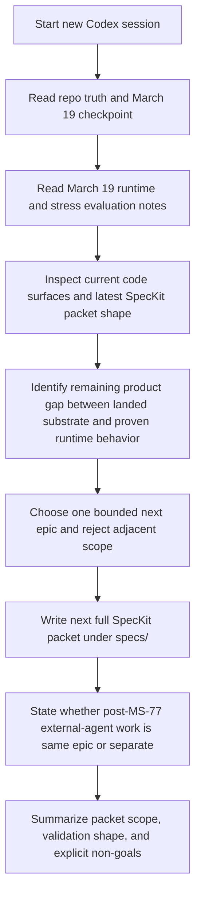

# Implementation Plan — Mister Smith Next SpecKit Epic Handoff Prompt

## Step 1: Example Identification

### Source Prompt (normalized from user request)

Create a handoff prompt for a new Codex session that starts the next phase of development by
creating and scoping the next bounded SpecKit epic for Mister Smith.

### Normalized Example

```text
{
  input: "Start a fresh session that reads current repo truth, determines the next bounded frontier
  epic, and writes the next full SpecKit packet without drifting into implementation.",
  ideal_output: "A prompt for a new Codex session that uses the March 19 checkpoint as the planning
  authority, grounds on current runtime/evaluation evidence, creates one bounded next SpecKit
  packet under the next specs/ directory, and explicitly decides whether remaining post-MS-77
  external-agent work belongs in the same epic or a later one."
}
```

### What the example demonstrates

- the receiving agent must spec the next epic, not implement it
- current repo truth must come from the March 19 checkpoint, current-state router, and current
  evaluation notes
- the prompt must keep the next packet bounded to the remaining differentiation gap between landed
  substrate and proven runtime behavior
- the prompt must force an explicit decision about post-`MS-77` external-agent scope
- the prompt should produce a durable SpecKit packet, not just an informal planning memo

---

## Step 2: Planning Analysis

### Intent Summary

**What**: A handoff prompt for a fresh Codex session that writes the next bounded SpecKit packet
for Mister Smith.

**Who**: A new Codex session with repo access, terminal access, and the ability to inspect code,
docs, evaluation artifacts, and the current `specs/` packet shape.

**Why**: The current planning authority says the next active work item is one bounded SpecKit epic
covering the remaining gap between landed substrate and proven runtime behavior. This should happen
in a clean new session, not be mixed with implementation or stale thread context.

### Deployment Summary

- **Target environment**: a new Codex session in `/Users/macmain/MisterSmith`
- **Primary task**: determine and author the next bounded SpecKit packet
- **Secondary task**: decide whether any remaining post-`MS-77` external-agent work belongs inside
  that epic or as a separate follow-on epic
- **Expected outcome**: one new `specs/` packet under the next numeric directory plus a concise
  session summary of chosen scope and deferred scope

### Task Flowchart



### Lessons From Repo State

- `docs/current-state.md` now routes planning to
  `docs/plans/2026-03-19-central-development-checkpoint.md`, not the older frontier note.
- The current checkpoint says the next action is **one bounded SpecKit packet**, not another
  cleanup pass and not immediate implementation.
- March 19 evidence shows a specific remaining gap: stronger proof and contract shape for complex
  multi-agent execution under harder workloads, plus final-result visibility on operator surfaces.
- `MS-77` is complete as a bounded external-agent surface, so the new packet must explicitly decide
  whether any remaining external-agent interoperability work stays inside the next epic or becomes
  a later epic.
- The prompt must keep the receiving agent from reopening completed Smith-first control-plane work
  or treating historical packet statuses as active work.

### Chain-of-Thought Approach

Yes. The prompt should force this order:

1. ground on current repo authority
2. review the strongest current runtime/evaluation evidence
3. inspect current code and `specs/` packet shape
4. choose one bounded next epic
5. author the full SpecKit packet
6. state what is intentionally deferred

### Output Format

Markdown.

The improved prompt should require:

- one new bounded SpecKit packet under `specs/`
- a concise terminal summary naming the chosen epic, the packet path, and deferred scope

### Variable Plan

| Variable | XML Tag | Description |
| -------- | ------- | ----------- |
| Repo root | `<repo_root>` | Absolute repo path for the new session |
| Checkpoint note | `<checkpoint_note_path>` | The active forward-development authority note |
| Packet root | `<next_specs_root>` | The new `specs/<NNN-slug>/` directory to create |
| Packet slug | `<next_packet_slug>` | The descriptive slug for the next epic |

### Structural Notes

- treat the March 19 checkpoint as the forward authority
- keep the packet bounded to one epic with explicit non-goals
- require the receiving agent to read runtime/evaluation notes before choosing scope
- require an explicit decision on post-`MS-77` external-agent work
- prohibit implementation, queue staging, or broad repo cleanup in the planning session

### Ambiguities & Questions

None that block prompt creation. The packet name and exact slug should be decided by the receiving
session after grounding in current repo truth and March 19 evidence.

### Prompt Filename

`mister-smith-next-speckit-epic-handoff`

### Constraint Preservation Checklist

- [x] New-session handoff requirement preserved
- [x] Next work remains a bounded SpecKit packet, not implementation
- [x] Current repo truth takes priority over historical direction notes
- [x] Explicit decision on post-`MS-77` external-agent scope added
- [x] Scope guardrails from the March 19 checkpoint preserved

---

## Step 4: Critique & Revision Plan

### Issues Identified

1. **A next-epic handoff can drift into doing the architecture work itself.**
   Problem: The prompt could over-prescribe the actual packet contents instead of briefing the next
   session.
   Revision: Keep the prompt focused on grounding sources, decision criteria, required outputs, and
   stop conditions rather than pre-solving the packet.

2. **Older direction notes are now historical.**
   Problem: The receiving session could incorrectly treat `frontier-direction.md` as the current
   authority.
   Revision: Make the March 19 checkpoint the primary authority and demote the older frontier note
   to historical context only.

3. **The session could reopen old control-plane or phase work.**
   Problem: Without guardrails, the next session could drift into Smith-first backlog work or older
   packet cleanup.
   Revision: Explicitly prohibit reopening completed control-plane programs or treating stale packet
   labels as current implementation gaps.

4. **The new packet could become too broad.**
   Problem: The remaining gaps touch complex execution proof, result visibility, and external-agent
   direction; the session could try to absorb all of it.
   Revision: Force one bounded epic, with explicit accepted scope and explicit deferrals.

5. **The prompt needs a durable output shape, not just a recommendation.**
   Problem: The next session could stop at a memo instead of writing a full packet.
   Revision: Require a real `specs/<NNN-slug>/` packet with the standard SpecKit files.

### Areas Needing Expansion

- exact reading order for repo authority and March 19 evidence
- the decision criteria for bounding the next epic
- explicit packet outputs and stop conditions

### Structural Improvements

- add a start sequence grounded in current authority docs
- add a packet-output section naming the required SpecKit files
- add a scope-decision section for the post-`MS-77` external-agent question
- add implementation and queue-staging non-goals

### Constraint Preservation Check

- [x] The task remains a planning/spec packet, not implementation
- [x] The prompt keeps current repo truth primary
- [x] The next packet stays bounded to one epic
- [x] Historical notes remain context only, not current authority
