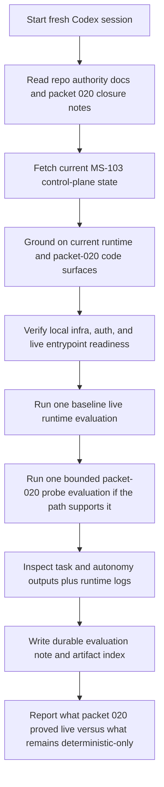

# Implementation Plan — Mister Smith MS-103 Packet-020 Live Evaluation Handoff Prompt

## Step 1: Example Identification

### Source Prompt (normalized from user request)

Create a fresh-session handoff prompt for live runtime evaluations of completed packet `020`
parent issue `MS-103`, using the prompt-improver workflow and current repo truth from `MS-103`
through `MS-107`.

### External Examples

#### Example 1

```text
{
  input: "Write a live-run evaluation handoff for Mister Smith.",
  ideal_output: "A fresh-session prompt that grounds the receiving agent on current runtime docs,
  verifies the actual live path from code, requires durable evidence capture, and distinguishes
  live proof from code inference."
}
```

Source: `docs/prompt-improver-spec/final-prompts/mister-smith-live-run-trace-evaluation.md`

#### Example 2

```text
{
  input: "Write a bounded packet implementation handoff for a specific Linear slice.",
  ideal_output: "A repo-grounded prompt with exact issue context, reading order, workflow rules,
  bounded scope, validation expectations, and clean-closure requirements."
}
```

Source:
`docs/prompt-improver-spec/final-prompts/mister-smith-ms-106-orchestration-provenance-handoff.md`

### What the examples demonstrate

- the prompt should be a direct fresh-session briefing, not a reusable generic template
- live evaluation prompts need explicit proof-boundary language and durable artifact requirements
- issue-specific handoff prompts work best when they include current known state plus instructions
  to verify mutable state before acting
- the receiving agent should be told what to prove and what not to overclaim, without pre-solving
  the evaluation outcomes

## Step 2: Planning Analysis

### Intent Summary

**What**: Produce a handoff prompt for a new Codex session to run live evaluations against the
completed packet-020 runtime path after `MS-103` through `MS-107` closed on `main`.

**Who**: A fresh Codex session operating in `/Users/macmain/MisterSmith`.

**Why**: The next session needs to validate what packet `020` actually proves live on the shipped
runtime path, without reopening implementation work or overstating claims beyond observed
evidence.

### Deployment Summary

- **Target environment**: fresh Codex session in `/Users/macmain/MisterSmith`
- **Primary task**: run bounded live runtime evaluations for completed packet `020`
- **Control-plane posture**: verify issue state, but execute locally and directly instead of using
  Symphony or reopening the completed implementation lane
- **Expected outcome**: one durable evaluation note plus supporting artifacts that separate
  baseline live proof, packet-020-specific live evidence, and remaining deterministic-only claims

### Task Flowchart



### Lessons from Examples and Current Repo Truth

- `MS-103` is already `Done`, so the handoff should not tell the receiving agent to reopen or
  restage the packet just to run evaluation
- packet `020` closure is documented in
  `docs/plans/2026-03-26-verifier-gated-adaptive-orchestration.md`, and its quickstart already
  defines the live-proof boundary as one bounded runtime transcript
- packet `019` already has a bounded repeatable live proof on the current shipped baseline, so the
  new prompt should reuse that baseline as grounding without confusing packet-019 proof with
  packet-020 proof
- the receiving agent needs a two-part evaluation posture:
  - confirm the current baseline live runtime path still works
  - attempt a bounded packet-020-specific transcript that honestly shows verifier or repair
    behavior, or record that the current path could not trigger it
- the prompt must be explicit that the goal is evaluation, not implementation, router changes, or
  benchmark claims

### Chain-of-Thought Approach

Yes. The prompt should require the receiving agent to:

1. verify current repo and issue truth
2. inspect code and existing proof harnesses before choosing the live procedure
3. run the narrowest honest live evaluation(s)
4. compare observed evidence with packet-020 claims
5. record proof boundaries and follow-up gaps explicitly

### Output Format

Markdown.

The handoff prompt should provide:

- the mission and current known packet state
- the file-reading order
- current control-plane rules for a completed parent issue
- live evaluation goals and boundaries
- required evidence and durable artifact locations
- stop conditions and final-response requirements

### Variable Plan

| Variable | XML Tag | Description |
| -------- | ------- | ----------- |
| Repo root | `<repo_root>` | Absolute path to the Mister Smith repo |
| Parent issue | `<linear_issue>` | Completed parent packet issue to evaluate |
| Packet source | `<packet_source>` | Packet 020 spec directory |
| Current main SHA | `<starting_main_sha>` | Current clean synced `main` commit at handoff |
| Base URL | `<base_url>` | Runtime base URL when HTTP surfaces are used |
| Artifact root | `<artifact_root>` | Directory for collected evaluation artifacts |
| Evidence note path | `<evidence_note_path>` | Durable markdown note for the evaluation summary |

### Structural Notes

- keep the prompt direct and issue-specific rather than turning it into a generic evaluation
  template
- front-load the fact that packet `020` is already landed and completed
- preserve the repo's "clarify, do not overclaim" proof-boundary posture
- instruct the receiving agent to prefer existing live harnesses and runtime surfaces over ad hoc
  one-off evaluation code
- explicitly forbid reopening `MS-103` or child issues unless evaluation reveals a real defect

### Ambiguities & Questions

None that block prompt creation.

The prompt can instruct the receiving agent to choose the narrowest honest live method from current
repo surfaces and to stop if packet-020 behavior cannot be triggered without unsupported changes.

### Prompt Filename

`mister-smith-ms-103-packet-020-live-evaluation-handoff`

### Constraint Preservation Checklist

- [x] The output remains a handoff prompt, not execution of the evaluation
- [x] Live proof versus deterministic proof boundaries remain explicit
- [x] The prompt does not reopen closed implementation scope
- [x] The prompt stays grounded in current packet-020 repo truth
- [x] The prompt requires durable evidence instead of terminal-only narration

## Step 4: Critique & Revision Plan

### Issues Identified

1. **"attempt one bounded packet-020-focused probe run if the current path supports it"** →
   Problem: this is directionally correct but still too open-ended about how to choose that run →
   Revision: add a run-selection rule that prefers existing harnesses and current runtime surfaces,
   then stops after one honest bounded probe instead of turning into an exploration program.
2. **"Suggested evidence note: `<evidence_note_path>`...2026-03-27..."** → Problem: the fixed
   date is useful as a handoff default but could be mistaken for a hard requirement in a later
   session → Revision: tell the receiving agent to keep the slug but update the date prefix if the
   session date differs.
3. **The draft lacked an explicit evaluation-only anti-pattern section.** → Problem: a capable
   receiving agent might still widen into implementation or issue reopening once a defect appears →
   Revision: add an anti-patterns section that forbids reopening completed work, patching code, or
   turning evaluation into a new development lane unless explicitly asked later.
4. **"You may use `scripts/live_runtime_proof_smoke.py` as the baseline entrypoint..."** →
   Problem: the draft did not explicitly say to follow a baseline-only result with either a
   packet-020 probe or a clear statement that packet-020 remains unproven live → Revision: make
   that proof-boundary rule explicit.
5. **The final response requirements were still slightly summary-heavy.** → Problem: the receiving
   agent could summarize the run without naming the actual packet-020 fields observed or missing →
   Revision: require an explicit statement of which packet-020 fields and behaviors were observed,
   absent, or only inferred.

### Areas Needing Expansion

- explicit run-selection guidance for the packet-020 probe
- explicit anti-patterns for evaluation-only work
- artifact path guidance when the receiving session date differs from the handoff date
- stronger final reporting requirements around packet-020-specific observed fields

### Structural Improvements

- add a dedicated **Evaluation-Only Boundary** section
- add a dedicated **Run Selection Rule** section after the live evaluation shape
- add a short **Anti-Patterns** section near the stop conditions
- tighten the final response requirements around observed packet-020 evidence

### Constraint Preservation Check

- [x] All core "do not overclaim" boundaries are preserved
- [x] The prompt still avoids doing the receiving agent's job
- [x] The prompt remains specific to `MS-103` packet-020 evaluation
- [x] The prompt stays evaluation-focused rather than implementation-focused
