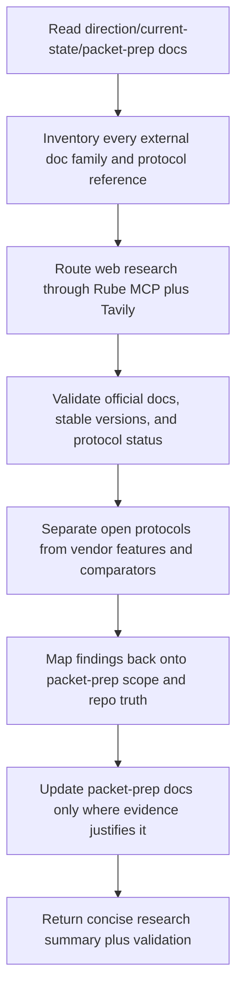

# Implementation Plan — Mister Smith Pre-Packet Rube Tavily Research Handoff

## Step 1: Example Identification

### Source Prompt (normalized from user request)

Create a handoff prompt for a fresh Codex session. The receiving session must use Rube MCP with
the Tavily app to thoroughly research the pre-packet dossier set under `docs/packet-prep/`,
extract current official documentation and protocol details, determine the most up-to-date stable
versions or revisions of anything mentioned, distinguish real protocols from product-specific
features, and then refresh the packet-prep docs if warranted.

This is a research-and-doc-grounding session. It is not a spec-writing session, code-writing
session, or implementation session.

### Embedded Examples

```text
{
  input: "use rube mcp with the tavily app",
  ideal_output: "the receiving prompt explicitly routes web research through
  RUBE_SEARCH_TOOLS, RUBE_MANAGE_CONNECTIONS, and Tavily MCP search/extract/research tools rather
  than generic browsing"
}
```

```text
{
  input: "THOROUGHLY RESEARCH and extract official doc information, most updated versions of
  anything mentioned, expanded research, the actual protocols",
  ideal_output: "the receiving prompt requires version and protocol validation against official
  sources, distinguishes protocol from product feature, and updates docs only when evidence
  justifies it"
}
```

```text
{
  input: "everything about the pre-packet docs",
  ideal_output: "the receiving prompt scopes the work to docs/packet-prep/README.md and dossiers
  022-028, then drives a complete source-and-version audit across every external reference they
  rely on"
}
```

### External Examples

#### Example 1

```text
{
  input: "docs/prompt-improver-spec/final-prompts/mister-smith-post-research-analysis-brief.md",
  ideal_output: "a handoff prompt that is clear about objective, authority order, anti-patterns,
  output sections, and verification while staying on the research side of the boundary"
}
```

#### Example 2

```text
{
  input: "docs/prompt-improver-spec/final-prompts/mister-smith-post-packet-020-next-phase-spec-handoff.md",
  ideal_output: "a repo-grounded handoff prompt that uses structured reading order, strong
  non-goals, and explicit stop conditions without pre-solving the task"
}
```

### What The Examples Demonstrate

- the prompt must explicitly drive Rube MCP and Tavily rather than generic browser research
- the prompt must stay research-first and doc-refresh-first, not drift into spec authoring
- the prompt must preserve repo authority order before external docs are used
- the prompt must require official-doc and version verification for every external family mentioned
- the prompt should clarify the work without pre-solving the research findings

## Step 2: Planning Analysis

### Intent Summary

**What**: create a reusable handoff prompt for a fresh Codex session that researches and updates
the pre-spec packet-prep docs using Rube MCP plus Tavily.

**Who**: a new Codex session working inside `/Users/macmain/MisterSmith`.

**Why**: the current packet-prep docs need a deep official-doc and protocol/version audit before
future packet specs are written.

### Deployment Summary

- **Working artifacts**:
  - `docs/prompt-improver-spec/implementation_plan.md`
  - `docs/prompt-improver-spec/task.md`
  - `docs/prompt-improver-spec/walkthrough.md`
- **Temporary draft**:
  - `docs/prompt-improver-spec/final-prompts/mister-smith-pre-packet-rube-tavily-research-handoff-draft.md`
- **Production output**:
  - `docs/prompt-improver-spec/final-prompts/mister-smith-pre-packet-rube-tavily-research-handoff.md`
- **Receiving context**:
  - `docs/direction.md`
  - `docs/current-state.md`
  - `docs/packet-prep/README.md`
  - `docs/packet-prep/022-028`
  - relevant research-output authority docs
  - Rube MCP with Tavily connection and tools

### Task Flowchart



### Lessons From Examples And Current Repo Pattern

- the repo's stronger handoff prompts start with authority order, scope, and stop conditions
- prompt-improver outputs in this repo should be reusable, durable, and file-backed
- the receiving agent should be told how to route the work, not given pre-solved answers
- the prompt should forbid generic search behavior and require targeted official-doc discovery
- the prompt should require honest differentiation between:
  - open protocol
  - official vendor API or spec
  - comparator framework doc
  - product-specific feature or config model

### Chain-of-Thought Approach

Yes.

The receiving prompt should require analysis before edits:

1. read repo authority docs
2. inventory all external references in the packet-prep docs
3. validate official sources and stable versions via Tavily
4. classify what each reference actually is
5. map findings back onto packet scope and repo truth
6. update docs only where the evidence is strong enough

### Output Format

Markdown.

The receiving agent should produce:

- doc updates if warranted
- a concise final report covering:
  - what changed
  - version/protocol corrections
  - unresolved questions
  - validation results

### Variable Plan

| Variable | XML Tag | Description |
| -------- | ------- | ----------- |
| Repo root | `<repo_root>` | Working repository root |
| Packet-prep root | `<packet_prep_root>` | Directory containing the packet-prep dossier set |
| Prompt-improver root | `<prompt_improver_root>` | Prompt artifact directory |
| Direction doc | `<direction_doc>` | Canonical overall direction source |
| Current-state doc | `<current_state_doc>` | Current repo truth source |
| Research authority docs | `<research_docs>` | Supporting research-output authority docs |
| Tavily session id | `<rube_session_id>` | Rube session id to reuse once search tools are discovered |

### Structural Notes

- the handoff prompt must explicitly require Rube MCP plus Tavily rather than native browsing
- it must force targeted vendor/protocol research instead of generic low-signal searches
- it must preserve the repo's authority order and current-truth rules
- it must keep the task on documentation and research refresh, not spec writing or implementation
- it should allow doc edits but keep them bounded to packet-prep unless a direct contradiction is
  found
- it should keep official-doc extraction and version auditing as first-class work, not a side note

### Ambiguities & Questions

None block execution.

The main scope is clear:

- use Rube MCP with Tavily
- research the full packet-prep doc set
- refresh official docs, versions, protocols, and compatibility framing
- do not implement or write specs

### Prompt Filename

`mister-smith-pre-packet-rube-tavily-research-handoff`

### Constraint Preservation Checklist

- [x] All "MUST" and "MUST NOT" rules preserved or strengthened
- [x] All "DO NOT" instructions preserved
- [x] Output format requirements match the user's intent
- [x] Role/persona definitions preserved
- [x] Domain-specific rules maintained
- [x] Edge case handling instructions preserved

## Step 4: Critique & Revision Plan

### Issues Identified

- Issue 1:
  `"THOROUGHLY RESEARCH and extract official doc information, most updated versions of anything
  mentioned"`
  → Problem: strong goal, but easy to turn into vague "go research everything" phrasing
  → Revision: make the research workflow concrete around source inventory, version validation, and
  protocol classification

- Issue 2:
  `"everything about the pre-packet docs"`
  → Problem: broad enough to cause scope drift into implementation or strategy rewrite
  → Revision: bind the session to `docs/packet-prep/README.md` and dossiers `022-028`, with
  explicit non-goals

- Issue 3:
  `"use rube mcp with the tavily app"`
  → Problem: if left vague, a receiving agent may revert to native web search or fail to validate
  the Rube/Tavily tool path
  → Revision: explicitly require `RUBE_SEARCH_TOOLS`, `RUBE_MANAGE_CONNECTIONS`, and Tavily
  search/extract/research tool use, with tool-result status validation

- Issue 4:
  `"actual protocols"`
  → Problem: a receiving agent could still blur protocol, API, comparator docs, and product
  features
  → Revision: add a mandatory classification step for each external family

### Areas Needing Expansion

- stronger authority-order and start-sequence language
- clearer Rube/Tavily workflow guidance and status checks
- explicit anti-patterns against generic searches and fake protocol assumptions
- tighter output requirements so the session ends with useful doc updates and summary

### Structural Improvements

- move the repo authority order near the top
- add a dedicated Rube/Tavily workflow section
- add a dedicated source and version audit section
- add explicit anti-patterns and stop conditions
- add a verification checklist that proves Tavily was actually used

### Constraint Preservation Check

- [x] All MUST and MUST NOT preserved
- [x] All DO NOT preserved
- [x] Output format requirements preserved
- [x] Role/persona preserved
- [x] Domain-specific rules preserved
- [x] Edge case handling preserved
