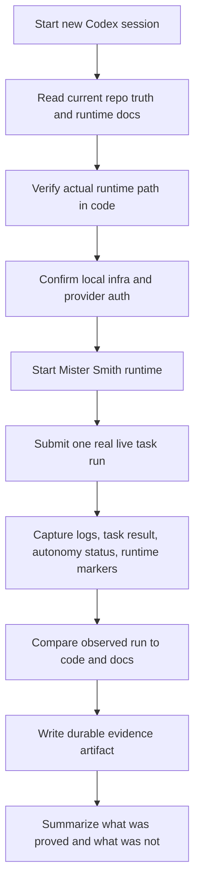

# Implementation Plan — Mister Smith Live Run Trace Evaluation Prompt

## Step 1: Example Identification

### Source Prompt (normalized from user request)

Create a prompt for a new Codex session that goes through a live run of Mister Smith and evaluates
and traces the run thoroughly.

### Normalized Example

```text
{
  input: "Run Mister Smith live, trace the execution deeply, and evaluate what the run proves.",
  ideal_output: "A prompt for a new Codex session that first verifies current repo truth, performs
  a real live runtime-backed run, captures runtime/task/autonomy evidence, compares observed
  behavior to the code path and current docs, and leaves a durable evidence artifact with explicit
  proof boundaries and remaining gaps."
}
```

### What the example demonstrates

- the receiving agent must do a real run, not a static audit
- repo truth must come from current code and runtime behavior, not old docs or Linear alone
- the run must be traced through multiple evidence surfaces, not just "it completed"
- validation boundaries must stay explicit: live evidence versus inference
- the prompt should produce durable artifacts, not only an ephemeral terminal summary

---

## Step 2: Planning Analysis

### Intent Summary

**What**: A high-quality handoff prompt for a new Codex session that executes a real Mister Smith
live run and then evaluates the run thoroughly against current code, runtime evidence, and repo
state.

**Who**: A frontier-capable Codex session with repo access, terminal access, and the ability to run
local infrastructure and inspect code.

**Why**: The repo has moved significantly. The user wants a fresh session to validate current
behavior from code and runtime truth, not from historical assumptions.

### Deployment Summary

- **Target environment**: a new Codex session in `/Users/macmain/MisterSmith`
- **Primary task**: run Mister Smith live and trace the run end to end
- **Secondary task**: compare observed behavior to current code and current-state docs
- **Expected outcome**: one durable evidence note plus a concise conclusion on what the run proves,
  what remains unproven, and any mismatches

### Task Flowchart



### Lessons From Repo State

- `docs/current-state.md` is now the broad state router and must be read early.
- `docs/plans/2026-03-18-ms-76-runtime-wiring.md` records the current runtime-wiring truth and the
  exact runtime markers worth checking during a live run.
- The current default runtime path is provider-backed on `openai_chatgpt` / `gpt-5.4`; the prompt
  must not claim provider-neutral proof unless that is actually run.
- The prompt should steer the receiving agent away from Linear/Symphony as proof surfaces unless
  they are needed for cross-checking development state rather than product runtime behavior.

### Chain-of-Thought Approach

Yes. The prompt should force this order:

1. orient on repo truth
2. verify current code path
3. run live
4. collect evidence
5. compare and explain

This keeps the receiving agent from jumping straight to commands or from over-trusting old docs.

### Output Format

Markdown.

The improved prompt should require:

- a durable evidence note in the repo
- a concise terminal summary with proof boundaries, mismatches, and remaining gaps

### Variable Plan

| Variable | XML Tag | Description |
| -------- | ------- | ----------- |
| Repo root | `<repo_root>` | Absolute repo path for the new session |
| Evidence note path | `<evidence_note_path>` | Durable note path for the session's findings |
| Primary task description | `<live_task_description>` | The real task to submit through the runtime |
| Base URL | `<base_url>` | Runtime HTTP base URL if it differs from default |

### Structural Notes

- start with repo truth, not implementation guesses
- keep the prompt focused on one honest live run plus deep tracing
- require the receiving agent to compare observed behavior against specific current code surfaces
- make provider/model selection explicit if the code still uses a fixed provider path
- require explicit stop conditions for auth, infra, or runtime blockers

### Ambiguities & Questions

None. The user asked for a prompt, not a broader planning packet, and the repo already contains the
needed current-state and runtime-wiring context.

### Prompt Filename

`mister-smith-live-run-trace-evaluation`

### Constraint Preservation Checklist

- [x] Live run requirement preserved
- [x] Deep tracing requirement preserved
- [x] Current code truth takes priority over historical docs
- [x] Durable artifact requirement added
- [x] No assumption that provider-neutral proof already exists

---

## Step 4: Critique & Revision Plan

### Issues Identified

1. **A live-run prompt can become too command-heavy.**
   Problem: It can turn into a shell script instead of a session brief.
   Revision: Keep commands illustrative only where they reduce ambiguity; keep the brief centered
   on objectives, evidence, and stop conditions.

2. **A tracing prompt can drift into solving the runtime bug space before the run happens.**
   Problem: The receiving agent could front-load speculative fixes.
   Revision: Require proof first, then root-cause analysis only if the run fails or the trace
   reveals a mismatch.

3. **Older runtime-proof docs are partially historical.**
   Problem: The receiving agent could treat March 15 and March 16 notes as current truth.
   Revision: Require those notes to be treated as historical context and force comparison against
   `docs/current-state.md` and current code.

4. **Linear can mislead the run evaluation if treated as the truth source.**
   Problem: Issue state is not runtime proof.
   Revision: Explicitly demote Linear and Symphony to optional cross-checking surfaces, not primary
   evidence.

5. **The prompt needs exact markers to verify MS-76 runtime wiring.**
   Problem: "trace thoroughly" is vague without concrete markers.
   Revision: Require checks for lifecycle, workflow runner, ToolBus execution boundary, routing
   history, topology, and step result metadata where present.

### Areas Needing Expansion

- exact evidence surfaces to inspect after the run
- what a durable evidence note must contain
- stop conditions and escalation rules

### Structural Improvements

- add a short "mission" section
- split the work into ordered phases
- add an explicit evidence checklist
- add a clear "do not claim" section

### Constraint Preservation Check

- [x] Live run remains the center of the task
- [x] Tracing remains thorough rather than superficial
- [x] Current code truth remains primary
- [x] The prompt does not pre-solve the runtime evaluation
