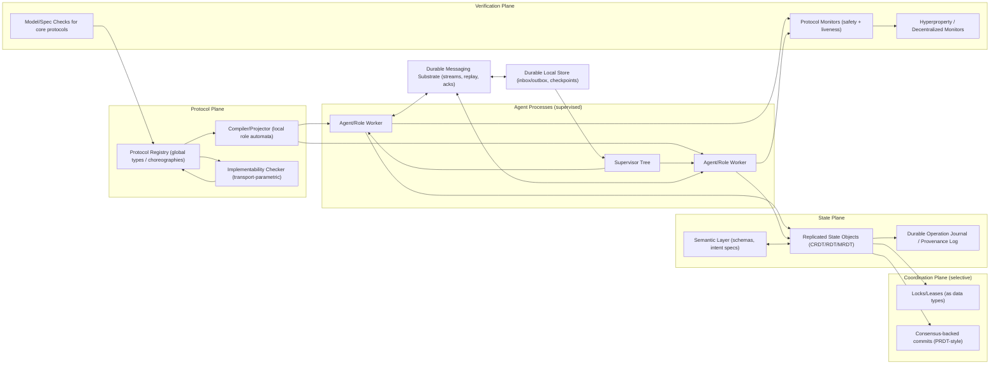
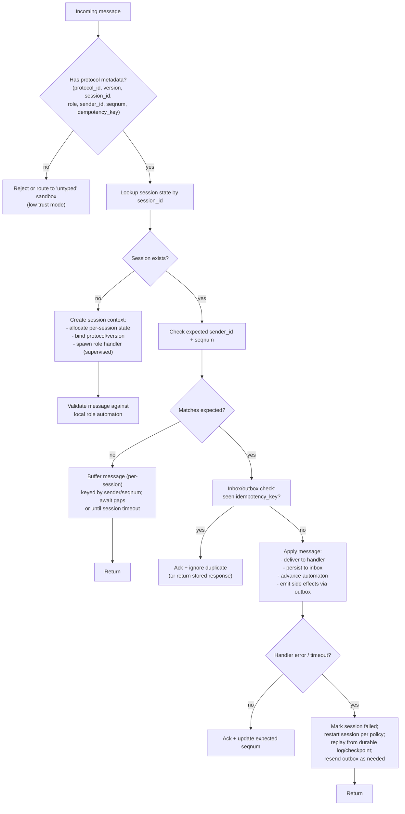
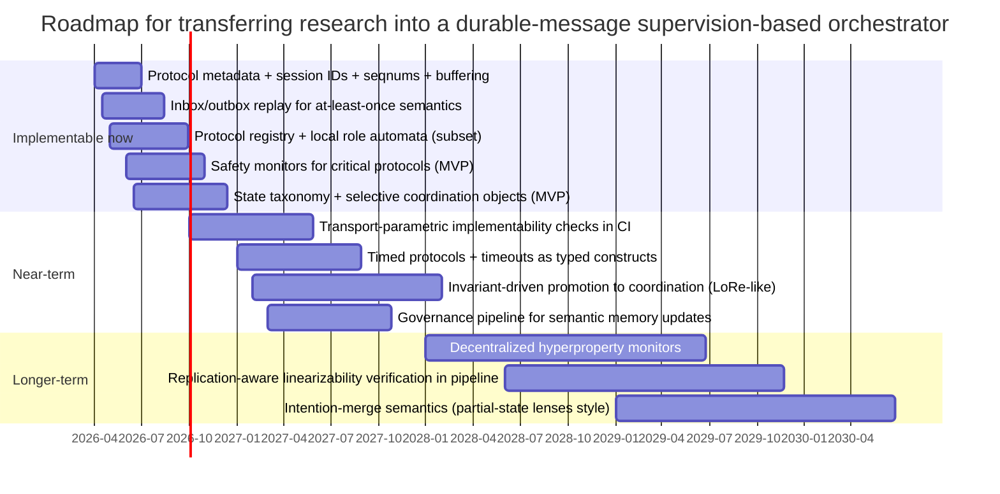

# Reliable Multi-Agent Coordination with Evolving State and Protocols (2020–2026)

## Executive summary

Recent research (2020–2026) converges on a layered answer to “reliable multi-agent coordination with evolving state and protocols”: treat **control flow** and **shared state** as separate artifacts, and make both **machine-checkable**, while adding a third “selective coordination” layer that is invoked only when invariants demand it. This is strongly reinforced by (i) resilient choreographic runtimes that require durable messaging plus replay/checkpoint mechanisms, (ii) multiparty/session type work that is now explicitly transport-semantics-aware, and (iii) mixed-consistency and verification work that automates where strong coordination is actually necessary. citeturn11view0turn9view1turn9view3turn6search7turn7search0

For a Rust-based orchestration OS with durable messaging and OTP-like supervision, the highest-confidence transfer is a “four-plane” architecture:

- **Protocol plane:** global protocol definitions compiled to local role automata (or endpoint APIs), with explicit protocol metadata in every message envelope, and implementability checks parameterized by the actual network/buffer semantics. citeturn9view1turn25view0turn20view0turn11view0  
- **State plane:** a replicated-state substrate based on CRDT/RDT families, with explicit contracts about what is “convergent by design” and what requires coordination (locks/leases/consensus-backed commits). citeturn6search22turn6search4turn6search7turn7search0turn6search2  
- **Verification plane:** runtime verification for protocol conformance and system invariants (including liveness), plus decentralized monitoring for cross-agent and hyperproperty-style requirements. citeturn15view0turn5search21turn5search10turn16view0  
- **Arbitration/coordination plane:** composable coordination primitives modeled as data types (locking as an ARDT; consensus as PRDT-style replicated knowledge), invoked selectively and minimally. citeturn7search0turn6search2turn9view3  

Across the requested dimensions, the most implementable-now ideas are: (1) protocol metadata + per-session role state machines + buffering/replay patterns inspired by resilient choreographic runtimes; (2) selective strong coordination driven by invariant analysis; (3) runtime monitors for protocol safety plus liveness detection, with a path to decentralized hyperproperty monitors for system-wide guarantees; and (4) “governed semantic updates” to long-lived shared memory (impact analysis + conflict surfacing) rather than silent semantic merges. citeturn11view0turn9view3turn23view0turn15view0turn8search5

## Assumptions and target architecture

This report assumes a target similar to: a Rust runtime coordinating many independent agent processes (or agent-like services) using pub/sub + durable streams, with crash/restart as a normal condition (supervision trees), and a long-lived durable state store that agents read/write over time. The trust model assumed is **crash fault + Byzantine-rare** (i.e., malicious participants are not the default design center), but we call out where Byzantine-tolerant CRDT work would matter if federation becomes a goal. citeturn11view0turn7search14

Messaging assumptions are consistent with JetStream-style persistence: durable streams enable replay, and consumers can provide at-least-once delivery (with optional exactly-once outcomes via dedup/double-ack patterns). citeturn18search6turn18search2turn18search10turn18search35 In such a substrate, **duplicates, reordering, and delayed delivery** must be treated as first-class, not as edge cases. This matches why implementability results differ under FIFO/mailbox/multiset “mailbag” network models, and why runtimes like Accompanist attach explicit metadata (session IDs, sender IDs, sequence numbers) and buffer out-of-order messages. citeturn9view1turn11view0

When needed, the report uses the following scale assumptions for concreteness (because some tradeoffs depend on scale): 10–1,000 concurrent agents per cluster, message rates from ~10³–10⁶/day per cluster, and latencies that vary from sub-millisecond intra-node to WAN-scale for cross-zone deployments. These are not claims about Mister Smith; they are merely modeling assumptions to categorize what is feasible now versus later. citeturn9view1turn11view0turn24view0

## Multiparty/session typing and choreographies

### Why transport semantics and implementability are now central

A key shift in 2024–2026 is that “a protocol is well-typed” is no longer treated as sufficient; whether a global protocol is implementable can depend on the **network architecture/buffer semantics**. The Sprout(A) work introduces “network-parametric implementability” and shows formal differences among architectures (including mailbox vs unordered “mailbag” semantics), with examples where a protocol becomes implementable again under mailbag even without certain repairs needed for mailbox. citeturn9view1 This is directly relevant to any messaging substrate where ordering and buffering depend on subject topology, consumer configuration, and replay behavior. citeturn18search6turn9view1

Complementing Sprout(A), 2025 work on implementability for protocols with infinite states and data argues that implementability checks should not be deferred (e.g., by permissive projection) and analyzes how non-implementability can arise from insufficient local information in control flow and data (dependent refinements), motivating more principled implementability checking/repair. citeturn13view0

### Toolchains and actor/actor-like integration

The “tooling signal” is unusually strong compared to earlier MPST literature. For Rust specifically:

- Rumpsteak targets async/await and is motivated by the fact that reordering sends/receives for performance can introduce subtle bugs; it uses MPST-based theory (k-multiparty compatibility and async subtyping) and reports significant efficiency gains over prior Rust approaches (1.7×–8.6× in its evaluation). citeturn26view0  
- MultiCrustyT extends a Scribble-based Rust toolchain with **time constraints and timeouts**, claiming static guarantees that timed asynchronous communication is deadlock-free and “fearless” w.r.t. timeout errors/abrupt terminations, with negligible overhead in evaluated examples. citeturn4search2turn3search2  
- A 2024 refinement framework provides a Rust toolchain for decentralized refined multiparty protocols, emphasizing specification-agnostic refinement theory and reporting negligible refinement overhead. citeturn1search0turn1search11  

For actor-like integration and failure handling:

- Maty (2026) is an actor-language design with static MPST and explicit failure handling: it enforces session typing via a flow-sensitive effect system and uses an event-driven style with first-class message handlers, and it extends the calculus with Erlang-style supervision and cascading failure while preserving metatheory. citeturn12view0turn12view1turn12view3  
- EnsembleS (2021) addresses **runtime adaptation** (discovery/replacement of components) with multiparty session types and explicit connection actions, aiming to check protocol compatibility when new components are discovered at runtime. citeturn2search23turn2search0  
- Teatrino (ECOOP 2023) incorporates crash-stop semantics into asynchronous MPST by adding crash handling branches, claiming deadlock-freedom, protocol conformance, and liveness “by construction” even with crashes, and implements code generation by extending Scribble and targeting Scala/Effpi. citeturn3search0turn3search4turn3search18  
- Mixed-choice asynchronous MPST (2026) explicitly models race-like patterns by allowing transient inconsistencies in participants’ local protocol views while proving progress/operational correspondence; it includes a prototype toolchain that generates Erlang/OTP gen_statem code and tests on RabbitMQ Erlang client protocols. citeturn25view0turn0search3  

On choreographies, the endpoint-projection lineage is now accompanied by runtimes that explicitly target failures and existing service ecosystems:

- Accompanist (2026) is a resilient runtime for Choral choreographies, designed to deploy “sidecars” alongside existing services; it assumes deterministic choreographies and idempotent saga steps, and relies on durable queues plus replay to mask faults. citeturn11view0  
- Ozone (ECOOP 2024) develops a model for safely executing choreographies “out of order” (e.g., via futures) while preventing communication integrity violations and deadlocks, with evaluation suggesting latency/throughput improvements from overlapping communication and computation. citeturn22view0  
- Chorex (2025) integrates choreographies into Elixir and explicitly tolerates actor crashes by restarting actors, restoring checkpoints, and updating network configuration for all actors, with measured checkpointing overhead. citeturn21view0  
- GoScr/DMst (2023) addresses **evolving protocols** by supporting dynamic participant introduction (“new role”) and “updatable recursion,” generating Go code from projected local protocols. citeturn20view0  

### Practical implications for a Rust orchestration OS

The transferable lesson for a durable-message orchestration OS is: **protocol is metadata-bearing state**, not just “a convention.” Accompanist demonstrates that a resilient runtime can multiplex many concurrent sessions by mapping each session to a lightweight execution context and attaching explicit per-message headers—Session ID, Choreography ID, Sender ID, Seqnum, and telemetry metadata—and buffering out-of-order messages based on expected sender/sequence state. citeturn11view0 This is directly aligned with a messaging substrate that may reorder or redeliver. citeturn18search6turn18search2

Separately, Sprout(A) implies that protocol validation should be parameterized by the *transport semantics you actually deploy*, because implementability can change under different buffering/ordering models. citeturn9view1

### Comparison table of protocol/choreography candidates

The table below is an engineering-oriented comparison (maturity/cost/complexity are **assessment labels**; factual feature claims are sourced in the notes immediately after).

| Candidate technique/tool | Maturity (2020–2026) | Rust tooling signal | Typical runtime cost | Integration complexity | Failure semantics emphasis | Recommended use-cases in a NATS/JetStream-like OS |
|---|---:|---|---|---|---|---|
| Rumpsteak (async MPST in Rust) | early-adopter research prototype | strong (Rust-native) | low–medium (type-level + compile-time checks) | medium | safety/deadlock freedom under async reordering | performance-sensitive, statically shaped protocols between stable roles |
| MultiCrustyT (timed MPST in Rust) | research prototype w/ artifacts | strong (Rust toolchain) | low–medium | medium–high | timeouts + time-failure handling | any protocol where timeouts are part of correctness (retries, tool deadlines) |
| Decentralized refined protocols toolchain (Rust, 2024) | research prototype | strong (Rust toolchain) | medium (refinement evaluation) | high | data-dependent constraints | flows where payload constraints prevent latent protocol bugs (e.g., resource claims) |
| Sprout(A) (implementability modulo network architectures) | research tool (checker) | indirect (can be integrated) | offline analysis cost | medium | deadlock freedom + fidelity under specific arch | pre-flight validation of critical global protocols against your transport semantics |
| Teatrino (crash-stop MPST codegen, Scala/Effpi) | research tool w/ artifact | weak (not Rust) | medium (failure branches) | high | crash-stop + liveness | blueprint for crash-aware protocol modeling even if you re-implement in Rust |
| Maty (actor + MPST + supervision, Scala) | research prototype | weak (not Rust) | medium | high | supervision + cascading failure | design reference for integrating MPST with supervision semantics |
| Accompanist (resilient choreography runtime) | fresh research runtime | indirect (runtime pattern transfer) | medium (headers, buffering, replay) | medium–high | timeout/restart + inbox/outbox | blueprint for session metadata, buffering, replay, and saga-style compensation |
| GoScr/DMst (dynamic participants, updatable recursion) | research tool | weak (Go) | medium | high | protocol evolution + dynamic roles | inspiration for protocol-versioning and dynamic role introduction |
| Ozone (out-of-order choreographies) | research model + API | indirect | medium | medium | asynchrony without CIVs | design input for “speculative/out-of-order” execution within safe boundaries |
| Chorex (restartable choreographies for Elixir) | research language | weak (Elixir) | medium (checkpointing) | medium | crash recovery via checkpoint/rescue | concrete pattern for restart + state restore in actor ecosystems |

**Sourcing for factual features:** Rumpsteak’s async Rust focus and reported speedups are from its paper abstract. citeturn26view0 MultiCrustyT’s timed MPST and “fearless” timeout handling claims are from its paper abstract. citeturn4search2 The 2024 refined protocol Rust toolchain and negligible overhead claim are from the refinement paper. citeturn1search0turn1search11 Sprout(A)’s network-parametric implementability framing and mailbag/mailbox contrast are from its PDF. citeturn9view1 Teatrino’s crash-stop semantics and correctness-by-construction claim are from its ECOOP paper abstract. citeturn3search0turn3search18 Maty’s actor+MPST+supervision and effect-system enforcement are from its PDF. citeturn12view1turn12view3 Accompanist’s headers/session model/buffering/inbox-outbox replay are from its PDF. citeturn11view0 GoScr/DMst’s “new role” and updatable recursion are from its PDF. citeturn20view0 Ozone’s out-of-order choreography model and futures API claim are from the ECOOP artifact page. citeturn22view0 Chorex’s crash recovery by checkpoint/respawn/network update is from its paper abstract/introduction. citeturn21view0

## Runtime verification and decentralized monitors

### From “types prove safety” to “monitors enforce reality”

A recurring theme is that static protocol typing is powerful but incomplete in practice: real systems evolve, integrate dynamic components, and encounter runtime failures that can violate assumptions. This drives a “belt-and-suspenders” approach: compile-time checks for what can be made static, plus runtime verification for what must be observed dynamically. citeturn15view0turn2search23turn11view0

Discourje is a concrete illustration. The earlier Discourje framework provides runtime verification for channel-based protocols in Clojure and reports low overhead in benchmarks (often <5% in evaluated programs). citeturn5search7 The 2024 “Live at Last” extension explicitly adds detection of **liveness violations** (communication deadlocks) using “mock channels” to test whether a contemplated channel action would lead to a total deadlock, addressing a limitation of purely safety-focused runtime checks. citeturn15view0

### Decentralized monitor synthesis and hyperproperties

As coordination systems scale, many requirements are not single-trace (“this agent never does X”) but **hyperproperties** (“no two agents finalize conflicting outcomes,” “every accepted task eventually either completes or compensates,” “observed histories admit a linearization,” etc.). Recent work makes this tractable:

- “Centralized vs Decentralized Monitors for Hyperproperties” synthesizes monitors from a hyperlogic (Hyper-recHML / HypermuHML variants) and proves soundness and violation-completeness both for centralized omniscient monitoring and for decentralized monitoring where monitors communicate to reach a verdict, with correctness supported via bisimulation arguments. citeturn5search21turn5search26  
- “Monitoring Hyperproperties over Observed and Constructed Traces” (2025) introduces *active quantification* via generator functions that can construct traces not observed at runtime (e.g., linearizations of concurrent traces), enabling monitoring of some asynchronous hyperproperties with alternating quantifiers, and includes an implemented/evaluated algorithm. citeturn16view0  

For a multi-agent orchestrator, these results matter because “system correctness” often means properties across many sessions and agents, not just per-message safety. citeturn5search21turn16view0

### Runtime verification meets real distributed coordination software

The ZooKeeper verification experience report is a strong practical anchor: the authors used TLA+ and model checking to verify a complex evolving coordination system, explicitly addressing “model-code gaps” through multi-grained specifications, finding six severe bugs, verifying fixes, and improving protocol design. citeturn5search10turn5search12turn5search19 This is evidence that formal/spec-driven verification scales beyond toy protocols when done with careful spec layering. citeturn5search10turn5search3

### Comparison table of monitoring/verification candidates

| Candidate technique/tool | Maturity (2020–2026) | Rust tooling signal | Typical runtime cost | Integration complexity | Failure semantics emphasis | Recommended use-cases in a multi-agent orchestration OS |
|---|---:|---|---|---|---|---|
| Discourje (dynamic MPST runtime verification) | mature-ish (industrial-feasible library) | weak (Clojure) | low–medium overhead | medium | safety + (2024) liveness deadlock detection | fast feedback during integration; “guardrails” for protocolized flows |
| Hyperproperty monitor synthesis (centralized/decentralized) | research-grade, proofs | indirect (logic/algorithm transferable) | potentially high (depends on property) | high | violation-complete monitoring of sets of traces | system-level safety properties, cross-agent invariants |
| Hyperproperty monitoring w/ constructed traces | research-grade, implemented | indirect | medium–high | high | monitor linearizability-like properties from observations | auditing and “global correctness” monitors for critical workflows |
| TLA+/model checking w/ multi-grained specs (ZooKeeper-style) | mature in DS practice | tool-agnostic | offline/CI cost | medium–high | safety invariants; spec/code gap management | a small set of core coordination subprotocols that must be rock-solid |

**Sourcing for factual features:** Discourje’s base approach and overhead claim are from the 2020 paper page. citeturn5search7 Discourje’s liveness extension and “mock channels” approach are from the 2024 technical report. citeturn15view0 Decentralized hyperproperty monitor synthesis soundness/violation-completeness is from the CONCUR/TOCL versions. citeturn5search21turn5search26 Constructed-trace hyperproperty monitoring (generator functions, linearizations) is from the 2025 arXiv abstract. citeturn16view0 ZooKeeper bug-finding and multi-grained spec approach are from the EuroSys paper sources. citeturn5search10turn5search19

## Replicated state: CRDT families, verification, PRDTs, and mixed consistency

### CRDT families and the op-based vs state-based tradeoff is no longer “handwavy”

The CRDT literature traditionally split into state-based (CvRDT) and op-based (CmRDT) approaches, with delta-state CRDTs used to reduce state dissemination overhead. citeturn6search22turn7search3 What’s changed recently is more precision about what “equivalence” between these families actually means.

“CRDT Emulation, Simulation, and Representation Independence” (2025) formalizes emulation between op-based and state-based CRDTs as simulations between transition systems, emphasizing that emulation depends on network assumptions (causal ordering, message granularity), and derives a **representation independence** result: clients should not be able to tell whether they are interacting with a state-based or op-based implementation (under the formal conditions). citeturn6search1turn6search22

This matters for an orchestration OS because it supports an architectural promise: you can begin with one CRDT dissemination strategy (e.g., op-based events over streams) and later move to state/delta dissemination without changing higher-level correctness contracts—*if* you explicitly track the underlying assumptions and satisfy them. citeturn6search22turn18search6

### Replication-aware linearizability and “stronger than SEC” specs

Strong eventual consistency (SEC) is often too weak for users who need a relation between a replica’s state and the set/order of updates it has received. “Automatically Verifying Replication-aware Linearizability” (2025) presents an automated technique for verifying replication-aware linearizability for mergeable replicated data types (MRDTs), introducing algebraic properties beyond simple commutativity/associativity/idempotence and applying the approach to complex designs including a JSON MRDT. citeturn6search4turn6search8turn6search0

For agent coordination, this supports a practical principle: when agents read local replicas, you may want guarantees stronger than SEC for specific classes of state (e.g., “the local view is consistent with some linearization of updates you have received”), because it enables simpler, sequential reasoning in higher layers. citeturn6search4turn16view0

### Mixed-consistency patterns and taxonomy of state classes

LoRe (2023/2024) frames local-first development as a verification + compilation problem: specify invariants, and have the system automatically determine which interactions can remain weakly consistent and where coordination (strong consistency) must be selectively employed. citeturn9view3turn6search17turn6search3 CONLOC (2024/2025) offers a related direction: developers annotate invariants, and a compiler/middleware maps methods to Weak vs Strong; its middleware uses actor messaging and relies on a coordination service (ZAB via ZooKeeper) for strong operations. citeturn23view0

A transferable taxonomy for an orchestration OS is:

- **Convergent replicated state (CRDT/RDT-friendly):** append-only facts, provenance logs, tool outputs, derived artifacts, partial results, “observations,” caches, and metadata where monotonicity or join-semilattice structure is natural. citeturn6search22turn24view0turn18search31  
- **Invariant-critical state (coordination-triggering):** resource reservation, uniqueness, “exactly-once” external effects, terminal workflow transitions, admission control, and any state whose invariants can be violated by concurrent updates (classic counterexample: bank account not going negative). citeturn23view0turn9view3  
- **Coordination primitives as reusable state objects:** locks/leases, bounded counters/escrow, membership/roster metadata, and consensus-backed commits—ideally implemented as composable replicated data types rather than ad hoc “special case” subsystems. citeturn7search0turn6search2turn9view3turn18academia38  

### Coordination “as a data type”: ARDTs, programmable locks, and PRDTs

A notable research trajectory is that coordination mechanisms themselves should be programmable and composable:

- “Distributed Locking as a Data Type” (2024) proposes implementing locking protocols as Algebraic Replicated Data Types (ARDTs), arguing that existing mixed-consistency models bake in coordination strategies and make assumptions that reduce portability; ARDTs are presented as a minimal-assumptions, composable approach, and the paper provides two locking protocols as ARDT case studies. citeturn7search0turn7search4  
- PRDTs (2025) propose implementing consensus protocols as replicated data types (monotonically accumulating “knowledge” until agreement), enabling protocol building blocks and arguing that the approach does not impose inherent performance limitations preventing real-world use. citeturn6search2turn17view0  

The practical transfer is that “coordination” should be a library of durable, inspectable replicated objects—usable from many workflows—rather than hidden inside a single coordinator module. citeturn7search0turn6search2turn11view0

### Pub/sub-oriented CRDT propagation for high-churn environments

If the orchestration OS supports dynamic agent membership and churn, publish/subscribe CRDT models are especially relevant. PS-CRDTs (2023) explicitly combines CRDTs with publish/subscribe to decouple update propagation spatially and temporally, targeting volatile environments where replicas cannot assume stable peer knowledge, and reports experimental evidence of practicality and lower communication than other CRDT-based approaches in such settings. citeturn24view0

This is a strong conceptual match for “agents subscribe to streams of updates” as a baseline dissemination strategy. citeturn24view0turn18search6

### Byzantine-aware replicated state (optional, longer-term)

If federation across partially trusted parties becomes important, Blocklace (2024) proposes a partially ordered, signed, hash-linked DAG CRDT that can detect and eventually exclude equivocating Byzantine nodes, claiming a Byzantine node can only harm a finite prefix of computation. citeturn7search2turn7search14 This is not necessary for many single-operator deployments, but it is one of the few CRDT results in the period that treats adversarial participants as first-class. citeturn7search14

### Comparison table of replicated state and coordination substrates

| Candidate technique/tool | Maturity (2020–2026) | Rust tooling signal | Typical runtime cost | Integration complexity | Failure semantics emphasis | Recommended use-cases in a multi-agent orchestration OS |
|---|---:|---|---|---|---|---|
| CRDT emulation + representation independence (theory) | research/theory | indirect | n/a (design-time) | medium | depends on network assumptions | guidance for safely swapping op/state/delta dissemination strategies |
| Replication-aware linearizability verification (MRDT/CRDT) | research prototype, automated | indirect | n/a (verification cost) | high | stronger reasoning contract than SEC | “critical” shared state where sequential reasoning is desired |
| LoRe (verified mixed-consistency compilation) | research prototype | indirect | n/a (compiler + runtime coordination) | high | selective coordination from invariants | designing invariant-driven “weak-by-default” shared state |
| CONLOC (weak/strong method classification + middleware) | research prototype | indirect (Java/Akka middleware) | medium | high | strong ops via coordination service | reference design for auto-promoting specific methods to strong consistency |
| ARDT-based programmable locking | research work-in-progress | indirect | medium (protocol overhead) | high | coordination as replicated object | reusable locks/leases in a durable state store |
| PRDTs (consensus as replicated data types) | research prototype | indirect | medium | high | consensus/strong consistency | reusable consensus-backed transitions, membership, commits |
| PS-CRDT (pub/sub CRDT propagation) | research validated (journal) | indirect | low–medium | medium | churn-friendly propagation | dynamic membership, pub/sub-first replication |
| Blocklace (Byzantine-repelling CRDT substrate) | research proposal | indirect | high | very high | byzantine/equivocation handling | only for federated/hostile environments |

**Sourcing for factual features:** CRDT emulation/representation independence claims are from the 2025 CRDT emulation paper abstract/PDF. citeturn6search1turn6search22 Replication-aware linearizability verification is from the 2025 paper abstract (and ACM listing). citeturn6search4turn6search0 LoRe’s “selectively employ strong consistency” claim is from the LoRe extended abstract/PDF. citeturn9view3turn6search7 CONLOC’s weak/strong classification, use of actor messaging, and ZooKeeper coordination are in its PDF. citeturn23view0 “Distributed Locking as a Data Type” ARDT framing is in its arXiv abstract/PDF. citeturn7search0turn7search4 PRDTs’ core model and evaluation framing are in its arXiv abstract. citeturn17view0turn6search2 PS-CRDT’s pub/sub CRDT model and volatility motivation are in the journal page abstract/highlights. citeturn24view0 Blocklace’s Byzantine-repelling CRDT claims are in its abstract/PDF. citeturn7search2turn7search14

## Semantic conflict resolution and intent/ontology merge

### What “semantic merge” is actually buying you

Semantic conflict resolution addresses cases where “the bytes merge” but the meaning diverges: concurrent edits to a knowledge graph, evolving ontologies, or an agent’s long-lived “memory/specification” that guides behavior. In agentic systems, this is non-optional: as policies, goals, and environment assumptions change, the shared semantics must be updated safely without silently corrupting meaning. citeturn8search5turn8search4turn8search6

### SHIMI: asynchronous semantic merge for evolving ontologies

SHIMI (2025) proposes a semantic hierarchical memory system designed for decentralized/federated knowledge graphs; it explicitly claims CRDT-style conflict resolution and semantic merge can support asynchronous updates without requiring a global ontology agreement, aiming for eventual semantic consistency even as nodes locally evolve. citeturn8search4turn8search0 This is a plausible pattern for “shared memory among agents” where schema alignment cannot be assumed to be perfect. citeturn8search4

### SemanticCommit: governed updates to long-lived intent specifications

SemanticCommit (2025) is especially actionable because it reframes memory updates as a **change-management** task: a “semantic commit” is made to an intent specification, conflicts are detected (knowledge-graph/RAG pipeline), and the interface supports impact analysis and user-controlled resolution. In user studies, many participants preferred a workflow where conflicts are flagged first (impact analysis) and only then resolved, rather than applying global revisions immediately. citeturn8search1turn8search5turn8search9

For an orchestration OS, the transferable idea is not the UI per se, but the workflow: **treat semantic updates as proposals with explicit diffs, conflict surfacing, and impact analysis**, and require a governance step for high-blast-radius memory rewrites. citeturn8search5turn15view0

### Partial-state lenses: merging update intentions, not just values

Partial-state lenses (2026) provide a formal model for bidirectional transformation when multiple views share a source, representing user update intentions as partially specified states with a partial order; the framework defines semantics for merging intentions and a refined update preservation notion compatible with merged intentions. citeturn8search2turn8search6

Even if not adopted directly, the core transfer is conceptual: “conflict resolution” should often merge **intentions** (constraints, partial orders, priorities), not just last-writer-wins values. That aligns with multi-agent settings where different agents act on different projections of a shared plan/state graph. citeturn8search6

### Explicit local-first semantic conflict models

A 2026 semantic conflict model for collaborative data structures argues that CRDT conflict resolution is often implicit/opaque, and proposes identifying conflicts via semantic dependencies and resolving them by rebasing conflicting operations onto a reconciling operation using three-way merge over a replicated journal—explicitly supporting local-first conflict resolution without central coordination. citeturn8academia43turn8search3

This suggests an additional pathway for an orchestration OS: keep a **replicated journal** of semantic operations and make conflict resolution a first-class workflow rather than an invisible merge. citeturn8search3turn6search22

## Practical runtime patterns, roadmap, and experiments

### Practical runtime patterns derived from the literature

The most immediately transferable runtime patterns (dimension 5) are not “fancy theory”; they are operational mechanisms already demonstrated in resilient choreography runtimes:

**Message envelope metadata is mandatory.** Accompanist shows a concrete set of headers used to multiplex many sessions and to handle failures/out-of-order delivery: Session ID, Choreography ID, Sender ID, Seqnum, and telemetry metadata; it buffers messages whose sender/sequence number does not match expected values and drops messages for timed-out/killed sessions. citeturn11view0 For a NATS/JetStream-like substrate where replay and at-least-once delivery exist, you should assume duplicates and potentially delayed/out-of-order arrivals across subjects and consumers, and therefore treat seqnums and idempotency keys as first-class. citeturn18search6turn18search2turn11view0

**Inbox/outbox replay for at-least-once with idempotent steps.** Accompanist’s fault-tolerant mode uses process-local DB tables (“inbox/outbox”) to persist received and sent messages, acknowledges receives, retries sends on timeout, ignores duplicates, and restores sessions by replaying from initial state; it explicitly depends on determinism and idempotency assumptions. citeturn10view0turn11view0 This pattern maps cleanly to durable streams and durable state because the core requirement is a durable message queue and a durable local store. citeturn11view0turn18search6

**Selective elevation to coordination, treated as a reusable primitive.** LoRe and CONLOC both encode the idea that only some operations should be “Strong,” and that the system should be able to infer or enforce which ones based on invariants. citeturn9view3turn23view0 Distributed locking as a data type and PRDTs suggest that the “Strong” mechanisms should be composable state objects rather than an opaque subsystem. citeturn7search0turn6search2

**Protocol evolution must be represented explicitly.** GoScr/DMst shows one explicit approach—dynamic participant introduction and updatable recursion—while EnsembleS shows compatibility checking for runtime adaptation. citeturn20view0turn2search23 At minimum, protocol-version metadata plus upgrade/compatibility policy must be in-band and testable. citeturn9view1turn13view0

**Telemetry correlation via session context.** Accompanist includes telemetry metadata used to correlate distributed tracing spans with sessions. citeturn11view0 This aligns with the general observability model in entity["organization","OpenTelemetry","observability framework"] (spans, trace context propagation). citeturn18search7turn18search11

### Mermaid diagram: protocol/state plane architecture

The following diagram is a concrete synthesis of the transfer: protocol plane + state plane + coordination plane + verification plane, with a durable messaging substrate and supervision/restart loops inspired by the actor/choreography work. citeturn11view0turn12view1turn9view3turn7search0

### Mermaid diagram: message handling with protocol metadata and recovery

This flowchart is essentially Accompanist’s multiplexing + buffering + durable inbox/outbox replay concepts adapted to a general message bus, combined with timeout/restart supervision semantics. citeturn11view0turn12view1turn18search2turn18search6

### Implementability timeline: now, near-term, longer-term

The following timeline (dimension 6) reflects “what is implementable” based on: the existence of toolchains (especially Rust-facing ones), the operational patterns already demonstrated in resilient runtimes, and the complexity of integrating more advanced formal monitoring. citeturn26view0turn4search2turn1search0turn11view0turn5search21turn16view0turn6search4

### Chart: maturity vs engineering effort (planning heuristic)

The scores below are intentionally coarse and should be read as prioritization aids (not scientific measurements). They are grounded in how complete the referenced artifacts are (toolchains/runtimes) and how directly they map to the OS constraints. citeturn26view0turn4search2turn11view0turn9view1turn5search21turn9view3turn8search5

```mermaid
xychart-beta
  title "Selected techniques: maturity vs integration effort (heuristic scores)"
  x-axis ["Protocol metadata + replay", "Rumpsteak-style MPST", "Timed MPST", "Transport implementability", "LoRe-like mixed consistency", "Hyperproperty monitoring", "SemanticCommit workflow"]
  y-axis "Score (1 low, 5 high)" 0 --> 5
  bar "Maturity" [4, 3, 3, 2, 2, 2, 3]
  bar "Integration effort" [3, 3, 4, 3, 4, 5, 3]
```

### Recommended research and engineering experiments for an orchestration OS

The experiments below are framed to answer: “Does the research transfer under durable messaging + supervision + evolving state?”

**Protocol-plane experiments (session typing/choreographies):**

A high-value experiment is to implement a **minimal protocol runtime** that matches Accompanist’s “session multiplexing” behaviors: per-session execution context, required headers (session_id, protocol_id/version, sender_id, seqnum), buffering, and strict checking against a per-role automaton. Accompanist provides a specific header set and buffering behavior that can be directly replicated. citeturn11view0

Separately, implement a “protocol CI” step that checks implementability of critical global protocols against several abstract transport models (FIFO per peer, mailbox, unordered multiset), following Sprout(A)’s transport-parametric framing. Even if you do not re-use Sprout(A)’s tool directly, its model is a blueprint for what conditions to validate. citeturn9view1

**Verification-plane experiments (runtime monitors):**

Adopt a two-tier monitoring strategy: first, integrate local protocol monitors (safety) and add liveness detection at least for deadlocks/timeouts using a Discourje-style idea (simulate permitted next steps before committing). citeturn15view0turn11view0 Then, pick one system-level hyperproperty (e.g., “no two conflicting finalizations”) and prototype a decentralized monitor, using the monitor synthesis work as conceptual guidance for sound/violation-complete monitors. citeturn5search21turn5search26

**State-plane experiments (replicated state + coordination):**

Choose 3–5 shared-state objects and deliberately place them on the state taxonomy. For at least one object, test both op-based and state/delta dissemination modes while keeping the higher-level API stable—this aligns with the CRDT emulation/representation independence result and will reveal which network assumptions you are implicitly relying on. citeturn6search22turn18search6

For one invariant-critical object (e.g., “resource reservations never exceed capacity”), implement two variants: (i) fully coordinated (lock/consensus-backed), and (ii) mixed-consistency where the system elevates only specific methods/operations to coordinated mode. LoRe and CONLOC provide two different “invariant-driven coordination” framings to draw from. citeturn9view3turn23view0

Finally, prototype one coordination primitive as a durable, reusable object (lock as ARDT-style or a PRDT-like monotonic knowledge accumulation) and test whether multiple workflows can share it without bespoke implementation. citeturn7search0turn6search2

**Semantic conflict resolution experiments:**

Treat “shared memory update” as a semantic commit pipeline: store a structured memory graph/spec, compute diffs when updates happen, run conflict detection + impact analysis, and require explicit resolution for high-impact updates. SemanticCommit provides evidence that impact analysis-first workflows can be preferred in practice. citeturn8search5turn8search1 If your memory graph uses evolving ontologies, SHIMI provides a model of asynchronous semantic merge without global ontology agreement. citeturn8search4

## Risks, open problems, and mitigations

### Transport/protocol mismatch is an evergreen risk

A core risk is encoding “protocol correctness” under an assumed transport semantics that does not match deployment reality. Sprout(A) shows implementability can differ under mailbox vs unordered multiset buffering, and global protocol validation must be parameterized by the network/buffer architecture. citeturn9view1 **Mitigation:** make transport assumptions explicit in the protocol registry and CI checks, and attach protocol/version metadata to every message so that mismatches fail loudly rather than silently. citeturn11view0turn13view0

### Failure handling semantics are subtle and can conflict with protocol typing

Crash-stop handling in session-typed systems often requires explicit modeling of crash branches, cancellations, timeouts, or retry paths. Teatrino shows one approach (crash handling branches added to async MPST), while Maty extends an actor MPST system with supervision/cascading failure semantics. citeturn3search18turn12view1 **Mitigation:** design a small number of standardized failure motifs (timeout + retry, cancellation + compensation, “let-it-crash” with restart) and bake them into your protocol DSL and runtime semantics early. citeturn11view0turn4search2turn12view2

### Monitoring can become expensive, but “no monitoring” is worse for global properties

Hyperproperty monitoring and decentralized monitors can impose high overhead and coordination costs, especially if the property requires relating many traces/sessions. citeturn5search21turn16view0 **Mitigation:** restrict hyperproperty monitors to a small set of invariants with the highest potential harm (e.g., conflicting external commitments), and implement them as sampled/audited monitors first; keep per-session safety monitors lightweight and local. citeturn15view0turn5search10

### Mixed-consistency automation is promising but not “push-button” yet

LoRe and CONLOC show that invariant-driven selective coordination is feasible, but both rely on explicit invariant specifications and nontrivial analysis/tooling. citeturn9view3turn23view0 **Mitigation:** begin with a hand-curated state taxonomy and a small set of reusable coordination objects (locks/leases/consensus-backed commits), and only later attempt automated classification of operations, using LoRe/CONLOC as north stars. citeturn7search0turn6search2turn23view0

### Semantic merge is still an open frontier, especially under concurrency

SHIMI, SemanticCommit, and partial-state lenses illustrate three different “semantic merge” approaches (ontology-level merge, governed natural-language intent updates, and formal intention merge), but the space is not mature enough to treat semantic conflict resolution as solved for arbitrary agent memory. citeturn8search4turn8search5turn8search6 **Mitigation:** treat semantic updates as governed changes with explicit conflict surfacing and durable journals; prioritize transparency and reversibility over automatic merges. citeturn8search5turn8academia43

### Governance and multi-tenant correctness (if needed later)

If the system evolves toward partially trusted federation, you will need stronger assumptions and designs (Byzantine-aware CRDT substrates, stronger identity/audit mechanisms). Blocklace is an existence proof for Byzantine-repelling CRDT-style replication, but adoption cost is high. citeturn7search14 A pragmatic mitigation is to begin with crash-fault assumptions and add an “auditability layer” (durable provenance + replay) so that future hardening is possible without re-architecting everything. citeturn11view0turn6search22