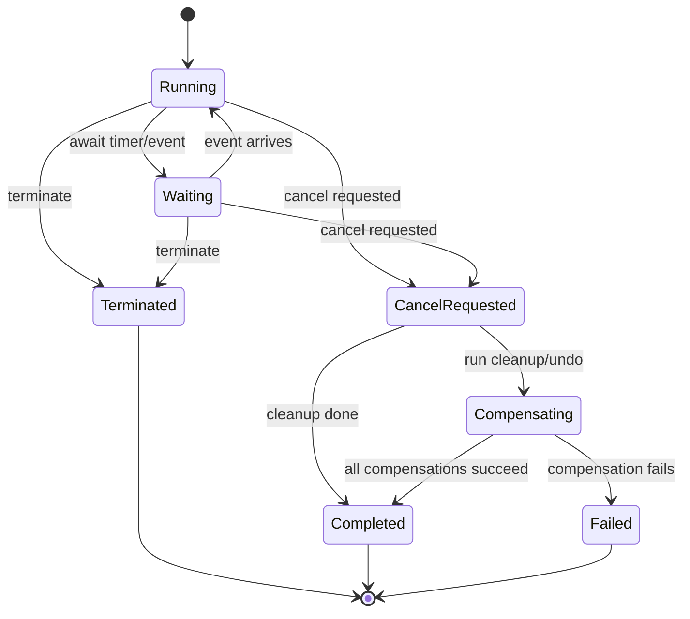
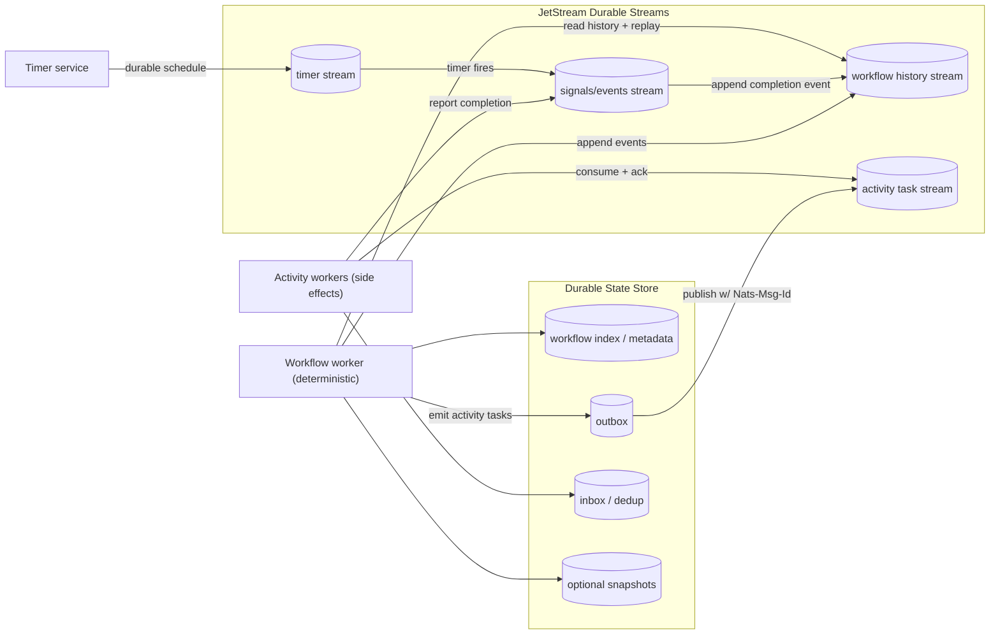
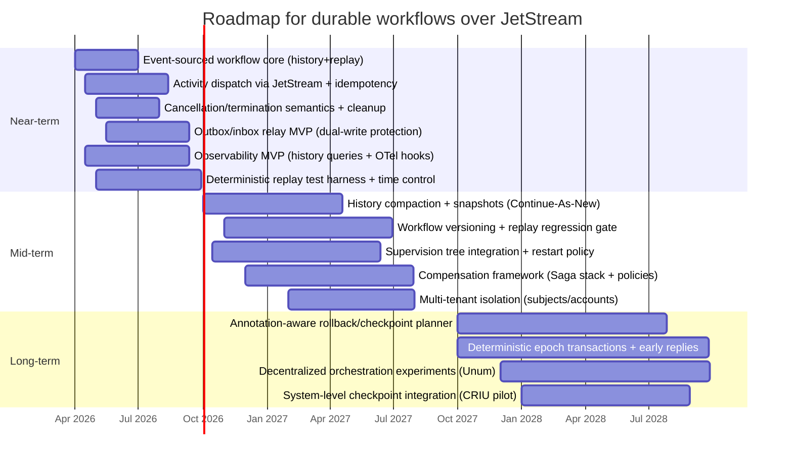

# Deep Research Report on Durable Workflows, Compensation, Cancellation, Checkpointing, and Resume Semantics

## Executive summary

Durable workflow platforms converge on a small set of “durable execution” design patterns: (a) **event-sourced histories + deterministic replay** (e.g., record every decision/event, replay to rehydrate state), (b) **log + materialized state snapshots** (e.g., replicated logs plus RocksDB state and periodic snapshots), or (c) **transactional/epoch protocols with coarse snapshots** (e.g., deterministic transaction ordering, asynchronous snapshots, and replayable input). These patterns differ mainly in how they trade off **runtime overhead vs recovery time**, and in how they manage **side effects** (the hardest part of “exactly-once”). citeturn0search12turn0search8turn10view5turn13view3turn16view2

Recent academic and experimental systems sharpen trade-offs in ways directly relevant to a NATS/JetStream-style orchestration OS:  
- **Beldi (OSDI’20)** shows how to retrofit *exactly-once-like outcomes* onto serverless functions using conditional writes, invocation logs, and a two-step callback mechanism—highlighting that exactly-once is often achieved via *idempotency + durable intent logs*, not by eliminating retries. citeturn10view3turn9view1turn2search0  
- **Durable Functions Semantics (OOPSLA’21)** and **Netherite (PVLDB’22)** formalize a serverless message-passing model and show that persisting *history* can be equivalent to persisting intermediate states; Netherite then addresses I/O bottlenecks via partitioning, batching/group commit, and log-structured persistence. citeturn10view0turn10view5turn10view4turn9view2  
- **ExoFlow (OSDI’23)** proposes a universal recovery layer for workflow DAGs using **task annotations** (determinism, rollbackability, idempotence) and explicit “checkpoint cuts,” a strong template for agentic multi-step pipelines. citeturn10view7turn9view3  
- **Unum (NSDI’23)** and **Pheromone (NSDI’23)** explore “decentralizing” orchestration: Unum embeds orchestration logic into functions and relies on strong datastores for coordination; Pheromone makes orchestration **data-centric** with data buckets and triggers to reduce interaction overheads—both relevant if “agents” should carry orchestration logic near computation. citeturn13view1turn13view4  
- **Styx (SIGMOD’25)** demonstrates a deterministic transactional runtime for stateful-function call graphs with **exactly-once state mutations**, **serializability guarantees**, and **asynchronous incremental snapshots**; it also explores **early commit replies** before durable snapshots complete—an advanced (but high-leverage) direction for “agent OS” semantics. citeturn16view0turn16view2turn14search5  

Industry systems largely agree on the operational reality: many workflow steps are executed **at-least-once**, so correctness comes from **idempotency** (and sometimes outbox/inbox patterns), while cancellations and compensations are **cooperative** and must be modeled explicitly. Temporal’s docs are unusually explicit about this: Activities should be idempotent because retries can lead to multiple executions; cancellation is graceful (cleanup allowed) while termination is forceful (no cleanup). citeturn3search6turn6search26turn6search23

For a JetStream-style transport, the semantic baseline should assume **at-least-once delivery**, potential duplicate deliveries, and configuration-dependent ordering constraints. JetStream supports publish de-dup via `Nats-Msg-Id` and durable consumers with explicit acks, but it does not magically remove the need for idempotency at consumers. citeturn0search3turn6search0turn6search8turn6search25

The most actionable near-term direction is to implement a **Temporal/Durable-Functions-like “durable state machine” core**: event history as the source of truth, deterministic orchestration, and side-effectful “activities” dispatched via JetStream with idempotency keys + outbox/inbox bridging. This yields strong *resume* semantics quickly, while leaving room for later research-inspired features like annotation-driven checkpoint placement (ExoFlow) or deterministic transactional epochs with early replies (Styx). citeturn0search12turn10view5turn3search6turn5search3turn16view2turn10view7

## Durable execution and formal models

### Durable execution as event-sourced state machines

Two production-proven formulations dominate:

**History-replay durable execution.** The engine persists an **append-only event history** (commands, timers, signals, activity completions), and rehydrates workflow state by **replaying** deterministic orchestration code against that history after failures. Temporal explicitly ties durable execution to event history replay. citeturn0search12turn0search8turn0search4turn0search16

**Log + materialized view.** The engine persists a **replicated log of records** and maintains a queryable **state view** (often a key-value store over an LSM tree). On restart, a node restores from snapshot then replays remaining log segments. Zeebe describes exactly this: per-partition RocksDB “state,” plus a log stream; snapshots accelerate restoration but logs are still needed for data not in snapshots. citeturn17search14turn17search10turn17search22turn1search17

A useful mental model for long-running “agentic” workflows is: a workflow instance is a **single-threaded deterministic state machine** whose transitions are driven by *durable inputs* (messages/timers), and whose side effects are routed through *explicit effect-handlers* (activities). This matches Durable Functions’ record/replay model and formal framing. citeturn10view0turn3search23turn0search9

### Formal models for exactly-once, recovery, and commit

In practical workflow settings, “exactly-once” almost always means **exactly-once effects on durable state** (or “effectively once” outcomes), not “no retries.” Netherite’s model (built on Durable Functions) uses a message-passing abstraction and defines properties like **serializable commit** for work items—capturing the intuition that each committed transition’s combined effects should appear atomic and isolated. citeturn10view5turn9view2turn10view1

Durable Functions’ semantics paper makes two points that transfer directly: (1) in mainstream languages, capturing execution state is hard (non-serializable heap, runtime-managed objects), and (2) persisting **histories of events** plus deterministic replay is a language-agnostic way to recover state; they also connect a series of progressively more realistic models and prove equivalence/bisimulation relationships. citeturn9view0turn10view0turn9view0

For workflows that communicate over at-least-once messaging, there is a compositional correctness principle:  
- workflow state transitions can be exactly-once (via serializable commit / event-sourced history),  
- but **activities/external calls are at-least-once unless you add stronger primitives**, so activity handlers must be idempotent and/or guarded by deduplication keys. Temporal documentation calls this out as a core design requirement. citeturn3search6turn3search2turn3search10

### Cancellation, termination, and “resume semantics” as first-class semantics

A robust semantics set typically includes:

- **Cancel (graceful):** record a cancel request; schedule work so the workflow can observe cancellation and run cleanup (including compensations). Temporal distinguishes cancellation from termination explicitly. citeturn6search26turn6search23turn6search1  
- **Terminate (forceful):** immediately stop with no cleanup—analogous to killing a process. Temporal documents the history event recorded and the fact that code cannot handle termination. citeturn6search26turn6search23  
- **Pause/Resume:** some platforms offer a “stop scheduling” state without canceling the execution. Dapr exposes explicit pause/resume workflow APIs. citeturn17search1turn17search5turn17search9  
- **Reset/Rewind:** rewind to an earlier consistent point and start a new run (useful after nondeterminism bugs); Temporal documents reset semantics as copying history up to a chosen point and discarding later progress. citeturn6search26  

These semantics must be aligned with recovery guarantees and history growth constraints (below). Temporal enforces hard event history limits (count and total size) and recommends “Continue-As-New” to checkpoint state into a fresh run. citeturn17search11turn7search3turn17search3

### Implementability implications for a NATS/JetStream-based orchestration OS

**Implementable now (core primitives):** event history persistence; deterministic orchestration execution; explicit side-effect tasks; durable timers; cancellation/termination state machine; idempotency keys for activities. This aligns with widely deployed models (Temporal, Durable Functions). citeturn0search12turn3search6turn3search23turn6search26

**Soon (requires additional infrastructure):** outbox/inbox bridging between durable state updates and JetStream publishes/consumes; history compaction/snapshots; workflow versioning and replay testing; structured cancellation scopes. citeturn5search3turn7search19turn8search24turn6search5

**Later (research-grade features):** annotation-driven rollback/checkpoint placement (ExoFlow), early-commit replies before durable snapshots complete (Styx), decentralized compilation of orchestration into task endpoints (Unum), or data-centric “bucket triggers” (Pheromone). citeturn10view7turn16view2turn13view1turn13view4

## Recent academic and experimental systems and prototypes

### Comparison table of key papers and systems

The table below mixes peer-reviewed papers (last ~10 years plus a few foundational items) and major industry systems. “Implementability” is assessed strictly as transferability to a Rust + JetStream-style durable orchestration architecture (not as “easy overall”). citeturn10view5turn6search0turn5search0

| Name | Year | Type | Core idea | Guarantees | Assumptions | Trade-offs / limitations | Implementability | Primary sources |
|---|---:|---|---|---|---|---|---|---|
| Durable Functions: Semantics for Stateful Serverless | 2021 | paper | Formalize replay-based orchestration; use event histories as a language-agnostic checkpoint of execution state | Correctness of record/replay vs higher-level model; durable progress via persisted histories | Deterministic orchestrator code; reliable storage; side effects outside orchestrator | History growth; nondeterminism breaks replay; replay overhead | now | citeturn10view0turn9view0 |
| Netherite: Efficient Execution of Serverless Workflows | 2022 | paper/system | Partition state, pipeline persistence, group commit; reduce storage IOPS for serverless workflows | Serializable commit in model; improved throughput/latency vs baseline DF engine | Fixed partitioning; durable log + snapshots; compute/storage separation | Added system complexity; partition tuning; still bounded by replay/history costs | soon | citeturn10view4turn10view5turn9view2 |
| Beldi: Fault-tolerant and transactional stateful serverless workflows | 2020 | paper/system | Log-based idempotency + conditional writes + federated transactions; callback mechanism for exactly-once-like invocation results | Exactly-once semantics for “Beldi API” calls; transactional workflows across serverless functions | Underlying K/V store supports conditional writes; cooperative federation model | Non-trivial protocol stack; GC complexity; boundaries where only at-least-once is possible | soon | citeturn10view2turn10view3turn2search0 |
| ExoFlow: A Universal Workflow System for Exactly-Once DAGs | 2023 | paper/system | Add a recovery layer via task annotations (determinism/rollback/idempotence) and checkpoint cuts | Exactly-once for DAG executions under specified task properties | Tasks can be annotated correctly; rollback works when declared; DAG structure known | Annotation burden; rollback not universal; complex semantics when external outputs are non-rollbackable | later | citeturn10view6turn10view7turn9view3 |
| Unum: Orchestrating Serverless Applications without an Orchestrator | 2023 | paper/system | Embed orchestration as a library inside functions; use strong datastore ops for coordination/dedup | Exactly-once “appearance” via dedup/coordination; portability across clouds | Strongly consistent data store; FaaS provides at-least-once invocation | Complexity shifts into libraries + datastore; less central observability unless engineered | later | citeturn13view0turn12view0turn13view1 |
| Pheromone: Rethinking Function Orchestration in Serverless | 2023 | paper/system | Data-centric orchestration: “data buckets” + triggers drive workflows and locality | Lower latency for function interactions; easier complex interactions with explicit data triggers | Object store + trigger system; coordinated scheduling | New runtime abstractions; may constrain programming model; semantics hinge on bucket/trigger consistency | later | citeturn13view4turn13view5turn12view2 |
| Styx: Transactional Stateful Functions on Streaming Dataflows | 2025 | paper/system | Deterministic epoch-based transactional execution for stateful-function call graphs; async incremental snapshots | Exactly-once state mutations; end-to-end serializability; snapshot-based FT; early commit replies | Deterministic transactional protocol; replayable ordered inputs; snapshot store | High complexity; needs careful ordering guarantees; early replies complicate external consistency | later | citeturn16view0turn16view2turn14search5 |
| State Management in Apache Flink: Consistent Stateful Distributed Stream Processing | 2017 | paper/system | Pipelined distributed snapshots (barriers) for exactly-once stream processing; state backends | Lightweight consistent snapshots; exactly-once vs at-least-once modes; rollback recovery | Replayable sources; aligned barriers (for exactly-once); state backend durability | Backpressure can make checkpoints expensive; external sinks need 2PC/idempotence | soon | citeturn13view2turn12view1 |
| Chandy–Lamport Distributed Snapshot | 1985 | paper | Global consistent cut via marker messages for FIFO channels; foundation for snapshots | Correct global snapshot for stable property detection under FIFO assumptions | FIFO channels (or extensions); marker delivery | Coordination overhead; needs channel assumptions | later | citeturn11search1turn11search17 |
| Temporal | 2020–2026 | system | Event history + deterministic replay for “durable execution”; rich interruption/versioning/testing toolchain | Durable workflow execution via event history; cancellation vs termination; testing harnesses | Deterministic workflow code; activity idempotency for retries; service persistence | History limits (count/size); replay overhead; side-effect correctness burden on activities | now | citeturn0search12turn6search26turn7search3turn8search4turn17search11 |
| Cadence | 2017–2026 | system | Similar to Temporal lineage; event-sourced history replay; workflow determinism + versioning patterns | Replay-based recovery; deterministic workflows; versioning guidance | Determinism; stable history evolution | Non-deterministic errors on incompatible code changes; history growth | now | citeturn19search0turn0search14turn0search2 |
| Azure Durable Functions | 2016–2026 | system | Orchestrator/activity split; event-sourcing + replay; durable timers/external events | Durable orchestration via replay; deterministic orchestrators; durable timers & signals | Deterministic orchestrator constraints; backing storage semantics | Replay CPU overhead; versioning pitfalls; storage/I/O bottlenecks without optimizations | now | citeturn3search23turn0search9turn3search19 |
| Zeebe | 2018–2026 | system | Partitioned replicated log (Raft) + RocksDB state; stream processing engine for workflow automation | Fault tolerance via replication; state restore via snapshot + log replay | Raft quorum; per-partition state/log; stable storage | Operational complexity (partitions, disks); snapshot/log retention tuning; exporters/backup | soon | citeturn1search17turn17search14turn17search26turn17search10 |
| Argo Workflows | 2017–2026 | system | Kubernetes-native workflow CRDs; controller executes DAG/steps as pods; retries and metrics | Retry semantics at workflow step level; observable controller metrics | Kubernetes control plane durability; pod execution semantics | Not a “durable code execution” model; step idempotency typically required; cluster failures can be complex | now | citeturn18search2turn1search2turn6search3 |
| Dapr Workflow | 2023–2026 | system | Workflow runtime in sidecar built on virtual actors; state store persistence + reminders | Durable orchestration via frequent writes; pause/resume/terminate/purge APIs | Reliable state store; actor/reminder semantics drive progress | Higher latency due to frequent state store writes; trade-off vs durability | now | citeturn1search3turn17search28turn17search1turn17search8 |
| NATS JetStream | 2020–2026 | system | Durable streams + consumers (at-least-once); publish dedup via message IDs; explicit ack protocols | At-least-once delivery via consumers; exactly-once publish via dedup IDs; ack sync possible | Consumers must ack; dedup IDs must be stable; ordering depends on configuration | Duplicates and ordering edges remain; consumer concurrency impacts ordering | now | citeturn6search0turn0search3turn6search8turn6search25 |

### What these research systems add beyond “standard” workflow engines

**Universal recovery for existing DAG engines (ExoFlow).** ExoFlow’s most transferable idea is that a workflow engine can reason about tasks if tasks declare properties: determinism, idempotence, whether external outputs can be rolled back, and where checkpoints should be placed (“edge cuts”). For agentic pipelines, this is a plausible way to differentiate safe retries (deterministic) vs unsafe (nondeterministic/external irrevocable). citeturn10view7turn9view3

**Transactional serverless without provider changes (Beldi).** Beldi is valuable as a reality check: pushing strong semantics “through” at-least-once serverless runtime typically requires designing a log/intent protocol around a conditional-write store, and reifying function invocation identity so that re-execution can return prior results. The paper’s callback mechanism highlights that you sometimes need a two-step handshake to avoid premature GC or missing results. citeturn10view3turn9view1

**Performance of durable state in elastic environments (Netherite).** Netherite shows that the biggest bottleneck in naive serverless orchestration can be excessive storage I/O; amortizing commits via partition-local batching and log-structured persistence yields order-of-magnitude throughput improvements in message-heavy workflows. If a JetStream-based OS uses a durable state store heavily, similar “partition + group commit” ideas are relevant. citeturn9view2turn10view5

**Decentralized orchestration vs centralized control (Unum, Pheromone).** Unum argues that “orchestration services” can be replaced by a library component plus a consistent store (coordination), while Pheromone argues that orchestration should follow intermediate **data** availability instead of static invocation dependencies. For multi-agent systems, these ideas matter because putting orchestration logic *close to the agent/work* can reduce coordination latency and widen optimization space—but it also makes global observability and reasoning harder unless you build it in. citeturn13view1turn13view4

**Deterministic transactions for workflows of stateful functions (Styx).** Styx is an advanced—and increasingly relevant—path when you want agent actions to compose like transactions rather than like ad-hoc retries. Its key transferable ingredients are: deterministic ordering of transaction epochs, asynchronous incremental snapshots for fault tolerance, and a clear statement that early commit replies depend on ordering guarantees typically provided by modern brokers. citeturn16view2turn14search5turn16view3

## Industry workflow engines and compensation patterns

### Temporal and Cadence lineage: event history, determinism, and idempotent effects

Temporal’s durability mechanism is explicitly grounded in persisted **event history** and deterministic replay. The service appends events to history to enable crash recovery and continued progress. citeturn0search12turn0search8turn0search4

Temporal also makes the operational semantics clear:

- **Activities may run more than once** under retries, which motivates the blanket guidance: make activities idempotent. citeturn3search6turn3search10  
- **Cancellation vs termination** are distinct: cancellation is cooperative (cleanup possible) whereas termination is forceful (no cleanup). citeturn6search26turn6search23  
- **Continue-As-New** is an explicit checkpoint-like mechanism to prevent history limits from killing very long workflows; a new run starts with a fresh history but carries forward state via parameters. citeturn7search3turn17search11turn17search3  
- Observability and testing are first-class: Temporal documents metrics/tracing via OpenTelemetry and provides in-memory test environments (e.g., Java test server with time skipping). citeturn6search2turn8search4turn6search21  

Cadence documentation reflects similar operational constraints: workflows are reconstructed by replaying history; incompatible code changes can cause nondeterministic errors, so versioning tooling/patterns are required. citeturn0search14turn0search6turn0search2

**Transfer takeaways:** A JetStream-based OS can replicate the core semantics if it provides (1) durable history, (2) deterministic orchestration runtime, (3) activity dispatch with at-least-once semantics and idempotency guidance, and (4) mechanisms to bound history via compaction or “continue-as-new.” citeturn0search12turn7search3turn3search6turn6search0

### Azure Durable Functions: orchestration constraints, versioning, and workload partitioning

Durable Functions uses an event-sourcing/replay pattern that comes with explicit constraints: orchestrator code must be deterministic because it will replay multiple times. Microsoft’s documentation also emphasizes that code updates can break replay and describes versioning strategies and built-in orchestration versioning. citeturn3search23turn8search13turn3search19

Durable Functions exposes key workflow primitives that are broadly reusable:

- **Durable timers** for timeouts and delays, rather than relying on in-process sleep. citeturn0search9  
- **External events** to represent signals/callbacks. citeturn3search11  
- **Critical sections/locks** (in some stacks) to coordinate race-prone interactions with external systems. citeturn0search9  
- **Unit testing patterns** including in-memory test infrastructure for some Durable Task SDKs. citeturn8search1  

Operationally, performance guidance highlights partitioning (e.g., storage provider “partitionCount”) and caching/replay costs. citeturn8search17turn0search13

**Transfer takeaways:** If orchestrations are reified as deterministic code, “workflow-safe” APIs (timers, external events, durable locks) become the core; everything else is pushed into side-effect tasks. This reduces the required semantics of the host language while still achieving durable progress. citeturn3search23turn0search9turn10view0

### Zeebe: replicated log + RocksDB state + snapshots

Zeebe’s design treats workflow execution as stateful stream processing. It replicates logs across brokers using Raft, dividing data into partitions with leaders/followers; committed log entries drive state transitions. citeturn1search17turn17search22turn1search1

State is stored in RocksDB (per partition) and updated as records are processed. Snapshotting restores state, but the log stream remains necessary for updates not included in snapshots. citeturn17search14turn17search10turn17search2

Zeebe also documents operational backup mechanics: hot backups collect a snapshot plus required log segments. citeturn17search26

**Transfer takeaways:** This architecture is compelling if Mister Smith wants “workflow engine as replicated state machine,” but it implies building or adopting consensus/sharding/replication semantics at the workflow layer. With JetStream already providing a durable log, a hybrid approach is possible: JetStream as the replicated log and a local KV (RocksDB-like) as a materialized view—while still needing careful dedup and ordering semantics. citeturn6search0turn17search14turn0search3

### Argo Workflows and Kubernetes-native orchestration

Argo Workflows (first open-sourced in 2017) uses Kubernetes CRDs and controllers; tasks execute in pods, and reliability is managed via retries and Kubernetes durability. citeturn18search2turn18search22turn1search2

Argo provides retry policies and operational tooling (`argo retry`), but it isn’t a “durable code execution runtime” in the Temporal/DF sense—workflow logic is declarative and steps’ idempotency is typically the user’s responsibility when retries occur. citeturn1search10turn1search2

Metrics collection supports OpenTelemetry or Prometheus scraping, showing a mature ops path for long-running pipelines. citeturn6search3

**Transfer takeaways:** Argo is primarily instructive for **workflow-as-infrastructure** patterns (CRDs, controller reconciliation) and observability conventions, rather than for durable replay semantics of arbitrary code. citeturn6search3turn18search6

### Dapr Workflow: actor-backed durability and explicit pause/resume

Dapr Workflows run inside the Dapr sidecar and are built atop Dapr Actors. Actor state outlives in-memory activation (state stored in the configured provider), and actor runtime properties (single-threaded actor execution, timers/reminders) underpin workflow durability. citeturn17search8turn17search12turn1search3

Dapr’s workflow docs note a key trade-off: to provide durability and resiliency, workflows frequently write to the state store and rely on reminders to drive execution; therefore they may be less suitable for latency-sensitive workloads. citeturn17search28turn17search0

The workflow API explicitly supports pause/resume/terminate/purge and querying execution history—useful semantics for a long-running agent OS. citeturn17search1turn17search9turn17search5

**Transfer takeaways:** Actor-backed orchestration aligns well with OTP-style supervision and single-thread semantics, but the design highlights a common tension: **more frequent durable writes → stronger durability but higher latency**. A JetStream-based OS can choose whether to be “state-write heavy” (Dapr-like) or “history-log heavy” (Temporal-like). citeturn17search28turn0search12turn10view0

### Compensation patterns and sagas in practice

“Sagas” remain the standard industrial approach to compensating long-running distributed work, formalized as sequences of local transactions with compensations that undo prior steps upon failure. citeturn2search10turn2search22turn2search6

The canonical engineering problem is reliable messaging between state and the broker. The **Transactional Outbox** pattern solves “dual write” by storing outgoing messages in the same database transaction as state updates, then relaying them to the broker asynchronously. citeturn5search3turn5search15turn5search23

**Transfer takeaways:** If Mister Smith uses JetStream as the backbone, it should treat outbox/inbox and idempotency keys as non-negotiable primitives for “exactly-once outcomes,” especially for compensation triggers and cancellation events that must not be dropped or duplicated semantically. citeturn5search3turn6search0turn0search3

## Checkpointing, snapshots, and resume semantics

### Application-level checkpointing via event history (record/replay)

Record/replay engines effectively use event history as a “logical checkpoint” of program progress: local variables are re-established by deterministic replay, and completed activity outputs are reused rather than re-executed. Durable Functions’ semantics paper motivates history storage as a way to avoid serializing arbitrary execution state, and also emphasizes that nondeterminism and large histories are problematic. citeturn9view0turn9view0turn10view0

Temporal documents hard limits on workflow event history (count and size). “Continue-As-New” is positioned as the way to checkpoint state and continue past history limits into a fresh run with the same workflow ID. citeturn17search11turn7search3turn7search19

**Resume semantics implication:** “resume” is implementable as “load history → deterministic replay → schedule next work,” but this requires either bounding history growth or implementing snapshots/compaction to limit replay cost. citeturn0search12turn7search3

### System-level checkpointing (CRIU) and when it matters

System-level checkpoint/restore freezes a running process or container and restores it later “as it was.” CRIU describes this capability as enabling snapshots and live migration for Linux workloads. citeturn7search18turn7search34

This approach is powerful for capturing opaque in-memory agent state (e.g., large model contexts or complex runtimes) but has significant constraints: kernel support limitations, environment dependence, and operational complexity. citeturn7search34turn7search26

**Transfer semantics:** CRIU-style checkpointing complements (not replaces) workflow history. Workflow history gives semantic determinism and auditability; CRIU gives “opaque memory snapshot” which might be useful for expensive agent runtime warm state, but is harder to validate and replicate across nodes. citeturn7search18turn0search12turn10view0

### Incremental checkpoints and log-structured snapshots (stream processing lineage)

Stream processors provide a mature body of checkpointing practice that maps surprisingly well to workflow “resume semantics”:

- Flink’s state management describes **pipelined, coordinated snapshots** inspired by Chandy–Lamport barriers; snapshots capture minimal operator state, while cyclic graphs may require capturing in-flight records. citeturn12view1turn13view3turn11search1  
- Modern Flink adds **unaligned checkpoints** to reduce checkpoint time under backpressure, explicitly trading off buffering/alignment costs. citeturn5search1turn5search13  

Research and newer systems extend these ideas: Styx explicitly aligns its fault-tolerance approach with checkpoint barrier ideas but leverages **epoch boundaries** as natural snapshot barriers, and persists snapshots asynchronously to blob storage. citeturn16view2turn14search5

**Transfer semantics:** “Workflow engines” that look like distributed dataflows can use barrier-based coordinated snapshots; event-sourced engines can use snapshots for acceleration (materialized state) and logs for completeness (replay from last snapshot). citeturn13view3turn17search10

### Causal-consistent snapshots and message-order assumptions

Chandy–Lamport-style snapshots assume enough channel structure (classically FIFO) to define consistent cuts; later work characterizes causal consistency and extends snapshot algorithms. citeturn11search1turn11search17turn7search32

For a JetStream-based OS, the key practical point is: if your workflow correctness depends on ordered message processing, you must either (a) enforce ordering with configuration (e.g., limiting in-flight acks), or (b) design workflow semantics to be order-robust via idempotent commutative updates and dedup. Some JetStream consumer configurations can deliver multiple in-flight messages; slow/failed acks can lead to re-delivery to another process, and concurrency can complicate ordering expectations. citeturn6search25turn6search12turn6search16

### Concrete checkpoint/snapshot options for Mister Smith transfer architecture

A pragmatic design space (all compatible with JetStream-style messaging):

**Event-sourced only (history as truth).**  
Persist every workflow event; resume by replay. Minimal extra machinery, maximal auditability, but replay cost and history growth must be controlled (e.g., Continue-As-New analog, history compaction). citeturn0search12turn7search3turn17search11

**Event-sourced + periodic snapshots.**  
Persist periodic materialized snapshots of workflow-local state (or computed state machine state), then replay only recent tail events. This mirrors Zeebe’s snapshot + log approach and common state-machine replication patterns. citeturn17search10turn17search14turn1search17

**Partitioned state + commit logs (Netherite-inspired).**  
Hash workflow instances or agent entities into fixed partitions; persist partition-local commit logs and snapshots; batch commits to reduce storage overhead. This is higher complexity but aligns well with a message-bus partitioning model and can improve I/O efficiency significantly. citeturn9view2turn10view5

## Supervision, failure containment, and correctness of cancellation and compensation

### OTP-style supervision and why it matters for durable workflows

OTP supervision is a disciplined approach to fault containment: supervisors restart child processes according to strategies such as `one_for_one`, `one_for_all`, or `rest_for_one`, and child restart types (`permanent`, `transient`, `temporary`) control restart behavior. citeturn5search8turn5search16turn5search0

This model is valuable for a workflow OS because it separates concerns:

- **Local fault handling:** restart crashed workers quickly and predictably. citeturn5search8turn5search0  
- **Global correctness:** durable workflow state ensures restarted workers continue from durable progress points rather than re-running from scratch. citeturn0search12turn9view0  

Actor-based runtimes embed a similar property: Dapr actors process one request at a time and store durable state externally, which aligns naturally with “single-threaded workflow instance” semantics. citeturn17search12turn17search8

### Interaction between supervision and durable workflow semantics

A durable orchestration OS can treat each workflow instance (or agent session) as a supervised “process,” but the supervisor’s job changes:

- The supervisor guarantees the *compute process* is alive (restart on crash). citeturn5search8  
- The durable workflow engine guarantees the *logical execution* progresses correctly (replay/commit semantics). citeturn0search12turn10view5  

This separation prevents a common failure mode: conflating a restarted worker process with “restarting the workflow.” In replay-based systems, the workflow is not restarted; it is **resumed** by rehydration. citeturn0search12turn3search23

### Cancellation and termination semantics as structured control-flow

Cancellation must be cooperative to preserve invariants and run cleanup/compensation logic. Temporal models this with cancellation scopes and explicitly recommends cancellation over termination in most cases. citeturn6search5turn6search26turn6search23

A transferable semantic design is to model cancellation as a state transition and an input event that can be observed:

This matches industry distinctions: terminate is forceful (no cleanup), cancel is graceful (cleanup possible and recorded as events). citeturn6search26turn6search23

### Compensation and reversibility: from sagas to formal reasoning

Industrial compensation is typically saga-based: a sequence of steps, each with a compensating action, run in reverse order on failure. AWS and Azure documentation explicitly frames sagas as continuation + compensation, emphasizing eventual consistency and the need for compensating actions when isolation is relaxed. citeturn2search22turn2search6turn2search10

Research adds important nuance relevant to multi-agent and parallel workflows:

- **Parallelism and compensation ordering.** “Petri Net Sagas” studies concurrency in sagas using Petri nets, explicitly addressing that typical saga implementations underuse concurrency and that concurrency complicates compensation semantics and correctness. citeturn4search11  
- **Task property annotations (rollbackable vs not).** ExoFlow makes rollbackability explicit: some outputs can be rolled back (e.g., within a transactional resource boundary) while others cannot; this becomes a formal constraint on checkpoint placement and on execution ordering. citeturn10view7turn9view3  
- **Semantic “undo” and invariants.** Newer DB/agent-adjacent work on “undoing” long-lived/LLM-generated transactions emphasizes invariant-aware coordination and removable history entries, suggesting that compensation correctness can be framed as maintaining invariants, not necessarily as strict serializability. citeturn4academia30turn3search24  

For agentic workflows, correctness arguments often reduce to: “If a partial execution is observed, compensations restore invariants and prevent external-visible inconsistency.” ExoFlow’s formal decomposition (internal vs external outputs, determinism vs nondeterminism) provides a concrete framework for making such arguments. citeturn10view7turn9view3

### Implementability implications for Mister Smith transfer architecture

**Now:** implement saga-style compensations as an explicit stack of compensators recorded in history; run compensators on cancellation/failure; design all compensators to be idempotent and retryable (since compensations themselves may fail). citeturn2search10turn3search6turn6search26

**Soon:** support parallel branches with structured cancellation scopes (like Temporal scopes) and define a deterministic compensation ordering policy (e.g., reverse topological order, or per-branch LIFO). citeturn6search5turn4search11turn10view7

**Later:** adopt ExoFlow-like task annotations (rollbackable/irreversible) and automatically compute checkpoint cuts and rollback boundaries; add invariant-aware “semantic undo” tooling for agent outputs. citeturn10view7turn4academia30

## Messaging guarantees, security, observability, and testing for long-running workflows

### Messaging semantics with JetStream-like guarantees

JetStream consumers can provide **at-least-once delivery**, tracking acknowledgments and re-delivering unacked messages. citeturn6search0turn6search29turn6search19

JetStream provides **publish-side de-duplication** via the `Nats-Msg-Id` header (idempotent writes) and allows “double-acking” (`AckSync`) to confirm the server processed the acknowledgment. citeturn0search3turn6search8turn0search11

However, at-least-once delivery and consumer parallelism mean duplicates and ordering corner cases remain possible; documentation and ecosystem discussions highlight that delivery to multiple consumers can occur if a consumer crashes or is slow to ack, and ordering can require configuration constraints (e.g., limiting in-flight messages). citeturn6search25turn6search12turn6search16

**Workflow semantic impact:**  
- Exactly-once *messaging delivery* should not be assumed; instead, the goal becomes exactly-once *state transitions* and effectively-once *external outcomes* via idempotency and dedup. citeturn6search0turn3search6turn10view5

### Achieving “effectively once” with durable state + at-least-once messaging

The standard pattern set is:

- **Idempotency keys for side effects** (e.g., activity invocation IDs stored in durable state; repeated execution checks prior completion). Temporal explicitly recommends idempotent activities because retries can cause multiple executions. citeturn3search6turn3search10  
- **Transactional outbox/inbox** bridging between state store commit and message publish/consume. Microservices.io and AWS guidance position this as the core fix for dual-write problems. citeturn5search3turn5search15  
- **Event history as an audit log** to replay, debug, and prove what happened (Durable Functions and Temporal both emphasize history observability). citeturn9view0turn0search12  

In a JetStream-based OS, publish dedup (`Nats-Msg-Id`) can reduce duplicates for outgoing messages, but it does not remove the need for outbox/inbox if durable state and publish are not in a single atomic transaction. citeturn0search3turn5search3turn6search0

### Security and multi-tenancy primitives

NATS’ security model provides **accounts as isolation boundaries** with independent subject namespaces, plus per-user subject-level authorization and NKey-based authentication. citeturn8search2turn8search26turn8search10turn8search18

Temporal frames multi-tenancy around **Namespaces** as the unit of isolation, with additional authentication/authorization capabilities in Temporal Cloud. citeturn8search3turn8search11turn8search15

**Transfer takeaways:** A workflow OS built atop JetStream can treat “NATS accounts + subject permissions” as an analog of “workflow namespaces,” aligning security boundaries with messaging routes and durable workflow state partitions. citeturn8search2turn6search0turn8search3

### Observability: workflow-native telemetry and auditability

Temporal documents observability as a combination of metrics, tracing, logging, and visibility APIs, and provides OpenTelemetry integration patterns. citeturn6search2turn6search14turn6search18

Argo Workflows supports metrics via OpenTelemetry protocol or Prometheus scraping, reflecting modern ops practices for long-running DAGs. citeturn6search3turn6search37

A durable workflow OS can exploit a key property of event sourcing: the workflow event history is already a structured, queryable “flight recorder.” Durable Functions’ semantics explicitly notes that saving histories improves debugging/observability by allowing users to inspect intermediate steps. citeturn9view0turn10view0

### Testing and verification approaches

Temporal provides dedicated testing suites (including in-memory test environments and time skipping), and community practice increasingly uses **replay testing** to detect nondeterministic workflow changes before deployment. citeturn8search4turn8search0turn8search24

Azure Durable Functions similarly documents unit testing approaches, including built-in test infrastructure for some Durable Task SDKs and history-based testing patterns. citeturn8search1turn3search23

For snapshot-style correctness, recent formalization work provides a fully mechanized proof of the Chandy–Lamport algorithm, illustrating that formal verification of recovery primitives is achievable when the model is crisp. citeturn11search29turn11search1

**Transfer takeaways:** A JetStream-based OS should treat deterministic replay as the foundation for (a) time-skipping testing, (b) property-based testing over event histories, and (c) regression checks for versioning compatibility. citeturn8search4turn9view0turn7search3

## Design options and prioritized roadmap for a JetStream-style durable orchestration OS

This section maps the research and industry findings into concrete design options and a staged roadmap. “Mister Smith” is treated purely as the target transfer architecture (Rust + JetStream-style messaging + durable state + OTP-inspired supervision), without researching the project itself. citeturn6search0turn5search8turn9view0

### Core architectural options

#### Event-sourced durable state machines with activity dispatch

This is the Temporal/Durable-Functions family design: persist event history, deterministic orchestration, external side effects via activities. citeturn0search12turn3search23turn3search6

Key properties and required primitives:

- **History stream:** append-only, immutable, ordered per workflow instance or per partition. citeturn0search12turn6search0  
- **Determinism enforcement:** orchestrator must avoid nondeterministic APIs; versioning support is required. citeturn3search23turn3search19turn0search14  
- **At-least-once activities:** treat activity execution as at-least-once and require idempotency keys; optionally allow at-most-once config with caveats. citeturn3search6turn3search10turn3search2  
- **Outbox/inbox:** bridge durable state and JetStream publish/consume to achieve effectively-once outcomes. citeturn5search3turn5search15turn0search3  
- **History compaction:** Continue-As-New analog + snapshots to bound replay cost. citeturn7search3turn17search11turn17search10  

**Implementability:** now for a minimal viable durable workflow engine; “soon” for compaction/versioning tooling; “later” for advanced recovery optimization. citeturn9view0turn7search3turn8search24

#### Replicated-log + materialized state view per partition

This is closer to Zeebe’s model, potentially using JetStream as the replicated log and a KV store (RocksDB) as the materialized view. citeturn17search22turn17search10turn6search0

Required primitives:

- Partition routing (hash workflow id → partition subject). citeturn1search17turn6search0  
- Snapshot management and log retention policies. citeturn17search10turn17search26  
- Strong deduplication of log replays into state (idempotent record application). citeturn10view5turn0search3  

**Implementability:** soon if the OS already embraces partition management; otherwise later because state machine replication and snapshot correctness are subtle. citeturn1search17turn11search29

#### Annotation-aware DAG recovery overlay

Inspired by ExoFlow: keep workflow engines relatively generic, but require tasks to declare properties (determinism, rollbackability, idempotence) so the system can place checkpoints and decide recovery strategies. citeturn10view7turn9view3

Primitive requirements:

- A task contract system (annotations), plus validation tooling. citeturn10view7  
- Recovery planner that computes checkpoint cuts and rollback plans. citeturn10view7turn9view3  
- Interop with multiple execution substrates (agents, ETL jobs, ML pipelines). citeturn9view3  

**Implementability:** later, because it requires new developer workflows and high semantic discipline, but it can be an “escape hatch” for integrating heterogeneous agent runtimes. citeturn10view7turn9view3

#### Deterministic transactional epochs for stateful function workflows

Inspired by Styx: order work deterministically, provide serializability, snapshot asynchronously, possibly reply before snapshot completes if ordering guarantees hold. citeturn16view2turn14search5

Primitive requirements:

- Deterministic sequencing service (per partition/epoch). citeturn16view1turn14search5  
- Replayable ordered inputs (broker or log). citeturn16view2turn6search0  
- Snapshot store and incremental snapshotting protocol. citeturn16view2turn14search5  

**Implementability:** later—high complexity, but potentially transformative for multi-agent systems that need transactional integrity and strong invariants. citeturn16view2turn4academia30turn4search0

### Required primitives and integration points with JetStream-style messaging

A “minimum semantics” set for durable workflows over JetStream should include:

- **Stable instance identity:** workflowId/runId; per-step activity IDs; all messages carry correlation IDs and idempotency keys. citeturn7search3turn5search3turn0search3  
- **Durable consumers + explicit ack policies:** ensure at-least-once; use ack sync for stronger acknowledgment confirmation when needed. citeturn6search0turn6search8turn6search29  
- **Publish dedup support:** set `Nats-Msg-Id` on externally visible commands/events to reduce duplicates from publisher retries. citeturn0search3turn0search31  
- **Inbox/outbox tables (or equivalent):** durable dedup of consumed messages and durable staging of produced messages, to avoid dual-write anomalies. citeturn5search3turn5search15  
- **Timer service:** durable timers implemented as scheduled messages or as state-store-driven reminders (Dapr-style). citeturn0search9turn17search0turn17search28  
- **Ordering strategy:** decide whether you enforce strict per-instance ordering (low throughput, simpler semantics) or allow parallelism with commutative/idempotent state transitions (higher throughput, harder reasoning). citeturn6search16turn6search12turn10view5  

### Prioritized roadmap

The roadmap is phrased as “features and experiments,” since many semantics questions benefit from prototype-driven validation (especially with agentic workloads and external side effects). citeturn16view2turn10view7turn6search0

#### Near-term features and experiments

A near-term milestone should aim to replicate the *semantic core* of durable execution:

- **Deterministic workflow runtime + persisted history.** Use an append-only history and deterministic replay to rehydrate workflow state after crash, mirroring DF/Temporal semantics. citeturn9view0turn0search12turn3search23  
- **At-least-once activities with mandatory idempotency keys.** Encode “activity invocation identity” into durable state and require idempotent handlers; align with Temporal guidance. citeturn3search6turn3search10  
- **Cancellation/termination contract.** Implement cancel as cooperative (cleanup allowed) and terminate as forceful (no cleanup). citeturn6search26turn6search23  
- **Inbox/outbox MVP.** Implement transactional outbox + inbox dedup to bridge durable state and JetStream messaging. citeturn5search3turn6search0turn0search3  
- **Observability MVP.** Treat event history as the first-class audit log; provide query APIs; add OpenTelemetry hooks (metrics/tracing) at workflow/activity boundaries. citeturn9view0turn6search2turn6search10  
- **Testing harness.** Build deterministic replay tests and time-skipping/time-control (Temporal and DF both emphasize replay constraints; Temporal’s testing framework shows how time-skipping unlocks fast tests). citeturn8search4turn8search1turn3search23  

#### Mid-term features and experiments

Once the semantic core is stable, mid-term work should focus on scalability, operability, and correctness envelopes:

- **History compaction and snapshots.** Implement Continue-As-New-like run chaining and/or periodic state snapshots; enforce history limits proactively to prevent termination at hard limits. citeturn7search3turn17search11turn17search3  
- **Workflow versioning and deployment safety.** Provide version markers and replay-based regression gates so that code changes don’t break determinism for in-flight workflows (Cadence/DF both emphasize this). citeturn3search19turn0search14turn8search24  
- **OTP-inspired supervision integration.** Introduce supervisor trees to manage worker processes and isolate failures; define restart strategies that complement durable resume (restart compute, not “restart the workflow”). citeturn5search8turn0search12  
- **Compensation framework (saga policies).** Provide structured compensation stacks and policy controls for parallel workflows (drawing on Petri net saga ideas). citeturn2search22turn4search11turn2search10  
- **Tenant isolation mapped to messaging substrates.** Use NATS accounts/subject permissions to isolate tenants; model “namespace” semantics similar to Temporal. citeturn8search2turn8search3turn8search26  

#### Long-term features and experiments

Long-term work should explore “next-generation” semantics suggested by research prototypes:

- **Task property annotations and checkpoint planning (ExoFlow).** Add a contract language for task determinism/rollbackability and build a planner for checkpoint cuts and rollback. citeturn10view7turn9view3  
- **Deterministic transactional epochs and early replies (Styx direction).** Explore deterministic ordering of multi-partition workflow effects with asynchronous incremental snapshots, and evaluate safety conditions for replying before durable snapshots persist. citeturn16view2turn14search5  
- **Decentralized orchestration experiments (Unum/Pheromone).** Prototype embedding orchestration logic into agent endpoints and using JetStream + a consistent state store as coordination primitives; evaluate observability and debugging costs. citeturn13view1turn13view4turn12view0  
- **System-level checkpoint pilots (CRIU).** Use CRIU to checkpoint expensive-to-rebuild agent runtime state (when it is safe), while preserving workflow history as the semantic ledger. citeturn7search18turn7search26turn9view0  

### Summary of “implement now vs later” decisions

- **Now:** event-sourced durable workflow core + deterministic replay; at-least-once activities with idempotency; cancel/terminate semantics; outbox/inbox; baseline observability and replay testing. citeturn0search12turn3search6turn5search3turn6search26turn8search4  
- **Soon:** snapshots/compaction; workflow versioning gates; OTP-style supervision trees integrated with durable resume; structured compensation policies for parallel workflows; multi-tenant security mapped to NATS accounts. citeturn7search3turn5search8turn4search11turn8search2turn8search3  
- **Later:** annotation-driven recovery planning (ExoFlow), deterministic transactional epochs with early replies (Styx), decentralized orchestration libraries (Unum), and system-level checkpoints for opaque agent runtimes (CRIU). citeturn10view7turn16view2turn13view1turn7search18