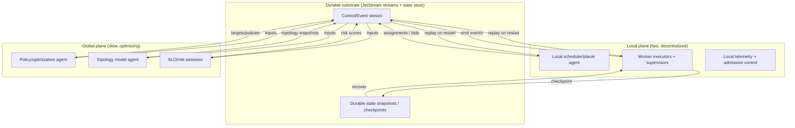

# Recent Research on Dynamic Orchestration, Topology Control, Adaptive Planning, Decentralized DAG Execution, and Resource-Aware Multi-Agent Coordination for a NATS-Style Orchestration OS

## Executive summary

Across the last decade of systems research, a consistent architectural “shape” emerges for building a robust, high-throughput orchestration substrate: **durable event/state logs + mostly-stateless control components + layered (hybrid) control loops + explicit fault semantics at every boundary**. Systems that scale to extreme task rates tend to (a) keep scheduling decisions close to execution (“bottom-up” or local-first), while (b) persisting enough lineage/control state to recover from failures without global stalls. A canonical example is **Ray (2018)**, which reports scalable scheduling with a bottom-up strategy and stores control state in a sharded metadata store; the evaluation demonstrates scaling beyond **1.8 million tasks/sec** and discusses durability via lineage and fault-tolerant metadata. citeturn15view0turn11view1

For **stateful or long-running DAG/workflow execution**, recent work converges on a family of techniques often described as “durable execution”: record progress in a durable log/state store and replay deterministically (or idempotently) so crashes and retries do not duplicate side effects. Research prototypes in serverless and dataflow systems push this significantly beyond “at-least-once + idempotence.” Notable examples include:  
- **Boki (SOSP 2021)**: a shared-log runtime for stateful serverless that separates ordering/consistency from data placement via a “metalog,” demonstrating substantial speedups over previous workflow solutions and practical durable queues/workflows built atop the log abstraction. citeturn11view8turn11view9  
- **Halfmoon (SOSP 2023)**: “log-optimal” asymmetric logging protocols that log either reads or writes (not both) and provide protocol switching for changing workloads, reporting materially lower latency and logging overhead than Boki and providing theoretical optimality arguments for their protocol class. citeturn18view4turn18view5  
- **Styx (transactional SFaaS on streaming dataflows, 2025 arXiv / research prototype)**: executes *serializable* transactions across arbitrary call graphs with exactly-once semantics, using deterministic transaction ideas to avoid expensive 2PC and introducing function-ack boundary tracking, caching, and “early commit” replies. citeturn21view2turn21view3  
These lines of work provide concrete building blocks for **exactly-once outcomes**, **checkpointing**, **recovery**, and **state migration**, but they also make strong assumptions (about determinism, external side effects, and/or which components are trusted).

For **adaptive planning and resource management**, the “best” approaches in practice are **hierarchical**: local controllers make fast decisions with limited state (low latency, high resilience), while global controllers run slower optimization/learning loops (better efficiency and fewer coordinated oscillations). **Autothrottle (NSDI 2024)** exemplifies this: it explicitly decouples app-level SLO feedback from per-service resource control and reports meaningful CPU savings while maintaining tail-latency SLOs. citeturn15view2turn9view6 Similarly, **AWARE (USENIX ATC 2023)** focuses on operationalizing RL for autoscaling in production settings via meta-learning and safe bootstrapping, quantifying faster adaptation and reduced SLO-violation risk during training. citeturn14view1turn14view3  
For **learning-based DAG scheduling**, **Decima (SIGCOMM 2019)** demonstrates that RL policies can outperform hand-tuned heuristics in Spark DAG scheduling, but it also highlights the practical need for careful representations, training methodology, and integration boundaries (because raw RL is brittle at cluster scale). citeturn11view2turn11view3

For **topology control** (placement under network constraints, edge heterogeneity, and dynamic connectivity), recent “graph-first” schedulers model both the **service dependency graph** and a **cluster topology graph**. **Polaris Scheduler (2022)** is representative: it models application dependencies and network QoS characteristics and uses a plug-in scheduling pipeline to enforce network SLOs at placement time. citeturn23view0turn23view1 More experimental work explores deeper decentralization, such as pushing scheduling logic into **service mesh sidecars** to reduce centralized bottlenecks. citeturn23view2turn23view3

Key transfer insight for Mister Smith (as a target architecture) is that **NATS/JetStream-style durable messaging can act as the shared “coordination substrate”** for both workflows and control loops, but only if semantics are clearly defined. JetStream explicitly describes “exactly once” publish/consume as a combination of **deduplication** and **double acknowledgments**, and supports durable replay and consumer state. citeturn6search2turn6search10turn6search18 Pairing that with **OTP-style supervision** patterns (restart strategies, restart intensity, hierarchical trees) yields a principled fault model for agents. citeturn6search7turn6search15turn6search32

The largest research gaps relevant to Mister Smith are: (1) **end-to-end semantics across untrusted/heterogeneous side effects** (external DBs, RPCs, human-in-the-loop actions), (2) **safe decentralized adaptation** (avoiding feedback instabilities and thrashing under partial observability), (3) **resource-aware topology adaptation** that includes network/storage/energy (not just CPU), and (4) **operational verification** (formal or test-driven) for failure transparency and correctness arguments—where recent formal work on failure transparency in dataflow systems is an instructive direction. citeturn27view1

## Problem decomposition and requirements mapping

This section frames the problem statements implied by the request, and ties them to the families of solutions found in the literature (not assuming any specific workload).

### Dynamic orchestration and topology control

Dynamic orchestration is the continuous decision process that maps changing “work intent” (tasks, workflows, agents) onto changing “execution reality” (nodes, resources, network links, failures). In edge and heterogeneous clusters, the topology (latency/bandwidth/jitter/loss) can dominate feasibility and SLO outcomes, hence topology modeling becomes a first-class scheduling input. Polaris explicitly motivates this: nodes can have sufficient CPU/memory, but still be unsuitable because the **network connection is unstable**, so placement must jointly consider compute resources and network QoS. citeturn23view0turn23view1

A practical decomposition used repeatedly in recent systems is:  
1) represent the application/workflow as a **graph** (DAG or call graph),  
2) represent the cluster/edge environment as a **constraint graph** (resources + link QoS),  
3) run a placement/scheduling pipeline that is **pluggable** (to encode policy and evolve it over time). Polaris uses a Service Graph (dependencies, QoS requirements) and a Cluster Topology Graph (network quality characteristics) and implements schedulers as plugins, aiming at enforcement “at the time of scheduling.” citeturn23view0turn23view1

### Adaptive planning and control loops

Adaptive planning includes classic control methods (e.g., MPC), heuristic policies, and RL/learning systems. What matters for an orchestration OS is less the “algorithm family name” and more the *interfaces* that keep the system safe: observability, actuation limits, rollback, and multi-timescale decomposition.

Two strong modern patterns appear:

- **Bi-level/hierarchical control**: global controllers use application-level feedback to set targets; local controllers meet those targets with less coordination overhead. Autothrottle operationalizes this for microservices by making global choices (performance targets as CPU throttle ratios) and local heuristic enforcement per service, reporting improved CPU savings while maintaining P99 SLO constraints. citeturn15view2turn9view6
- **Operationalizing RL safely**: production RL needs bootstrapping and lifecycle management (training vs serving, drift detection, safe exploration). AWARE focuses on bridging this “lab-to-prod gap,” using meta-learning for faster adaptation and bootstrapping to reduce SLO violations during training. citeturn14view1turn14view2turn14view3

### Decentralized DAG execution and durable semantics

The core tension is: the more decentralized the execution, the harder it is to maintain strong semantics (exactly-once, transactional guarantees) without paying large coordination costs; but centralized orchestrators become bottlenecks, cost centers, and failure domains at scale.

This motivates a spectrum:
- **Standalone orchestrator services** (strong central logic),  
- **library/in-situ orchestration** (“orchestration without an orchestrator”),  
- **dataflow/streaming-inspired runtimes** that treat the workflow as a distributed computation graph with explicit state and recovery.

Unum argues that standalone orchestrators (as separate services) are expensive and constrain flexibility; it shows that application-level orchestration as a library can support similar patterns with only universally-available serverless components, and reports that in representative applications it can run faster and cheaper than a managed orchestrator baseline. citeturn11view10

For a NATS/JetStream-style OS, the immediate relevance is that **durable messaging can approximate the shared log / event substrate** used in these designs, but the OS must explicitly define semantics: state versioning, retries, idempotency keys, and commit/ack boundaries. JetStream directly documents a model for exactly-once publish/consume using deduplication and double acknowledgments. citeturn6search2turn6search18

### Fault tolerance and supervision

OTP-style supervision is a well-established fault model: workers fail; supervisors restart them; and restart intensity limits prevent infinite crash/restart loops from cascading. The Erlang/OTP documentation formalizes supervision trees and restart strategies (e.g., one_for_one), and explains restart intensity/period as a mechanism to bound repeated failures. citeturn6search7turn6search15turn6search32

A key transcription for orchestration OS design is: supervision must be integrated with durable state semantics. Otherwise, restarts can create duplicates, partial side effects, or “split brain” workflows. Research systems like Boki, Halfmoon, and transactional SFaaS runtimes provide concrete patterns to make restarts safe. citeturn11view8turn18view4turn21view2

## Evidence review of key systems, algorithms, and experimental results

The items below are selected for relevance to: dynamic orchestration, topology control, adaptive planning, decentralized DAG execution, durable semantics, and resource-aware coordination. For each: citation, year, summary, key results, limitations, and concrete implications (near-term vs experimental).

### **Ray (2018, OSDI)**

**Summary:** A distributed execution framework unifying task-parallel and actor-based computations. Its core design principle is storing control state in a sharded metadata store with other components stateless, plus a bottom-up distributed scheduling strategy for scalability and low latency. citeturn15view0turn10view1  
**Key results:** Reports scaling beyond **1.8 million tasks/sec** and near-linear scaling in a high-throughput evaluation; also discusses object store throughput and fault-tolerant control state. citeturn15view0turn11view1  
**Limitations/assumptions:** The evaluation includes synthetic microtasks; real DAGs with heavy dependencies can exhibit different bottlenecks. The design assumes reliable metadata persistence and effective locality/caching. citeturn11view1turn10view1  
**Implications for Mister Smith:**  
Near-term: adopt Ray’s **bottom-up scheduling** idea as a “local-first” assignment path: try to schedule on the node/region that has recent data/context, escalate to global only when needed.  
Longer-term: implement **lineage-backed recovery** for tasks, where a durable stream records task dependencies and outputs so recomputation can occur after failure (requires careful side-effect modeling). citeturn15view0turn11view1

### **Decima (2019, SIGCOMM)**

**Summary:** Reinforcement-learning-based scheduling for DAG-structured jobs in data processing clusters (Spark). It models scheduling as an RL agent with a policy network that makes DAG-stage scheduling and executor allocation decisions. citeturn11view2turn11view3  
**Key results:** Integrated with Spark and evaluated on a 25-node cluster: reduces average job completion time by at least **21%** for TPC-H query mixes vs baseline heuristics; shows other improvements depending on resource dimensionality and workload. citeturn11view2turn11view3  
**Limitations/assumptions:** Requires training and simulated workload generation; policies can be workload-dependent and sensitive to drift. Complexity rises with multi-resource heterogeneity and noisy metrics; it relies on Spark’s task-level scheduling for within-stage choices. citeturn8view1turn11view2  
**Implications for Mister Smith:**  
Near-term: structure scheduling decisions so they can later be learned—expose state/action/reward interfaces (even if you begin with heuristics).  
Longer-term/experimental: RL for DAG scheduling is plausible only with strong safety rails (bootstrapping, offline training, rollback) similar to AWARE; otherwise risk of pathological allocations.

### **Tiresias (2019, NSDI)**

**Summary:** GPU cluster manager for distributed deep learning workloads with unpredictable runtimes and inflexible multi-GPU placement constraints. Introduces a “2DAS” scheduling framework and (discretized) 2D Gittins-index and 2D LAS policies, plus placement relaxations. citeturn26view0turn25view1  
**Key results:** Reports up to **5.5×** improvement in average job completion time in testbed experiments and trace-driven simulations, while remaining practical/deployable. citeturn26view0turn26view3  
**Limitations/assumptions:** Tailored to deep learning multi-GPU jobs and their structure; assumes a cluster manager can preempt and reassign resources and has enough resource telemetry. citeturn26view0turn26view3  
**Implications for Mister Smith:**  
Near-term: incorporate the idea of **priority policies robust to unknown job length** (LAS-style attained service) for queue fairness and latency control.  
Longer-term: multi-dimensional “Gittins-like” policies could be implemented as plugins when workload distributions are learnable.

### **Gavel (2020, OSDI)**

**Summary:** Scheduler for heterogeneous accelerator clusters that makes existing policies heterogeneity-aware using “effective throughput,” translating policies into optimization problems and enforcing allocations via round-based scheduling. citeturn26view1turn25view0  
**Key results:** Claims improvements in end objectives (e.g., makespan and mean JCT) by **1.4× and 3.5×** compared to heterogeneity-agnostic policies, by accounting for model-specific performance differences across accelerator types. citeturn26view1turn25view0  
**Limitations/assumptions:** Designed around ML accelerators and measured throughput models; relies on profiling/estimating effective throughput and a cluster capable of time-slicing / migration style enforcement. citeturn26view1turn25view0  
**Implications for Mister Smith:**  
Near-term: define a generic “resource effectiveness” layer that can incorporate observed performance multipliers (CPU types, NICs, storage tiers).  
Mid-term: build a policy DSL that compiles to optimization + enforcement, similar to Gavel’s policy generalization.

### **Cloudburst (2020, PVLDB)**

**Summary:** Stateful Functions-as-a-Service platform aiming for low-latency mutable state and inter-function communication while preserving autoscaling benefits. It builds on an autoscaling key-value store (Anna) and emphasizes caching + consistency mechanisms. citeturn11view4turn11view5  
**Key results:** Demonstrates large latency advantages in function composition (noting overheads of commercial serverless calls), and frames consistency and autoscaling as central challenges for stateful serverless. citeturn11view4turn9view2  
**Limitations/assumptions:** Focus is stateful serverless; assumes co-located caches and a backing store tuned for elasticity. Semantics are often weaker than full transactional orchestration systems. citeturn11view4turn11view5  
**Implications for Mister Smith:**  
Near-term: prioritize **data locality** as a first-class routing dimension in message subjects/consumer groups.  
Experimental: “autoscaling state stores + compute” patterns could map to JetStream stream partitioning + state shards, but require careful consistency boundaries.

### **Beldi (2020, OSDI)**

**Summary:** Library/runtime for composing fault-tolerant, transactional stateful serverless workflows on existing providers, extending log-based approaches (Olive) with new data structures, transaction protocols, function invocations, and GC. Focuses on exactly-once semantics and transactions. citeturn15view1turn11view7  
**Key results:** Positions a design for exactly-once semantics via intent/log structures and provides locking/transaction support; demonstrates practicality on existing serverless infrastructure. citeturn15view1turn11view7  
**Limitations/assumptions:** Still pays overheads from remote storage and synchronous invocation patterns; relies on log structures and deterministic replay semantics, and the serverless environment’s failure modes. citeturn15view1turn11view7  
**Implications for Mister Smith:**  
Near-term: implement an “intent log” pattern: every step/task has a unique ID; on retry, consult durable progress before re-executing side effects.  
Mid-term: transactional composition across tasks requires explicit consistency model design (see Styx and Apiary).

### **Unum (2023, NSDI)**

**Summary:** “Orchestrating serverless applications without an orchestrator.” It argues standalone orchestrators are expensive and limiting, and proposes application-level orchestration (as a library) that partitions higher-level definitions and executes orchestration in-situ with user functions, using strongly consistent stores. citeturn11view10  
**Key results:** The abstract claims Unum can run up to **2× faster** and cost **9× less** than AWS Step Functions for representative applications, while providing more flexibility. citeturn11view10  
**Limitations/assumptions:** Relies on strong consistency stores and careful orchestration compilation; may shift complexity to developers/libraries and can constrain cross-workflow global optimization. citeturn11view10  
**Implications for Mister Smith:**  
Near-term: prefer **library-first orchestration** APIs (embedded in agents) over a single monolithic orchestrator service, using JetStream as the durable substrate.  
Mid-term: provide compilation/IR for workflows so that “in-situ” execution and decentralized coordination become feasible.

### **Boki (2021, SOSP)**

**Summary:** Shared-log architecture for stateful serverless computing, exporting a LogBook API. Introduces a “metalog” to decouple ordering, read consistency, and fault tolerance, and builds libraries for workflows (BokiFlow), storage, and message queues. citeturn11view8turn11view9  
**Key results:** Reports best-case LogBook read latency (microseconds scale) and significant improvements vs prior solutions: workflows faster than Beldi, higher throughput and lower latency in queue/storage comparisons (within the system’s setup). citeturn8view4turn11view9  
**Limitations/assumptions:** Requires a shared-log substrate and tightly engineered storage/ordering; still must trade ordering strength vs overhead. Also depends on how external side effects are modeled (the log can’t “undo” the outside world). citeturn11view9turn18view3  
**Implications for Mister Smith:**  
Near-term: model JetStream streams as a **shared log** for control-plane state and workflow step state; implement “metalog-like” cross-shard ordering only where required.  
Longer-term: explore separating ordering semantics from storage placement, similar to Boki/FlexLog, but mapped to JetStream partitioning and consumer state.

### **FlexLog (2023, HPDC)**

**Summary:** Shared log optimized for stateful serverless requirements (low latency, scalability), leveraging persistent memory and offering **flexible ordering semantics** rather than always requiring total order. Provides correctness proofs and reports large improvements compared to Boki’s shared log architecture. citeturn18view2turn17view1  
**Key results:** Claims scaling to millions of ops/sec with minimal latency; compares to Boki: **10×** better throughput in storage, **2–4×** lower ordering latency, and notes weaker ordering can improve performance (reported ~10% better throughput in one comparison). citeturn18view2turn18view3  
**Limitations/assumptions:** Depends on persistent memory availability (explicitly notes limitations around Intel Optane PM) and engineering complexity; also shows that ordering layer can dominate latency after storage is optimized. citeturn17view1turn18view3  
**Implications for Mister Smith:**  
Near-term: treat ordering as a **policy choice** per workflow/state type (strict total order vs causal vs per-key order), not a global invariant.  
Experimental: plug-in ordering protocols and proofs are long-term work; start with pragmatic per-stream/per-subject ordering and idempotence.

### **Halfmoon (2023, SOSP)**

**Summary:** Fault-tolerant stateful serverless runtime using “asymmetric logging”: instead of logging both reads and writes, log one side (reads or writes) while providing log-free operations on the other side; includes a “pauseless switching mechanism” to switch protocols as workload changes. citeturn18view4turn18view5  
**Key results:** Reports **20–40% lower latency** and **1.5–4×** lower logging overhead than Boki; includes theoretical proof that protocols are “log-optimal” under a modeled class (no other protocols can asymptotically do better within the assumptions). citeturn18view4turn18view5  
**Limitations/assumptions:** Leverages an event stream with recoverable timestamps; assumes certain determinism/stability properties to make asymmetric logging work; real-world heterogeneity and non-deterministic side effects complicate strict application. citeturn18view5turn17view2  
**Implications for Mister Smith:**  
Near-term: implement **dynamic protocol selection** for durability: e.g., “log-heavy safe mode” vs “log-light fast mode” depending on observed failure rates/load.  
Longer-term: halfmoon-style asymmetric schemes suggest a path to reduce JetStream write amplification (fewer “reads must be logged”) but require careful determinism design.

### **Apiary (2022/2023, DBMS-integrated transactional FaaS framework)**

**Summary:** Integrates function execution into the DBMS layer, co-locating application logic and data management to reduce communication overhead and enable transactional function composition. Provides run-to-completion workflows and exactly-once function effects, with multi-function transactions to avoid excessively large transactions. citeturn18view0turn18view1  
**Key results:** Abstract claims **2–68×** speedups on microservice workloads by reducing communication overhead, and explicitly states guarantees: workflows run to completion and workflow functions execute “exactly once” in effect. citeturn18view0turn18view1  
**Limitations/assumptions:** Requires deep DBMS integration (stored procedures / DB execution runtime); portability is harder; function sandboxing and multi-tenant isolation become DB-engine concerns. citeturn18view0turn18view1  
**Implications for Mister Smith:**  
Near-term: adopt Apiary’s concept of *transaction boundary shaping* (multi-function groups) even without DB integration: define “atomic groups” of tasks with a shared commit/abort contract.  
Experimental: DB-integrated execution is a major architectural investment; emulate at the orchestration layer via deterministic event sourcing + transactional state store.

### **Styx (transactional stateful functions on streaming dataflows, 2025 arXiv / research prototype)**

**Summary:** A dataflow-based SFaaS runtime that executes serializable transactions consisting of stateful functions forming arbitrary call graphs, with exactly-once guarantees. Uses a deterministic transactional protocol to avoid 2PC and adds mechanisms (function acknowledgment for transaction boundaries, function-execution caching, early-commit replies). citeturn21view2turn21view3  
**Key results:** States that it outperforms prior systems in transactional workloads by at least an order of magnitude in throughput and improves latency substantially in certain regimes, and describes incremental snapshots with delta maps for fault tolerance. citeturn21view2turn21view3  
**Limitations/assumptions:** Strongly depends on determinism and a dataflow execution model; integrating arbitrary external side effects without leaking failures into business logic remains difficult; likely requires careful function constraints (pure-ish logic or controlled I/O). citeturn21view2turn21view3  
**Implications for Mister Smith:**  
Mid-term: treat “stateful agents” as **deterministic state machines** with command/event logs; use JetStream streams as the event substrate and apply deterministic execution and snapshotting.  
Long-term: consider a “dataflow mode” for high-throughput transactional workflows: compile orchestrations into a streaming-style graph, potentially improving throughput and recovery.

### **CausalMesh (PVLDB 2024)**

**Summary:** Causal cache for stateful serverless computing, addressing anomalies from functions scheduled on different nodes with different caches. Claims coordination-free and abort-free operations under certain models, and supports transactional causal consistency with tradeoffs. citeturn18view8turn18view9  
**Key results:** States it is the first cache system supporting coordination-free, abort-free read/write operations and read transactions with client roaming, while also supporting read-write transactional causal consistency (at cost of abort-freedom). citeturn18view8turn18view9  
**Limitations/assumptions:** Causal consistency semantics are complex and can leak into application reasoning; the appeal depends on whether workloads truly need roaming and low-latency caching vs simpler per-key linearizable approaches. citeturn18view8turn18view9  
**Implications for Mister Smith:**  
Near-term: implement **session/causal metadata** for agent-local caches when tasks hop nodes (message headers carrying causal context).  
Long-term: coordination-free caching is attractive for edge and bursty workloads, but needs careful observability and correctness debugging support.

### **Styx (workflow engine for serverless platforms, 2025 TechRxiv preprint / likely 2026 journal)**

**Summary:** Workflow engine that decouples compute and I/O stages for serverless workflows, uses a fetch latency predictor based on real-time metrics, and offloads output uploads to a host-side data service to reduce memory pressure. citeturn21view0turn21view1  
**Key results:** The abstract claims improved overall memory allocation by **51.6%** when running workflows simultaneously, and improved tail/mean workflow latency by ~**21.8%/20.8%**; an evaluation page also reports benefits under bursty load and discusses storage-service overhead. citeturn21view0turn21view1  
**Limitations/assumptions:** Depends on accurate latency prediction and the ability to split compute vs I/O stages; introduces additional host-side service complexity. citeturn21view1turn21view0  
**Implications for Mister Smith:**  
Near-term: explicitly model **I/O stages** in tasks; schedule prefetch and output persistence as first-class steps to control memory and tail latency.  
Mid-term: introduce predictive policies (simple models first) using system metrics, before attempting RL.

### **Autothrottle (NSDI 2024)**

**Summary:** Bi-level resource management framework for latency-SLO microservices, decoupling app-level SLO feedback from service resource control via “performance targets.” citeturn15view2turn8view6  
**Key results:** Reports CPU savings up to **26.21%** over best baseline (and larger vs weaker baselines) while maintaining P99 latency SLOs in evaluated apps. citeturn15view2turn9view6  
**Limitations/assumptions:** Targets CPU throttling and microservice latency; relies on accurate application-level measurements and training/tuning of the learning-based controller. citeturn15view2turn9view6  
**Implications for Mister Smith:**  
Near-term: implement **bi-level control** as a standard pattern: global “goal-setter” agents produce targets; local agents enforce them with bounded actuation (rate limits, hysteresis).  
Mid-term: expose components as pluggable controllers (heuristic, MPC-like, learning-based).

### **AWARE (USENIX ATC 2023)**

**Summary:** RL model-serving and management framework focused on deploying RL-based autoscaling agents in production, using meta-learning for fast adaptation and bootstrapping for safe exploration. citeturn14view1turn14view2  
**Key results:** Reports meta-learning enabling **5.5× faster** adaptation to new workloads and stable online policy-serving with **<3.6%** reward degradation; bootstrapping improves CPU and memory utilization and reduces SLO violations during training by a large factor. citeturn14view1turn14view3  
**Limitations/assumptions:** Focused on autoscaling; it explicitly acknowledges variability and retraining costs; the success depends on a robust telemetry substrate and safe fallback controllers. citeturn14view2turn14view3  
**Implications for Mister Smith:**  
Near-term: adopt AWARE’s **lifecycle separation** even without RL: clear “policy evaluation,” “policy rollout,” “fallback” states.  
Experimental: RL controllers only after you implement safe bootstrapping, drift detection, and audit trails.

### **TOPOSCH (2022, IEEE TPDS)**

**Summary:** QoS-aware co-scheduling for distributed long-running microservice applications (DLRAs) co-located with batch jobs, using per-request tracing, latency graph construction, and critical path analysis to identify microservices at risk of QoS violation, plus prediction-based vertical resource autoscaling and cost-effective preemption. citeturn23view4turn22view2  
**Key results:** Reports that tail latency of co-located DLRAs is ~**1.12×** the “run-alone” case on average, with batch-job JCT increases around **26%** in the evaluated configuration; also discusses multi-dimensional resource isolation. citeturn23view4turn23view5  
**Limitations/assumptions:** Evaluated within YARN-based clusters and specific workloads; requires rich tracing/instrumentation and control over resource isolation and preemption. citeturn23view4turn22view2  
**Implications for Mister Smith:**  
Near-term: treat **critical-path tracing** as a core OS feature (not an afterthought), since it enables targeted mitigation (scale the bottleneck microservice, not everything).  
Mid-term: implement “risk scoring” for services/nodes based on observed tail-latency contribution.

### **Polaris Scheduler (2022, UCC)**

**Summary:** Edge microservices scheduler that aims to enforce network QoS SLOs by modeling application service dependencies (Service Graph) and edge network topology (Cluster Topology Graph). Implemented as a plugin-based scheduler framework and evaluated on topologies representing edge clusters. citeturn23view0turn23view1  
**Key results:** Explicitly encodes link requirements (latency, bandwidth, jitter, packet drop) in service graphs and highlights that naive schedulers can violate strict network SLOs even when CPU/memory suffice. citeturn23view0turn23view1  
**Limitations/assumptions:** Focus is placement time; runtime adaptation (migration, rebalancing) is separate. The quality of results depends on accurate topology measurement and graph modeling overhead. citeturn23view1turn23view0  
**Implications for Mister Smith:**  
Near-term: add first-class **topology graph** and **service graph** objects and require placement decisions to cite which constraints they satisfied.  
Mid-term: introduce triggers for re-placement (link QoS drift, jitter spikes, packet loss) with bounded migration budgets.

### **Decentralized scheduling using service mesh sidecars (2025, arXiv)**

**Summary:** Proposes embedding lightweight scheduling logic into service mesh sidecars to decentralize scheduling decisions, improving scalability and resilience under dynamic cloud-edge conditions, evaluated in a SimGrid-based environment including network and energy modeling. citeturn23view2turn23view3  
**Key results:** Claims lower makespan under high load with minimal overhead in simulations, and frames decentralization levels (partial, semi-, fully decentralized) as comparative criteria. citeturn23view3turn22view1  
**Limitations/assumptions:** Early evidence and architectural direction rather than a matured algorithm; depends on service mesh capabilities and introduces complexity in distributed decision consistency and debugging. citeturn23view2turn23view3  
**Implications for Mister Smith:**  
Near-term: support “local schedulers” at agent boundaries (like sidecars) that can make quick choices under local constraints.  
Long-term: truly decentralized scheduling requires strong observability and conflict-resolution semantics (CRDT-like or consensus-like), otherwise it becomes un-debuggable under failure.

### **CheckMate (2024, checkpointing protocols evaluation)**

**Summary:** Evaluates coordinated, uncoordinated, and communication-induced checkpointing protocols for streaming dataflows. Observes that coordinated checkpointing is widely used (often Flink-derived), but argues the dominance is partly anecdotal and benchmarks alternatives. citeturn29view0turn28view0  
**Key results:** Finds coordinated protocols outperform under uniformly distributed workloads; however, uncoordinated checkpointing becomes competitive and can outperform under skewed workloads, suggesting protocol choice should be workload-dependent. citeturn29view0turn28view0  
**Limitations/assumptions:** Evaluations are in a dedicated testbed and focus on streaming-like topologies; external side effects are not the central focus. citeturn29view0turn28view0  
**Implications for Mister Smith:**  
Near-term: implement coordinated checkpointing first (simpler), but design the system so alternative protocols can be swapped.  
Mid-term: detect workload skew and consider uncoordinated-style approaches when coordination stalls or aligns poorly with topology.

### **Apache Flink checkpointing under backpressure (aligned vs unaligned) (docs + engineering writeups)**

**Summary:** Unaligned checkpoints include in-flight data in the checkpoint state, allowing checkpoint barriers to overtake buffered data and making checkpoint duration less dependent on current throughput/backpressure. However, they increase I/O to state storage and have limitations (e.g., concurrency, savepoint interactions, watermark guarantees). citeturn27view2turn27view3  
**Key results:** States that unaligned checkpoint duration becomes mostly independent of throughput under backpressure; warns against using unaligned checkpoints when storage I/O is already the bottleneck; enumerates limitations and behavioral differences. citeturn27view2turn27view3  
**Implications for Mister Smith:**  
Near-term: treat checkpointing as an adaptive policy: switch to “unaligned-like” snapshots when queues/backpressure rise, but cap the I/O budget.  
Mid-term: encode checkpoint-mode changes as durable events so recovery behavior is explainable.

### **Failure transparency for stateful dataflow systems (ECOOP 2024)**

**Summary:** Models a stateful dataflow system (focusing on Apache Flink) using operational semantics and provides a definition of “failure transparency” via observational explainability, then proves that the failure-free model abstracts failure-handling details of the implementation model; also shows liveness under a fairness assumption. citeturn27view1  
**Implications for Mister Smith:**  
Mid-term: define “failure transparency” as an explicit product goal: the workflow programming model should not require users to write failure-handling logic for ordinary crash/restart cases.  
Long-term: formal modeling (or at least property-based testing derived from a semantics model) becomes feasible once the execution model is constrained and deterministic enough.

### **Membership, coordination, and consistency primitives**

**Failure detection and membership:** Lifeguard extends SWIM-like membership by tracking “local health” to reduce false positives in failure detection in real deployments. citeturn2search0turn2search32  
**Coordination-free replication:** CRDT overviews emphasize strong eventual consistency under concurrent updates without coordination, at the cost of weaker consistency semantics and sometimes metadata overhead; they are a key tool for certain decentralized control state. citeturn2search11turn2search19  
**Consensus under adversarial models:** HotStuff provides BFT consensus with linearity and responsiveness in the partially synchronous model, illustrating the cost/benefit of Byzantine-tolerant coordination when agents/nodes are not mutually trusted. citeturn2search2turn2search6  
**Implications for Mister Smith:**  
Near-term: crash-fault tolerance is likely sufficient inside a single administrative domain; use gossip membership + strong authentication, plus crash-consensus if needed for a small control quorum.  
Long-term: offer BFT-style options only if Mister Smith targets multi-organization federations or hostile environments.

### **Observability, debugging, and trust foundations**

**OpenTelemetry correlation model:** OTel explicitly focuses on correlating logs/traces/metrics with shared context/resource semantics; logs can include resource context similar to traces/metrics. citeturn6search0turn6search4turn6search37  
**eBPF-based observability:** eBPF is increasingly used for cloud-native observability and security; recent research explores diagnosing performance degradation and correlating distributed traces with minimal instrumentation (e.g., CrossTrace uses eBPF to embed span identifiers into TCP headers for correlation). citeturn6search9turn6academia38  
**Workload identity:** SPIFFE specifications define a framework for issuing workload identity (“SPIFFE IDs” and verifiable identity documents), enabling identity-based service-to-service trust foundations. citeturn16search0turn16search8  
**Messaging auth chains:** NATS security docs describe NKeys (Ed25519) and JWT-based chains of trust for decentralized authentication/authorization. citeturn16search2turn16search18  
**Supply-chain security:** a SoK on supply chain security patterns provides a structured view of attack stages and mitigations, relevant to plugin ecosystems and distributed agent deployment. citeturn16search7turn16search23

## Comparative analysis and tradeoffs

Because workload assumptions are unspecified, the table entries below should be read as **relative tendencies** rather than absolute guarantees. Many systems are optimized for one workload class (serverless, streaming, DL jobs, edge microservices), which heavily influences latency/scalability behavior. citeturn15view0turn18view4turn23view0

### Comparative table of DAG/workflow execution models

| Approach | Latency | Scalability | Fault model | Resource-awareness | Decentralization level | Implementation difficulty | Maturity |
|---|---:|---:|---|---|---|---|---|
| Ray-style DAG execution | very low scheduling latency; microtask-friendly | very high (millions tasks/s) | crash faults; lineage-based recovery | CPU/mem/object store locality | hybrid (local-first + global metadata) | high | production in many orgs + academia citeturn15view0turn11view1 |
| Unum-style in-situ orchestration | low (no standalone orchestrator hop) | moderate–high (depends on store) | depends on store + function retries | indirect (uses store/function substrate) | decentralized (library) | medium | research prototype citeturn11view10 |
| Beldi transactional workflows | higher than shared-log designs | moderate | crash faults + retries | storage/network sensitive | hybrid (library + logs) | high | research prototype citeturn15view1turn11view7 |
| Boki shared-log workflows/queues | low for log ops (engineered) | high (sharded logs) | crash faults; log-based recovery | strong storage locality focus | hybrid (shared log centralizes ordering per shard) | very high | research prototype + open-source citeturn11view8turn11view9 |
| FlexLog shared log w/ flexible ordering | lower than total-order log layers | high (claims millions ops/s) | crash faults; protocol proofs | storage-tier aware (persistent memory) | hybrid | very high | research prototype citeturn18view2turn18view3 |
| Halfmoon asymmetric logging | lower than symmetric logging | high (runtime protocols) | crash faults; exactly-once via logging protocol | reduces logging overhead | hybrid | very high | research prototype citeturn18view4turn18view5 |
| Apiary DBMS-integrated transactional FaaS | very low for data-centric ops (co-location) | depends on DBMS scaling | crash faults; transactional semantics | strong (data locality) | hybrid (DBMS is central primitive) | extremely high | research prototype citeturn18view0turn18view1 |
| Styx transactional dataflow SFaaS | low latency + high throughput claimed | near-linear claimed | crash faults; snapshotting | strong (state co-location) | hybrid (dataflow runtime + partitioned state) | extremely high | research prototype citeturn21view2turn21view3 |

### Comparative table of adaptive scheduling and topology-aware control

| Approach | Latency | Scalability | Fault model | Resource-awareness | Decentralization level | Implementation difficulty | Maturity |
|---|---:|---:|---|---|---|---|---|
| Autothrottle (bi-level SLO control) | fast local actuation; slower global target setting | high (microservices) | crash faults; relies on telemetry | CPU-centric (throttling) | hybrid | medium–high | research + practical eval citeturn15view2turn9view6 |
| AWARE (RL lifecycle for autoscaling) | control loop latency depends on serving cadence | high (intended production) | crash faults; includes safe exploration | CPU/mem scaling | hybrid | high | research prototype citeturn14view1turn14view3 |
| TOPOSCH (critical path + resource control) | slower (needs tracing + analysis) | moderate–high | crash faults | multi-resource + end-to-end latency graphs | mostly centralized analysis | high | research prototype citeturn23view4turn23view5 |
| Polaris (topology-aware placement plugins) | placement-time overhead | moderate (edge clusters) | crash faults | network QoS + compute resources | centralized scheduler w/ plugins | medium | research prototype citeturn23view0turn23view1 |
| Service-mesh sidecar scheduling (decentralized) | low local decisions | high under high load (claimed) | crash faults; coordination drift risk | can include energy/network | decentralized/semi-decentralized | high | early research direction citeturn23view2turn23view3 |
| Decima (RL DAG scheduling) | decision latency depends on policy inference | moderate–high | crash faults; uses existing scheduler substrate | primarily compute/executor allocation | centralized policy (in Spark) | very high | research prototype citeturn11view2turn11view3 |
| Tiresias/Gavel (accelerator schedulers) | scheduler-loop dependent | moderate–high | crash faults | heterogeneity-aware accelerators | centralized scheduling + enforcement | high | research + some open-source citeturn26view0turn26view1 |

### Tradeoff notes directly relevant to Mister Smith

**Decentralization vs hybrid control:** The evidence repeatedly supports **hybrid** approaches: local autonomy for low latency and resilience (Ray bottom-up scheduling; sidecar scheduling direction), plus some global durable state or target-setting. citeturn10view1turn23view2 Pure decentralization without strong convergence/consistency primitives tends to trade correctness and debuggability for throughput.

**Latency/cost vs correctness:** Systems that deliver stronger semantics (serializability, exactly-once effects) typically pay in either logging/coordination overhead (Boki/Beldi) or in architectural complexity (Styx/Apiary). Halfmoon and FlexLog show that narrowing ordering/logging requirements can recover performance, but only under carefully defined assumptions. citeturn18view4turn18view3turn18view0

**Checkpointing mode selection is workload-dependent:** CheckMate indicates protocol choice can flip under skew, while Flink docs show unaligned checkpoints help under backpressure but increase I/O and have semantic limitations. citeturn29view0turn27view2 This suggests the orchestration OS should treat checkpointing as an adaptive policy, not a static config.

## Transfer to Mister Smith architecture, implementation fit, and prioritized roadmap

This section focuses on concrete transfer implications to a Rust-based multi-agent orchestration OS built around NATS/JetStream-style messaging, durable state, and OTP-inspired supervision. It does not research Mister Smith itself.

### Architectural “transfer pattern” for Rust + NATS/JetStream + supervision

The most transferable design is a **durable event-sourced control plane**:

- **JetStream streams** store *control events* (task requested/assigned/started/completed, checkpoint created, topology snapshot) and optionally *workflow state deltas*. JetStream’s persistence and replay capabilities support recovery after failures. citeturn6search10turn6search18  
- Exactly-once outcomes are achieved by combining **JetStream deduplication + double ack** with application-level idempotence (intent logs, deterministic replays, and “commit once” side effect boundaries). citeturn6search2turn15view1turn11view9  
- **Supervision trees** manage agent lifecycles: if an agent crashes, it restarts; durable streams ensure state isn’t lost and already-committed steps aren’t duplicated. OTP supervision principles provide the conceptual blueprint for restart strategies and restart intensity. citeturn6search7turn6search15turn6search32  
- Local-first schedulers (Ray, sidecar scheduling) become “edge agents” that read local telemetry and task queues and make assignments quickly, while higher-level “policy agents” set constraints/targets (Autothrottle, AWARE) and publish them as events. citeturn15view0turn15view2turn23view2

A helpful mental model is a **two-tier orchestrator**:

This matches the “stateless compute + durable control state” principle in Ray, but adapted to a message-log substrate. citeturn10view1turn6search10

### Monitoring/observability requirements implied by the research

Several systems (TOPOSCH, Autothrottle, AWARE, Styx workflow engine) are only possible with rich telemetry (traces, per-request graphs, resource usage). citeturn23view4turn15view2turn14view1turn21view0  
A practical baseline:

- **OpenTelemetry** as a unifying model for traces, metrics, and logs, with correlated context. citeturn6search0turn6search4turn6search37  
- “Always-on” low-overhead signals via **eBPF** for network and syscall-level telemetry, especially when agent code is heterogeneous or uninstrumented; CrossTrace demonstrates a research direction for correlation without code changes. citeturn6search9turn6academia38  
- Durable audit logs of orchestration decisions (policy changes, checkpoint modes, placement decisions) so failures are explainable—aligning with the “observational” framing in failure-transparency work. citeturn27view1turn27view2

### Security and trust baseline

Given a messaging-centric OS, the minimal viable trust stack is:

- Strong workload identity (SPIFFE IDs / verifiable identity docs) so agents can authenticate each other using short-lived credentials rather than static secrets. citeturn16search0turn16search8  
- Message-bus authentication/authorization using asymmetric keys and JWT claims (as documented in NATS security docs). citeturn16search2turn16search18  
- Supply chain security discipline for agent binaries/plugins (dependency signing, provenance, least privilege), guided by supply chain security SoK patterns. citeturn16search7turn16search23  
This is enough for crash-fault and insider-misconfig models; Byzantine threat models (HotStuff class) are significantly more expensive and should be an opt-in tier only if cross-organization federation becomes a primary requirement. citeturn2search2turn16search0

### Prioritized roadmap for Mister Smith

Effort and risk are rough engineering estimates (Small/Medium/Large/XL; Low/Med/High). They assume an early-stage system with a small core team.

#### Near-term roadmap

**Durable DAG core + supervision (Effort: Large, Risk: Medium)**  
Implement: (a) event-sourced workflow state machine, (b) intent IDs for steps, (c) retry/replay logic integrated with supervision restarts. This is the foundational pattern behind Beldi and Unum’s “orchestrate without orchestrator,” and the general shared-log approach in Boki. citeturn15view1turn11view10turn11view8

**JetStream semantics layer (Effort: Medium, Risk: Medium)**  
Codify exactly-once *outcomes* (not merely delivery): dedup keys + double ack + idempotent sinks; define per-task commit protocol and “ack after commit” discipline. citeturn6search2turn6search18

**Membership + failure detection (Effort: Medium, Risk: Medium)**  
Implement gossip membership and health-aware suspicion tuning (Lifeguard-inspired) to reduce false positives under load, since orchestration planes are prone to CPU starvation and delayed heartbeats. citeturn2search0turn2search32

**Observability baseline (Effort: Medium, Risk: Low)**  
Adopt OpenTelemetry tracing/metrics/log structure and propagate trace context through messages; record orchestration decisions as durable “control events.” citeturn6search0turn6search4turn6search37

**Heuristic scheduling + local-first assignment (Effort: Medium, Risk: Low)**  
Start with LAS-style “attained service” and simple packing heuristics; structure the scheduler as a plugin interface so advanced policies can be swapped in (Gavel/Polaris style). citeturn26view0turn23view0turn15view0

#### Mid-term roadmap

**Topology graph + service graph scheduling (Effort: Large, Risk: Medium)**  
Implement Polaris-like objects: cluster topology graph and service dependency graph; add placement constraints for network QoS and triggers for re-placement when topology changes. citeturn23view0turn23view1

**Critical-path tracing and QoS risk scoring (Effort: Large, Risk: Medium–High)**  
Implement TOPOSCH-like end-to-end latency graphs and critical path analysis to guide targeted scaling/throttling, with resource reclamation policies. This requires deep observability integration. citeturn23view4turn23view5

**Adaptive checkpointing modes (Effort: Medium, Risk: Medium)**  
Implement coordinated checkpointing and “unaligned-like” modes for backpressure; later consider uncoordinated variants informed by CheckMate results for skewed workloads. citeturn27view2turn29view0

**Bi-level control framework (Effort: Medium, Risk: Medium)**  
Add a standard interface for “global target setting + local enforcement” (Autothrottle pattern), initially with heuristics and bounded actuation, not RL. citeturn15view2turn9view6

**CRDT-based coordination for select control state (Effort: Medium, Risk: Medium)**  
Use CRDTs for coordination-friendly metadata that can tolerate eventual consistency (e.g., capability announcements, approximate load summaries), while keeping workflow correctness state strongly consistent. citeturn2search11turn18view2

#### Long-term roadmap

**Transactional dataflow mode for stateful workflows (Effort: XL, Risk: High)**  
Pursue Styx-style compilation of orchestrations into a dataflow runtime with serializable transactions and exactly-once semantics, potentially using deterministic transaction protocols to avoid coordination overhead. citeturn21view2turn21view3

**Advanced log/ordering optimization (Effort: XL, Risk: High)**  
Investigate Halfmoon/FlexLog ideas: asymmetric logging, flexible ordering semantics, and protocol switching to reduce durability overhead. These likely require deep changes to how state updates and reads are encoded in events. citeturn18view4turn18view3

**Decentralized scheduling at the edge (sidecar/agent local scheduling) (Effort: Large, Risk: High)**  
Explore pushing scheduling logic into per-service agents/sidecars to avoid central bottlenecks, but only after observability and conflict-resolution semantics are mature enough to diagnose distributed decisions. citeturn23view2turn23view3

**RL-based scheduling/autoscaling in production (Effort: Large, Risk: High)**  
If pursued, adopt AWARE-style lifecycle management: bootstrapping, drift detection, safety constraints, offline/online training separation, and auditable rollouts. citeturn14view1turn14view2

## Open research gaps, “unknowns,” and evaluation guidance

### Semantics and correctness gaps

**Exactly-once delivery vs exactly-once effects:** Messaging systems can offer exactly-once delivery semantics (JetStream via dedup + double acks), but exactly-once *effects* require application-level commit boundaries and idempotent/compensatable side effects. citeturn6search2turn15view1turn11view9 A major open challenge is providing a uniform abstraction that covers: external RPCs, DB transactions, file/object storage, and human/AI-agent actions.

**Failure transparency as a first-class goal:** Formal work shows that failure transparency can be proven for dataflow systems (given a semantics model and fairness assumptions), but extending such reasoning to heterogeneous orchestration OS components and plugins remains an open area. citeturn27view1turn29view0

### Decentralization and stability gaps

**Safe decentralized adaptation:** Decentralized scheduling/control often risks oscillation (thrashing) under partial observability. The research trend is hybrid control (local fast loops + global slow loops). citeturn15view2turn23view2turn15view0 A key gap is principled, testable stability guarantees for multi-agent control in real systems conditions (delays, failures, measurement noise).

**Checkpointing protocol selection:** CheckMate suggests uncoordinated protocols can outperform coordinated ones under skew, while Flink’s unaligned checkpoints address backpressure but introduce I/O and semantic caveats. citeturn29view0turn27view2 A missing piece is an “online protocol selector” that can safely swap modes based on detected workload characteristics.

### Resource-awareness beyond CPU

Many systems remain CPU-centric (Autothrottle) or focus on one dimension (Polaris network QoS, Styx memory). citeturn15view2turn23view0turn21view1 Unified multi-resource scheduling that includes CPU, memory, network (latency/bandwidth/jitter/loss), storage I/O, and energy/carbon is still fragmented, and often evaluated only in simulation or narrow scenarios—making transfer risky without careful measurement. citeturn23view2turn23view1turn21view1

### Monitoring and debuggability gaps

Systems that decentralize decision-making (sidecar schedulers, coordination-free caches) increase the need for **explainability** in operational terms: why did a task move, why did it retry, why did it select a topology, what causal chain led to an SLO miss. Failure transparency work and OTel correlation models provide conceptual guidance, but “debugging at scale” remains an open systems design space. citeturn27view1turn6search4turn6academia38

### Suggested evaluation methodology for Mister Smith-derived designs

Given unspecified workloads, the highest-value evaluation approach is to use **a portfolio** of synthetic + representative benchmarks that stress different axes:

- **Microtask throughput and locality:** Ray-style empty tasks + small object dependencies to validate scheduling overhead ceilings. citeturn11view1turn15view0  
- **Stateful workflow correctness under failure:** Beldi/Boki-style workflow patterns (fan-out/fan-in, retries, lock/transaction patterns) with injected crash faults. citeturn15view1turn11view9  
- **Backpressure + checkpoint stress:** aligned vs unaligned checkpoint behavior under induced backpressure and skew, guided by Flink and CheckMate findings. citeturn27view2turn29view0  
- **Topology drift:** Polaris-like network QoS benchmarks where links degrade and placements must adapt. citeturn23view1turn23view0  
- **Control-loop safety:** Autothrottle/AWARE style scenarios with drift and sudden workload changes, measuring SLO violations, resource waste, and oscillation. citeturn15view2turn14view1turn14view3