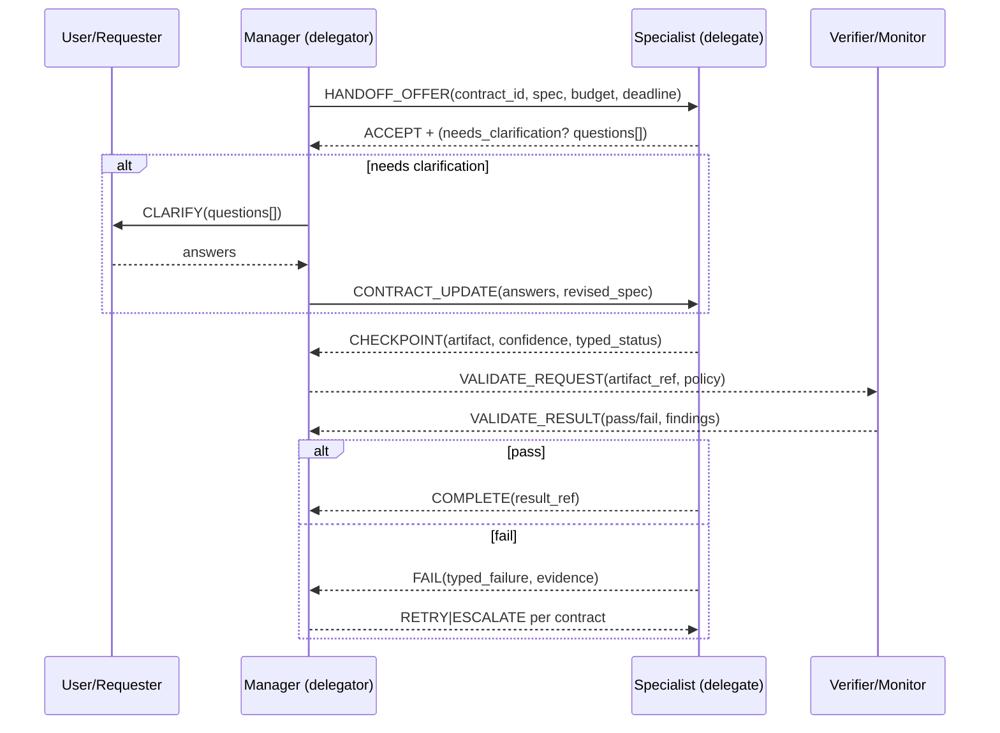
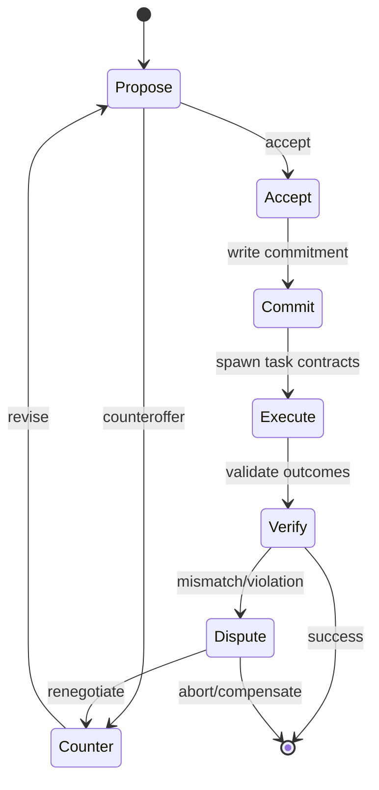
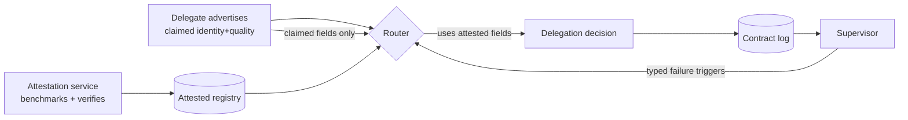

# Collaborative Communication Between Agents: Evidence, Mechanisms, and Transfer Patterns for a Durable Message-Driven Orchestration OS

## Executive summary

Recent work converges on a consistent lesson: **multi-agent performance gains come less from “more agents” and more from “better communication governance.”** Across delegation frameworks, multi-agent clarification experiments, negotiation benchmarks, trust/provenance studies, and deliberation research, the strongest evidence supports **making coordination semantics explicit**—contracts, typed acts, calibrated uncertainty, and shared state—rather than relying on unstructured chat between agents. citeturn19view3turn21search0turn19view2turn11search5turn21search23turn12search0turn13view2turn19view0

Key findings with direct design implications:

**Handoffs work best when they are treated as contracts, not routing.** entity["company","Google DeepMind","ai lab"]’s “Intelligent AI Delegation” frames delegation as transferring scoped authority, responsibility, accountability, monitoring obligations, and trust—not just task decomposition. This aligns with newer protocol research (LDP / “provenance paradox”) showing that delegation needs **bounded authority (budgets/deadlines), structured failures, and verified provenance** to avoid systematic misrouting and silent failure cascades. citeturn19view3turn21search0turn21search23turn13view5

**Clarification loops are measurably beneficial when role-assigned and coordinated.** A 2026 multi-agent clarification framework (MAC) reports higher task success and fewer turns when clarification can occur at both manager/router and specialist levels (vs. no clarification or only one level), suggesting that clarification should be orchestrated as a **two-layer repair policy** rather than ad-hoc questioning. citeturn19view2

**Negotiation is emerging as a core “agent communication primitive,” not just an application.** The strongest empirical anchor is Cicero (human-level play in “Diplomacy”), demonstrating that language-based negotiation can materially improve coordination in mixed cooperative/competitive settings. Newer benchmarks (LLM-Deliberation) operationalize negotiation as scorable multi-party, multi-issue games and explicitly evaluate the effects of greedy/adversarial players—useful as a testbed for robustness. citeturn0search2turn11search5turn11search0

**Trust metadata can *harm* system quality if it is unverified.** The “provenance paradox” shows that when delegates can inflate self-reported quality, routing based on those claims can become worse than random; “attested” identity/provenance and typed failures restore performance with negligible overhead. This strongly implies Mister Smith should treat confidence/provenance as **adversarial inputs unless attested**. citeturn21search23turn13view5

**Anti-groupthink requires engineered diversity + calibrated confidence + structured deliberation—otherwise debates collapse to majority voting.** Multiple lines of work show: (a) debate can improve factuality/reasoning (Du et al.; MAD), but (b) improvements are not guaranteed and can be matched by strong single-agent prompting (ACL 2024), while (c) controlled studies and theory emphasize that diversity and confidence handling dominate outcomes, and (d) “typed epistemic acts” and “decision packets” with minority reports offer a promising governance pattern at the cost of extra latency/compute. citeturn5search1turn5search2turn4search0turn12search6turn12search1turn12search0turn12search3

**Shared mental models are best implemented as explicit, versioned shared state (“common ground objects” + blackboards), not implicit conversation context.** Recent work on common ground tracking specifies dynamic data structures (Dialogue Game Board + graded commitments). Terrarium argues for blackboards as a canonical shared workspace and also highlights the security surface of multi-agent messaging and shared logs (prompt injection propagation, agent-in-the-middle, etc.). New grounded benchmarks (CRAFT) show that strong reasoning alone does not reliably translate to good coordination under partial information—supporting the need for explicit shared-model machinery and pragmatic repair. citeturn19view0turn13view2turn19view1

Implementation posture for Mister Smith-style primitives (message bus + durable state + supervision):

**Recommended “Now” (implementable with current LLMs + systems engineering):**
contract-based handoffs; hierarchical clarification policies; typed message acts; attested identity/provenance fields; calibrated confidence as a first-class header (with explicit “claimed vs attested” separation); blackboard/event-log shared workspaces with snapshots; diversity-aware deliberation with minority reports; robust fault injection and evaluation harnesses. citeturn19view3turn19view2turn21search23turn12search0turn13view2turn12search3

**Recommended “Later” (requires training or deeper research):**
learned communication/topology control from MARL (DIAL/CommNet/TarMAC/AC2C); “trusted partner” learning (T2MAC); negotiation-trained models optimized over full conversations (GameTalk / negotiation-based alignment) once the orchestration substrate is stable enough to support data collection and reproducible training loops. citeturn1search0turn1search1turn1search2turn18academia38turn18search1turn11academia30turn11academia32

## Framing and transfer lens for an agent-orchestration OS

This report treats Mister Smith only as a **target architecture pattern**: a message-driven multi-agent OS with (i) subject-based messaging, (ii) durable streams/state, and (iii) OTP-style supervision semantics (process monitoring, restart strategies, escalation). The research transfer question is therefore: **what communication mechanisms deserve first-class protocol and state primitives**, vs. what can stay “in prompt space”? citeturn13view2turn21search0turn21search23turn19view0

A useful taxonomy from recent MAS safety work is to separate **channels** (pairwise, broadcast, group, blackboard), **governance** (identity, trust boundaries, auditing), and **task semantics** (commitments, negotiations, failures). Terrarium explicitly argues that multi-agent systems need measurable joint objectives, controlled communication modalities, and logged transcripts for forensic analysis—precisely the kinds of affordances a durable orchestration OS can provide. citeturn13view2

In parallel, protocol work such as LDP and the “provenance paradox” highlights that modern “agent interoperability” efforts (e.g., entity["company","Anthropic","ai company"]’s MCP and entity["company","Google","technology company"]’s A2A) primarily standardize **connection and capability discovery**, but delegation for long-running systems also needs **bounded authority, verified provenance, and typed failure semantics**. citeturn21search4turn21search1turn21search2turn21search8turn21search0turn21search23

Two transfer heuristics emerge:

**Heuristic A: Promote anything that affects safety/robustness to “protocol + durable state.”** If a mechanism changes routing, authority, trust, or failure recovery, keeping it implicit in prompt text invites silent failures and adversarial manipulation (e.g., “provenance paradox,” security propagation). citeturn21search23turn13view2turn13view5

**Heuristic B: Keep reasoning strategies in “prompt space” only when they are local and easily replaceable.** Debate styles, negotiation prompts, and summarizers can iterate rapidly if the surrounding contract/state machinery is stable; but the moment they influence delegation choices, they become governance-relevant. citeturn12search6turn21search23turn21search0

## Handoffs and clarification loops

### Key papers and experimental anchors

**“Intelligent AI Delegation” (arXiv:2602.11865)** explicitly reframes delegation as a multi-step decision sequence involving task allocation plus transfer of authority/responsibility/accountability, role boundaries, clarity of intent, monitoring, and trust mechanisms; it is best read as a requirements document for “handoff as governance.” citeturn19view3

**MAC: Multi-Agent Clarification (IWSDS 2026)** is one of the more directly “communication-loop” experimental pieces: it introduces a taxonomy of user ambiguities and evaluates multi-agent clarification strategies, reporting improved task success and reduced turns when clarification is enabled both at manager/router and expert levels. citeturn19view2

**MasRouter (ACL 2025 / arXiv:2502.11133)** operationalizes a key orchestration idea: routing for multi-agent systems should decide not only “which model,” but also collaboration mode and role allocation; it reports outcomes suggesting performance/cost tradeoffs are meaningfully improvable via learned routing. citeturn22search5turn22search0

### Methods and results in brief

**Delegation as contract + monitoring.** Intelligent AI Delegation’s core contribution is not an algorithmic benchmark; it is a structured framework and taxonomy of delegation requirements (dynamic assessment, adaptive execution, transparency, scalable coordination, systemic resilience) that anticipates real-world failure modes (unexpected failures, environmental change) and treats monitoring as essential rather than optional. citeturn19view3turn2search1

**Clarification is a measurable coordination policy.** MAC compares configurations where clarification is performed by (a) none, (b) experts only, (c) manager only, or (d) both; the “both” setting improves task success and reduces dialogue length in reported evaluations, consistent with a “global disambiguation + local slot-filling” two-layer repair model. citeturn19view2

**Routing is not stable by default.** MasRouter frames multi-agent routing as a unified decision problem that includes collaboration-mode selection and role allocation; its reported improvements (task performance gains plus overhead reductions) indicate that “handoff selection” is a first-class optimization surface—not just heuristics. citeturn22search5turn22search0

### Practical implications for agent cognitive communication

**Protocols and data structures**
- **Delegation Contract (durable object):** `{task_spec, success_criteria, authority_scope, budget{tokens,calls,$}, deadline, monitoring_policy, escalation_policy, confidentiality/trust_domain, required_outputs_schema}`. The key insight is that authority/budget/deadline must be machine-checkable to enable enforcement and supervision (not just described in prompt text). citeturn19view3turn21search23turn21search0
- **Handoff Envelope (message header):** `{contract_id, correlation_id, causation_id, sender_identity, recipient_identity, claimed_confidence, attested_confidence?, provenance_id, attempt_no}`; this is motivated by provenance/routing failures when metadata is missing or untrusted. citeturn21search0turn21search23
- **Clarification State (durable, per-session):** `open_questions[]`, `missing_slots[]`, `ambiguity_type`, `who_asked`, `deadline_for_answer`, `user_visible?`; MAC’s results suggest these should be orchestrated, not left to each agent independently. citeturn19view2

**Timing and control**
- **Two-phase handoff** is strongly implied: (1) *Offer/accept* (contract negotiation, capability check), then (2) *Execution with monitored progress* (heartbeats, intermediate artifacts, checkpoints). Intelligent delegation emphasizes monitoring and accountability; protocol work shows typed failures are necessary for automated recovery. citeturn19view3turn21search23
- **Clarification windows** should be explicit: MAC’s “both levels” strategy effectively front-loads ambiguity resolution to reduce downstream repetition, implying a scheduler policy like “clarify early when ambiguity risk > threshold.” citeturn19view2

**Failure modes to engineer against**
- **Responsibility diffusion / silent failure** (delegator assumes delegate handled it; delegate assumes delegator will validate). Intelligent delegation treats accountability transfer as a requirement; this maps directly to durable contract state transitions. citeturn19view3turn2search1
- **Clarification ping-pong** (multiple agents ask overlapping questions). MAC’s manager/expert separation suggests requiring a single “clarification arbiter” role with deduplication authority. citeturn19view2
- **Cost blowups via over-communication** (routing too many agents, too many clarification rounds). MasRouter’s framing indicates routing should jointly optimize role structure and cost. citeturn22search5

### Maturity and implementability

**Now:** contract objects + explicit accept/reject; managed clarification queues; role assignment with deterministic policies; instrumentation and supervision. These are systems-engineering tasks that do not require new model training. citeturn19view3turn19view2turn21search23

**Later:** learned routing/role policies (MasRouter-style) and automatic ambiguity classifiers trained with feedback loops, once you have stable logging data and reproducible evaluation. citeturn22search5turn22search0turn13view2

### Concrete mapping to Mister Smith primitives

**Messaging patterns**
- **Request/Reply** for offer/accept (“handoff negotiation”); include explicit `ACCEPT|REJECT|COUNTER` actions.
- **Pub/Sub (scoped)** for progress events (`progress`, `checkpoint`, `artifact_ready`), enabling observers (validators, monitors) without adding coupling.
- **Queue groups** for “first available specialist” but only after contract acceptance and trust-domain checks (to avoid misrouting). citeturn21search23turn21search0

**Durable state**
- Store the **Delegation Contract** as an event-sourced stream: `Created → Offered → Accepted → InProgress → Checkpointed* → Completed | Failed(typed) | Escalated`.
- Store **Clarification State** in a separate stream keyed by `(session_id, contract_id)` to allow restart and replay. citeturn19view2turn21search23

**Supervision**
- Supervisor watches (a) timeouts on `Accepted→FirstCheckpoint`, (b) heartbeat gaps, (c) repeated clarification loops, and applies restart/escalation policy from the contract (not hard-coded in supervisor logic). citeturn19view3turn21search23

## Negotiation and commitment

### Key papers and experimental anchors

**Cicero in “Diplomacy” (Science, DOI:10.1126/science.ade9097)** demonstrates a full-stack negotiation agent combining language and strategic reasoning to achieve human-level performance in a multi-player environment with private negotiation and mixed cooperative/competitive incentives. citeturn0search2

**LLM-Deliberation / “Cooperation, Competition, and Maliciousness” (arXiv:2309.17234; also published in proceedings)** introduces multi-party, multi-issue scorable negotiation games, includes performance metrics, and studies dynamics under greedy and adversarial players—useful for evaluating negotiation robustness rather than cherry-picking examples. citeturn11search5turn11search0turn11search21

**GameTalk (arXiv:2601.16276)** is representative of a newer class: training LLMs for strategic decision-making in multi-turn dialogue where the reward depends on the full conversation (not single-turn prediction). citeturn11academia30

**Negotiation-driven alignment (arXiv:2603.10476)** uses structured self-play negotiation for value-conflict scenarios, showing how negotiation can be embedded into RL-style loops to improve conflict-resolution behaviors without degrading general capabilities (as reported). citeturn11academia32

### Methods and results in brief

**Natural-language negotiation can be instrumented to improve strategic coordination (Cicero).** Cicero’s result matters for orchestration because it validates that negotiation is not “fluff”—it is an information channel for aligning plans under partial information and competing incentives. citeturn0search2

**Scorable negotiation games provide measurable outcomes and adversary models (LLM-Deliberation).** By defining hidden scores, thresholds, and deal spaces, LLM-Deliberation makes negotiation evaluable and highlights safety-relevant dynamics: cooperative agents can be disrupted by greedy/malicious participants, which is directly analogous to multi-tenant agent ecosystems. citeturn11search5turn11search0

**Conversation-level optimization is feasible but requires explicit reward design (GameTalk / negotiation alignment).** Both GameTalk and negotiation-driven alignment reflect the move from “prompt-only negotiation” to “trained negotiation policies,” suggesting a future pathway once orchestration logs can supply stable training data. citeturn11academia30turn11academia32

### Practical implications for agent cognitive communication

**Protocols and data structures**
- **Proposal objects** (structured, even if rendered to natural language): `proposal_id`, `issues[]`, `options`, `constraints`, `expiry`, `expected_utility_range`, `assumptions`, `side_payments?`, `contingencies`.
- **Commitments ledger**: append-only durable record of `Propose → Counter → Accept → Commit → Execute → Verify`, enabling rollback/compensation if execution deviates.
- **Preference models (private vs shareable)**: explicit separation between *private utility* and *public rationale* reduces leakage while still enabling compromise (mirrors LLM-Deliberation’s hidden scores design). citeturn11search0turn11search5turn0search2

**Timing and failure modes**
- **Deadlines** and **expiry** are non-negotiable for distributed negotiation: without expiry, agents can stall; with expiry, supervisors can terminate and choose fallback actions.
- **Adversarial negotiation** failure modes include: “agreement sabotage,” “preference poisoning,” and “strategic delay.” LLM-Deliberation explicitly studies unbalanced adversarial settings, supporting inclusion of sabotage tests in Mister Smith evaluations. citeturn11search0turn11search5

### Maturity and implementability

**Now:** implement negotiation as a protocol with typed proposal/acceptance and a durable commitments ledger; use prompt-based negotiators initially, but rely on system-level guardrails (timeouts, quorum, arbitration). citeturn11search5turn21search23turn13view2

**Later:** train negotiation policies (GameTalk / negotiation alignment) and/or incorporate game-theoretic controllers; this depends on having stable simulations and logged trajectories. citeturn11academia30turn11academia32

### Concrete mapping to Mister Smith primitives

**Messaging patterns**
- **Topic per negotiation table**: `negotiation.<session_id>.*` (broadcast within allowed participants).
- **Request/reply** for counterparty-specific offers; **pub/sub** for shared updates (“current draft deal”).

**Durable state**
- **Commit ledger stream** per negotiation session, plus a snapshot of “current deal draft.”
- Store *execution bindings* mapping accepted deals → downstream task contracts (handoffs). citeturn11search0turn19view3

**Supervision**
- Negotiation supervisor enforces phases (explore → converge → commit) and termination conditions; on failure, triggers fallback policy (e.g., default safe plan, escalation to human). citeturn12search3turn11search5

## Trust calibration and provenance

### Key papers and experimental anchors

**Calibration-Tuning (UncertainNLP 2024; “Teaching LLMs to Know What They Don’t Know”)** proposes a fine-tuning protocol to produce better-calibrated, concept-level uncertainty estimates usable for both multiple-choice and open-ended generation, explicitly using ECE-style calibration framing. citeturn20view0turn20view2turn4search2

**“Large Language Models Must Be Taught to Know What They Don’t Know” (arXiv:2406.08391)** details why token-level uncertainty often fails for open-ended correctness, and recommends evaluating calibration and selective prediction (e.g., AUROC) rather than relying on raw likelihoods. citeturn19view4

**LDP (arXiv:2603.08852)** and **“Provenance Paradox” (arXiv:2603.18043)** provide unusually concrete evidence that (a) richer identity/provenance primitives can reduce tokens/latency, but (b) unverified provenance can degrade outcomes below baselines, and (c) claimed-vs-attested identity plus delegation contracts and typed failures materially improve delegation under adversarial claims. citeturn21search0turn21search23turn13view5

**BlockA2A (arXiv:2508.01332)** argues that interoperable agent ecosystems need verifiable authentication and auditability (e.g., DIDs, immutable ledgers, smart contracts) to resist Byzantine agents and prompt-based/communication-based attacks, with empirical overhead claims appropriate for deployment discussion. citeturn18academia36

**T2MAC (AAAI 2024; arXiv:2401.10973)** is relevant as a research analogue for “trust-aware partner selection”: it proposes selective engagement and evidence-driven integration so agents communicate at the right times, with the right partners, integrating messages at an evidence level. citeturn18search1turn18search3

### Methods and results in brief

**Calibrated uncertainty can be trained explicitly (Calibration-Tuning).** The paper motivates concept-level uncertainty in open-ended generation and proposes a practical tuning protocol; reported tables show calibration-sensitive comparisons and highlight design tradeoffs (e.g., data distribution effects; cost tradeoffs when separating answer generation from uncertainty estimation). citeturn20view0turn20view2

**Calibration should be validated via selective prediction, not just “confidence words.”** The 2406.08391 paper formalizes evaluation using ECE and AUROC and argues that perplexity/log-likelihood is not reliably predictive of correctness in open-ended outputs, especially when many semantically equivalent phrasings exist. citeturn19view4

**Unverified trust signals can become actively harmful (provenance paradox).** When quality claims influence routing, dishonest inflation can invert routing performance (worse than random), while attested identity and contract-bound delegation restore near-optimal outcomes in the reported experiments and sensitivity analyses. citeturn21search23turn13view5

**Identity-aware routing yields efficiency but must treat provenance as a governed object (LDP).** LDP reports large latency reductions on “easy tasks” via specialization and token savings via payload modes, but also reports that noisy provenance can degrade synthesis—supporting a firm separation between “informational metadata” and “decision-relevant, verified metadata.” citeturn21search0turn21search3

### Practical implications for agent cognitive communication

**Protocols and data structures**
- **Claimed vs attested fields** (strongly supported): `claimed_quality`, `attested_quality`, `claimed_confidence`, `attested_confidence`, `verification_method`, `verification_timestamp`. This directly targets the provenance paradox failure mode. citeturn21search23turn13view5
- **Typed Failures**: structured error ontology `{type, severity, retryable, blame{self|dependency|input}, evidence_refs[]}`. The provenance paradox work argues unstructured strings block automated recovery. citeturn13view5turn21search23
- **Confidence should be calibrated, not merely expressed**: message headers may carry confidence, but supervisors/routing should only use confidence for decision-making if the system has measured calibration (ECE/AUROC) for that agent/model class. citeturn19view4turn20view0
- **Evidence packaging**: T2MAC’s “evidence-driven integration” is an ML design, but the transferable system insight is to distinguish **claims** from **evidence objects** and integrate at the evidence level rather than averaging free-form text. citeturn18search1turn18search3

**Timing and failure modes**
- **Asynchronous attestation**: identity/quality attestation can be done out-of-band (periodic evaluation jobs) and cached; routing uses cached attested scores plus recency weighting, not self-reports.
- **Adversarial metadata**: treat provenance/confidence as attacker-controlled if not signed/attested; BlockA2A provides a design direction for authenticated communication and immutable audit logs. citeturn18academia36turn13view2

### Maturity and implementability

**Now:** implement claimed-vs-attested splitting, typed failures, provenance IDs, and audit logs; add calibration evaluation harnesses (ECE/AUROC) and use confidence only when calibrated. citeturn21search23turn19view4turn20view0

**Later:** learned trust/partner selection (T2MAC-style) and cryptographic/ledger-backed interoperability (BlockA2A) once performance/security tradeoffs are validated in your environment. citeturn18search1turn18academia36

### Concrete mapping to Mister Smith primitives

**Messaging patterns**
- **Signed identity beacons** on a well-known subject (for discovery) + **attestation updates** on a separate “trust” stream (avoid mixing operational and governance channels).
- **Typed failure events** published to a contract-specific subject so supervisors can pattern-match and trigger recovery. citeturn21search23turn21search0

**Durable state**
- **Reputation/attestation KV** keyed by `delegate_id` with versioned updates.
- **Provenance log** referencing all artifacts used to form conclusions (inputs, tools, messages), aligned with LDP’s governed sessions/provenance framing. citeturn21search0turn13view5

**Supervision**
- Quarantine policies: if an agent’s claimed vs attested divergence grows, or if its outputs fail verification frequently, supervisor can reduce routing weight, require secondary verification, or isolate to a “sandbox trust domain.” citeturn21search23turn13view2turn18academia36

## Anti-groupthink and deliberative safeguards

### Key papers and experimental anchors

**Multiagent Debate for factuality/reasoning**: Du et al. propose multi-agent debate to improve reasoning and factuality via multi-round arguments and a final synthesis; Liang et al. propose MAD to counter “degeneration-of-thought” in self-reflection and report improvements plus judge-bias concerns. citeturn5search1turn5search2turn5search6

**Negative/neutral evidence on “multi-agent discussion hype”**: an ACL 2024 reevaluation reports that a strong single-agent prompt can match the best discussion approaches on many tasks/backbones, implying that “multi-agent discussion” is not a free lunch and needs principled design. citeturn4search0turn4search8

**Theory + controlled studies:** Estornell & Liu (NeurIPS 2024) analyze debate dynamics and show that similar models/responses can converge to majority; Wu et al. (2025) use a controlled logic puzzle benchmark to disentangle factors and find diversity/model strength dominate, majority pressure can suppress correction; Zhu et al. (2026) propose diversity-aware initialization and confidence-modulated updates and report consistent improvements over vanilla debate and majority vote. citeturn12search6turn12search1turn12search0

**Structured deliberation with typed epistemic acts (DCI; arXiv:2603.11781)** introduces explicit reasoning archetypes, typed acts, shared workspace, and decision packets with minority reports and reopen conditions; it reports improvements on non-routine tasks with efficiency tradeoffs. citeturn12search3turn12search11

**Role-based “devil’s advocate” as bias mitigation (clinical multi-agent conversation; arXiv:2401.14589)** simulates team roles (final decider, devil’s advocate, facilitator, summarizer) and reports large gains in diagnostic differential accuracy vs initial responses, illustrating a concrete anti-bias pattern that is directly transferable to agent teams. citeturn5search0turn5search4

**Human-facing debate systems as precedent (Nature 2021; DOI:10.1038/s41586-021-03215-w)** provides an existence proof of long-form debate architectures and systematic evaluation, useful for thinking about debate as a system rather than a prompt trick. citeturn5search3

### Methods and results in brief

The research consensus is conditional:

- Debate *can* help (multiagent debate / MAD) by surfacing counterarguments and reducing hallucination-like errors in some tasks. citeturn5search1turn5search2  
- But debate often degenerates into majority voting unless it is engineered for diversity and calibrated confidence, and single-agent baselines can be competitive. citeturn12search6turn4search0turn12search0  
- Structured deliberation frameworks (typed acts, minority reports, termination guarantees) improve reliability especially on “hidden-profile” style problems but add latency/compute overhead. citeturn12search3turn12search11

### Practical implications for agent cognitive communication

**Protocols and data structures**
- **Typed epistemic acts** (transferable from DCI): represent messages as `{act_type, claim, evidence_refs, confidence, objections_to[], supports[]}` instead of raw chat; produce a final **decision packet** `{selected_option, residual_objections, minority_report, reopen_conditions}`. citeturn12search3turn12search7
- **Diversity-aware initialization**: ensure the initial candidate set contains genuinely different hypotheses (not paraphrases), because later debate cannot reliably “invent” missing hypotheses under majority pressure. citeturn12search0turn12search1
- **Confidence-modulated updating**: treat confidence as an input to belief updates, but only if confidence is calibrated (connects anti-groupthink to trust calibration). citeturn12search0turn19view4turn20view0
- **Role assignment as an anti-bias primitive**: “devil’s advocate,” “facilitator,” and “summarizer” roles in the clinical study map cleanly to agent teams and are easy to implement without training. citeturn5search0turn5search4

**Timing and failure modes**
- **Majority pressure failure**: controlled studies show group dynamics can suppress independent correction; mitigate by enforcing independence windows (agents commit privately before seeing others) and by preserving minority reports in durable state. citeturn12search1turn12search0
- **Judge bias**: MAD reports concerns that an LLM judge may be biased toward debaters using the same backbone; mitigate by using a separate verifier model or non-LLM scoring when ground truth exists. citeturn5search2turn12search6
- **Termination and cost control**: DCI explicitly targets termination and structured outcomes; without this, debates can loop or bloat token usage. citeturn12search3turn12search11

### Maturity and implementability

**Now:** implement diversity-aware initialization, structured phases, typed acts, and minority report persistence; these are orchestration/device-layer solutions and can be used with existing black-box models. citeturn12search0turn12search3

**Later:** train debaters/judges or develop task-specific deliberation policies; rely on controlled benchmarks (below) to avoid regressions masked by anecdotal wins. citeturn12search1turn4search0

### Concrete mapping to Mister Smith primitives

**Messaging patterns**
- Deliberation sessions as a **supervised workflow** with phase topics: `delib.<id>.propose`, `delib.<id>.critique`, `delib.<id>.rebut`, `delib.<id>.synthesize`.
- Each message includes `act_type` (typed epistemic act) and references into an artifact store for evidence. citeturn12search3turn13view2

**Durable state**
- Append-only **Deliberation Log** capturing all hypotheses, confidence, and evidence.
- Persist **Decision Packet** as an immutable summary artifact; link it to downstream delegation contracts. citeturn12search3turn21search23

**Supervision**
- Supervisor enforces independence window, maximum rounds, and “reopen conditions”; on timeout, produce best-effort decision plus explicit residual uncertainty rather than silent default. citeturn12search3turn19view4

## Shared mental-model formation and common ground

### Key papers and experimental anchors

**Common Ground Tracking in Multimodal Dialogue (arXiv:2403.17284)** argues that multi-participant task dialogue needs an explicit data structure for common ground and adopts a Dialogue Game Board (DGB) with evidence-based, graded commitments (not purely binary belief). citeturn19view0

**Terrarium (arXiv:2510.14312)** repurposes blackboard architectures for LLM-based multi-agent safety/security experimentation and explicitly lists blackboards, tuple spaces, append-only logs, CRDT-backed documents, and vector-indexed memory as modern shared-workspace realizations; it also formalizes multi-agent tasks with measurable objectives and highlights security issues unique to multi-agent communication. citeturn13view2turn13view2

**CRAFT benchmark (arXiv:2603.25268)** stresses pragmatic communication under strict partial information and provides a failure taxonomy (spatial grounding, belief modeling, pragmatic communication); it reports that stronger reasoning does not reliably translate into better coordination, which is a direct argument for explicit shared-model and repair machinery. citeturn19view1

**Human–Robot Teaming survey (ACM THRI 2026; DOI:10.1145/3776548)** provides a broad, systems-oriented view of collaboration/communication/cognition (“3Cs”), noting persistent gaps such as limited robot adaptation to human states and the need for better communication metrics; while human-robot, it offers mature measurement concepts for shared understanding and interaction fluency. citeturn16view0

**Theory-of-mind capability evidence (PNAS 2024 DOI:10.1073/pnas.2405460121; Nature Human Behaviour 2024)** indicates LLMs can perform on certain ToM batteries but with limitations; for agent teams, this supports treating “belief modeling” as possible but fragile—better externalize beliefs into shared state rather than assuming implicit ToM works reliably. citeturn3search2turn3search6

### Methods and results in brief

**Common ground as an explicit state machine.** The common ground tracking work specifies dialogue states and updates to DGB-like structures, and adopts graded commitments that change with evidence—directly suggesting that shared mental models in agent systems should be implemented as **versioned, evidence-linked records**, not as “whatever is in context.” citeturn19view0

**Blackboards as an orchestration-friendly shared workspace.** Terrarium’s modernized blackboard framing is particularly compatible with durable message streams: agents append partial results and constraints to a common log rather than constructing brittle pairwise conversations, and the system can audit, replay, or test attacks/defenses at the channel level. citeturn13view2

**Coordination under partial information remains unsolved.** CRAFT’s results—coordination doesn’t reliably improve with stronger reasoning models—imply that multi-agent coordination needs targeted evaluation and dedicated mechanisms for belief alignment, repair, and pragmatic messaging. citeturn19view1

### Practical implications for agent cognitive communication

**Protocols and data structures**
- **Common Ground Object (CGO)** per session:  
  `participants`, `shared_facts[]`, `open_questions[]`, `commitments[]`, `plans[]`, `constraints[]`, `evidence_graph`, `confidence_by_fact`, `last_updated`, `version`.  
  This is directly motivated by DGB/common ground work and by CRAFT’s emphasis on belief modeling failures. citeturn19view0turn19view1
- **Blackboard Event Types** (system-level schema): `Hypothesis`, `Constraint`, `Proposal`, `Commitment`, `Objection`, `Evidence`, `DecisionPacket`, `ReopenCondition`. Terrarium explicitly argues for posting proposals/commitments/exception notes to a common log. citeturn13view2turn12search3
- **Evidence links everywhere**: treat evidence as first-class artifacts referenced by IDs (tool outputs, retrieved docs, computed results) to support verification and reduce prompt injection propagation. citeturn13view2turn18academia36

**Timing and failure modes**
- **Staleness and split-brain**: if multiple agents maintain divergent “shared state” summaries, coordination degrades; use versioning + conflict resolution (CRDT or authoritative event-log + snapshots), as Terrarium explicitly situates among modern shared-workspace designs. citeturn13view2
- **Security propagation**: compromising one agent can propagate via shared logs or forwarded messages; Terrarium emphasizes multi-agent amplification of prompt injection/jailbreak style vulnerabilities, motivating access control and trust domains on shared-state channels. citeturn13view2turn18academia36

### Maturity and implementability

**Now:** implement CGO + blackboard logs + snapshotting; add deterministic reducers that compute “current shared view” from the event stream; implement access control and audit logs. citeturn13view2turn19view0

**Later:** incorporate richer belief modeling (ToM-enhanced strategies) once you can validate them on grounded partial-information benchmarks like CRAFT, not just on offline QA tasks. citeturn19view1turn3search2turn3search6

### Concrete mapping to Mister Smith primitives

**Messaging patterns**
- A **blackboard stream** implemented as an append-only subject where agents publish typed events.
- **Derived “materialized views”** published periodically to a `cgo.<id>.snapshot` subject for low-latency reads.

**Durable state**
- Event-sourced CGO streams with periodic snapshots.
- Artifact store keyed by content hash to enable evidence reuse and reduce token duplication.

**Supervision**
- “State health” supervisors detect runaway growth (unbounded blackboards), conflicting commits, or unresolved open questions; apply compaction or escalation policies. citeturn13view2turn12search3

## Candidate mechanism comparison and evaluation designs

### Comparison table of candidate mechanisms

| mechanism | core idea | evidence strength | implementation complexity | latency/throughput impact | recommended for now/later |
|---|---|---|---|---|---|
| Contract-based handoff (delegation contract + accept/reject) | Treat handoff as a governed contract with budgets, deadlines, monitoring, accountability | Medium-High (framework + convergent protocol evidence) | Medium | Low–Medium (extra handshake + logging) | Now |
| Hierarchical clarification policy (manager + specialist) | Separate global disambiguation from local slot filling; deduplicate clarifying questions | Medium (measured in MAC on MultiWOZ) | Medium | Low–Medium (extra turns, but fewer downstream loops) | Now |
| MAS routing with role allocation | Router chooses collaboration mode + roles + model selection to optimize cost/perf | Medium (benchmarked, but domain-sensitive) | High | Medium (router inference + extra orchestration) | Now→Later (start rule-based, learn later) |
| Negotiation-as-primitive (propose/counter/commit ledger) | Use structured negotiation to resolve conflicts under partial info | High (Cicero + scorable negotiation benchmarks) | Medium | Medium (multi-round interaction) | Now (protocol) / Later (trained negotiators) |
| Calibrated uncertainty headers | Confidence as first-class field, used for abstention/selective routing only if calibrated | Medium (calibration methods + eval guidance) | Medium | Low | Now |
| Claimed vs attested provenance | Separate untrusted self-report from verified metrics; route only on attested | Medium (strong controlled evidence, very recent) | Medium–High | Low (verification overhead can be amortized) | Now |
| Typed failure semantics | Machine-readable failures enable automated recovery and supervision decisions | Medium (protocol-driven evidence) | Medium | Low | Now |
| Diversity-aware debate initialization | Ensure initial candidate set is diverse to avoid majority lock-in | Medium (theory + benchmarks, recent) | Medium | Medium (more sampling/agents) | Now |
| Confidence-modulated debate updates | Debate updates conditioned on calibrated confidence | Medium (theory + empirical) | Medium–High | Medium | Now→Later (requires calibration harness) |
| Typed epistemic acts + decision packet | Structured deliberation phases with explicit acts, minority report, reopen conditions | Medium (empirical + strong conceptual clarity; efficiency tradeoffs) | High | High (more turns + bookkeeping) | Now for high-stakes flows; otherwise Later |
| Shared blackboard (event log) | Shared workspace: agents post partial results/constraints; others refine | Medium (MAS research + safety framework) | Medium | Low–Medium (log growth + reads) | Now |
| Common ground object (DGB-inspired) | Explicit versioned “common ground” updated by dialogue moves with graded commitments | Medium (formalization + applicable data structures) | Medium | Low–Medium | Now |
| Learned targeted/multi-round comms (TarMAC/AC2C-style) | Select who to talk to, when, possibly via multi-hop rounds | Medium (MARL evidence) | High | Low–High depending on policy | Later (after stable infra) |
| Learned trust-aware partner selection (T2MAC) | Learn selective engagement with reliable partners; evidence-level integration | Medium (MARL + benchmarks) | High | Medium | Later |

Evidence strength notes: “High” rows are supported by peer-reviewed demonstrations in complex interactive environments (Cicero) or multiple convergent studies; “Medium” includes strong recent preprints and conference papers with controlled experiments but less time for replication; “Low” would be mostly conceptual (none are listed as purely low here). citeturn0search2turn19view2turn22search5turn11search5turn20view0turn19view4turn21search23turn12search0turn12search3turn13view2turn19view0turn1search2turn18academia38turn18search1

### Recommended evaluation metrics for Mister Smith implementations

A message-driven orchestration OS can evaluate communication mechanisms at **three levels**: task outcomes, coordination quality, and systems reliability/security.

**Task outcome metrics (domain-dependent but standardizable)**
- Success / correctness / constraint satisfaction, preferably with ground truth (Terrarium uses measurable objectives; negotiation games have hidden scores; CRAFT has target structure correctness). citeturn13view2turn11search0turn19view1
- Optimality gap / regret where an oracle baseline exists (Terrarium explicitly motivates oracle baselines and utility gap). citeturn13view2turn13view2

**Coordination quality and communication metrics**
- **Communication overhead**: message count, bytes, token count, and “coordination cost per success.” (MultiAgentBench explicitly expands beyond success to coordination quality; LDP reports token reductions from protocol primitives.) citeturn22search4turn21search0turn21search3
- **Time-to-alignment**: time/turns until shared plan stabilizes; number of reopen cycles (DCI provides reopen conditions as explicit output). citeturn12search3turn12search7
- **Diversity and groupthink indicators**: number of unique hypotheses considered; rate of consensus reversal (controlled debate studies emphasize majority pressure and diversity). citeturn12search1turn12search0
- **Clarification efficiency**: clarification turns per task; reductions in downstream rework; MAC reports turn reductions as a core metric. citeturn19view2
- **Negotiation quality**: agreement rate; Pareto efficiency / collective utility; susceptibility to sabotage by greedy players (LLM-Deliberation includes adversarial/greeedy dynamics). citeturn11search0turn11search5

**Trust calibration metrics**
- **ECE** (expected calibration error) and **Brier score** where probabilistic correctness labels exist; Calibration-Tuning and 2406.08391 emphasize ECE framing. citeturn20view1turn19view4
- **Selective prediction AUROC**: ability to abstain from likely-wrong outputs (explicit in 2406.08391). citeturn19view4
- **Claim divergence**: `|claimed_quality - attested_quality|` over time; tie directly to provenance paradox risk. citeturn21search23turn13view5

**Reliability/security metrics**
- **Recovery success rate under fault injection**: completion under dropped/delayed messages, tool failures, agent crashes; Terrarium explicitly motivates such evaluable failures and attack classes. citeturn13view2
- **Attack propagation rate**: how often a compromised agent corrupts the shared state or other agents (Terrarium; BlockA2A). citeturn13view2turn18academia36
- **Audit completeness**: fraction of decisions traceable to evidence/provenance objects (LDP/provenance paradox emphasize structured provenance). citeturn21search0turn21search23

### Experimental designs to validate implementations

**Benchmark-driven harness (start here, then augment with internal workloads)**
- Use **MultiAgentBench** to evaluate coordination/competition dynamics with standardized metrics. citeturn22search4turn4search1
- Use **AgentBench** for single-agent baselines and to quantify what multi-agent orchestration adds beyond agent capability. citeturn22search3turn22search7
- Use **CRAFT** for grounded, partial-information pragmatic coordination with failure taxonomies that map directly to shared mental model errors. citeturn19view1
- Use **LLM-Deliberation** negotiation games to test compromise, adversarial participants, and commitment ledgers. citeturn11search0turn11search5
- Use **Terrarium**-style configurations (or Terrarium itself if adopted) for security/fault propagation testing across message channels and shared workspaces. citeturn13view2

**Factorial “mechanism isolation” experiments**
- Vary: team size, heterogeneity (different model families/temps/prompts), confidence availability, debate structure, and supervision strictness; controlled debate studies show these factors have separable effects and that diversity/model strength dominate. citeturn12search1turn12search0
- Always include strong **single-agent baselines**; ACL 2024 shows multi-agent discussion can be matched by strong prompting, so improvements must beat “best single agent,” not strawman baselines. citeturn4search0turn4search8

**Fault and adversary injection**
- Inject dishonest quality claims to validate claimed-vs-attested logic (provenance paradox). citeturn21search23turn13view5
- Inject prompt-injection style malicious messages into blackboards to measure propagation and defense effectiveness (Terrarium; BlockA2A). citeturn13view2turn18academia36
- Inject message delays/reordering to validate that durable state + supervision yields correct recovery (Terrarium’s emphasis on logged transcripts and recovery). citeturn13view2

**Instrumentation-first design**
- Treat every session (handoff, clarification, negotiation, deliberation) as producing a **machine-readable transcript**: contracts, typed acts, evidence refs, decision packets, and typed failures. This is essential both for evaluation and for later learning-based improvements (MasRouter/GameTalk/T2MAC-style “later” work). citeturn21search0turn12search3turn22search5turn11academia30turn18search1